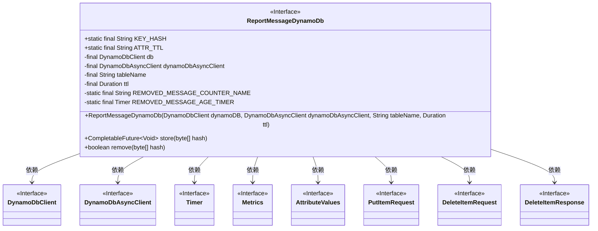
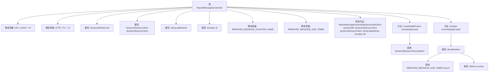

# 基础信息

|      |      |
|------|------|
| 名称 | ReportMessageDynamoDb |
| 编码语言 | .java |
| 代码路径 | Signal-Server/service/src/main/java/org/whispersystems/textsecuregcm/storage/ReportMessageDynamoDb.java |
| 包名 | org.whispersystems.textsecuregcm.storage |
| 依赖项 | ['io.micrometer.core.instrument.Metrics', 'io.micrometer.core.instrument.Timer', 'org.whispersystems.textsecuregcm.util.AttributeValues', 'org.whispersystems.textsecuregcm.util.Util', 'software.amazon.awssdk.services.dynamodb.DynamoDbAsyncClient', 'software.amazon.awssdk.services.dynamodb.DynamoDbClient', 'software.amazon.awssdk.services.dynamodb.model.DeleteItemRequest', 'software.amazon.awssdk.services.dynamodb.model.DeleteItemResponse', 'software.amazon.awssdk.services.dynamodb.model.PutItemRequest', 'software.amazon.awssdk.services.dynamodb.model.ReturnValue', 'java.time.Duration', 'java.time.Instant', 'java.util.Map', 'java.util.concurrent.CompletableFuture', 'org.whispersystems.textsecuregcm.metrics.MetricsUtil.name'] |
| 概述说明 | ReportMessageDynamoDb类管理DynamoDB消息存储、删除及TTL，支持异步操作。 |

# 说明

ReportMessageDynamoDb类是一个专门用于处理DynamoDB中消息存储和删除的工具，支持异步操作，能够有效管理消息的生命周期（TTL）。该类通过异步机制提升操作效率，同时具备TTL管理功能，确保消息在指定时间后自动删除，优化存储资源的使用。

# 类列表 Class Summary

| 名称   | 类型  | 说明 |
|-------|------|-------------|
| ReportMessageDynamoDb | class | ReportMessageDynamoDb类用于存储和删除DynamoDB中的消息，支持异步操作和TTL管理。 |

## 类 ReportMessageDynamoDb

|      |      |
|------|------|
| 访问范围 | public |
| 类型 | class |
| 名称 | ReportMessageDynamoDb |
| 说明 | ReportMessageDynamoDb类用于存储和删除DynamoDB中的消息，支持异步操作和TTL管理。 |

### UML类图

这段代码定义了一个名为 `ReportMessageDynamoDb` 的类，用于管理 DynamoDB 表中的消息存储和删除操作。该类依赖于 `DynamoDbClient` 和 `DynamoDbAsyncClient` 来执行同步和异步的数据库操作。它还使用了 `Timer` 和 `Metrics` 来记录删除消息的年龄和计数器。`store` 方法用于将消息存储到 DynamoDB 表中，而 `remove` 方法则用于删除消息并记录相关指标。

### 内部方法调用关系图

**描述：**
该代码定义了一个名为 `ReportMessageDynamoDb` 的类，用于与 DynamoDB 数据库交互。类中包含两个主要方法：`store` 和 `remove`。`store` 方法用于将数据存储到 DynamoDB 表中，而 `remove` 方法用于从表中删除数据并记录删除操作的统计信息。代码中还定义了一些静态常量和属性，用于配置和记录操作的状态。通过 `DynamoDbClient` 和 `DynamoDbAsyncClient` 实现与 DynamoDB 的同步和异步操作。

### 字段列表 Field List

| 名称  | 类型  | 说明 |
|-------|-------|------|
| KEY_HASH = "H" | String | 静态常量KEY_HASH值为"H"。 |
| ATTR_TTL = "E" | String | 静态常量ATTR_TTL定义为字符串"E"。 |
| tableName | String | 私有不可变的字符串变量tableName。 |
| db | DynamoDbClient | 私有且不可变的DynamoDB客户端实例。 |
| ttl | Duration | 私有常量ttl表示时间长度。 |
| dynamoDbAsyncClient | DynamoDbAsyncClient | 私有属性为DynamoDbAsyncClient的异步客户端实例。 |
| REMOVED_MESSAGE_AGE_TIMER = Timer      .builder(name(ReportMessageDynamoDb.class, "removedMessageAge"))      .publishPercentiles(0.5, 0.75, 0.95, 0.99)      .distributionStatisticExpiry(Duration.ofDays(1))      .register(Metrics.globalRegistry) | Timer | 创建计时器，记录消息删除时长，发布百分位数，统计分布过期时间为一天。 |
| REMOVED_MESSAGE_COUNTER_NAME = name(ReportMessageDynamoDb.class, "removed") | String | 定义常量REMOVED_MESSAGE_COUNTER_NAME，用于记录移除消息的计数器名称。 |

### 方法列表 Method List

| 名称  | 类型  | 说明 |
|-------|-------|------|
| store | CompletableFuture<Void> | 异步存储字节数组哈希值到DynamoDB表，并设置TTL。 |
| remove | boolean | 该方法从数据库中删除指定哈希值的数据项，并返回是否成功删除。 |

