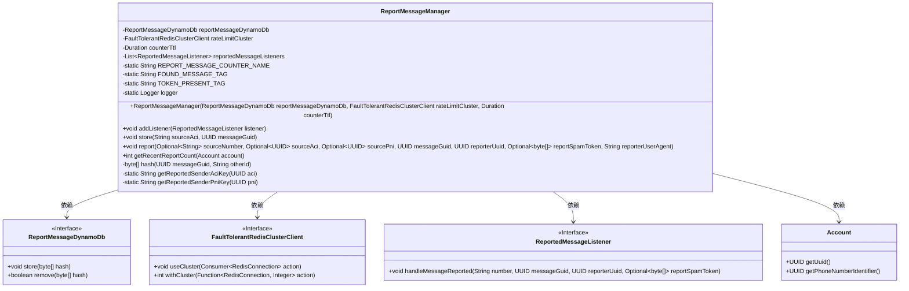
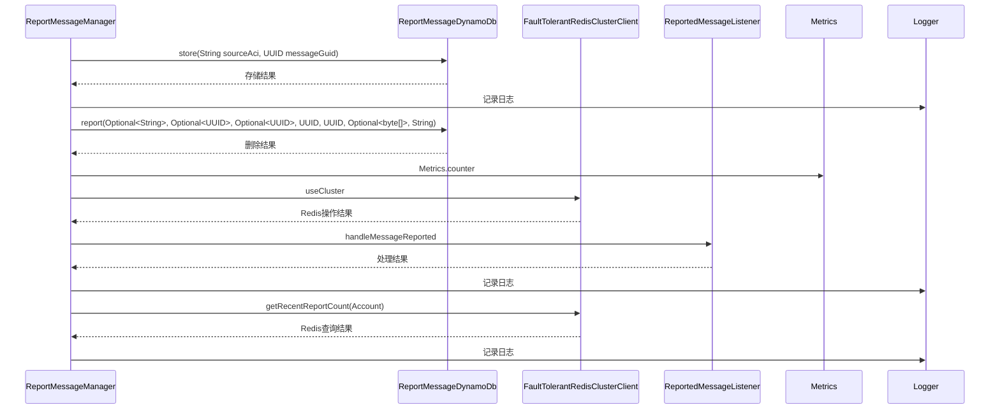

# 基础信息

|      |      |
|------|------|
| 名称 | ReportMessageManager |
| 编码语言 | .java |
| 代码路径 | Signal-Server/service/src/main/java/org/whispersystems/textsecuregcm/storage/ReportMessageManager.java |
| 包名 | org.whispersystems.textsecuregcm.storage |
| 依赖项 | ['io.lettuce.core.RedisException', 'java.nio.charset.StandardCharsets', 'java.security.MessageDigest', 'java.security.NoSuchAlgorithmException', 'java.time.Duration', 'java.util.ArrayList', 'java.util.List', 'java.util.Objects', 'java.util.Optional', 'java.util.UUID', 'io.micrometer.core.instrument.Metrics', 'io.micrometer.core.instrument.Tags', 'org.slf4j.Logger', 'org.slf4j.LoggerFactory', 'org.whispersystems.textsecuregcm.metrics.MetricsUtil', 'org.whispersystems.textsecuregcm.metrics.UserAgentTagUtil', 'org.whispersystems.textsecuregcm.redis.FaultTolerantRedisClusterClient', 'org.whispersystems.textsecuregcm.util.UUIDUtil'] |
| 概述说明 | ReportMessageManager类管理消息、存储哈希、处理事件并统计报告次数。 |

# 说明

ReportMessageManager类负责管理消息报告的相关功能。它存储消息的哈希值，用于唯一标识和追踪报告。该类还处理与报告相关的事件，确保消息报告的流程顺利进行。此外，ReportMessageManager统计近期报告的次数，提供数据支持以便分析和监控报告频率。通过这一系列功能，该类有效地管理和维护消息报告的完整性和可追溯性。

# 类列表 Class Summary

| 名称   | 类型  | 说明 |
|-------|------|-------------|
| ReportMessageManager | class | ReportMessageManager类管理消息报告，存储哈希值，处理报告事件，并统计近期报告次数。 |

## 类 ReportMessageManager

|      |      |
|------|------|
| 访问范围 | public |
| 类型 | class |
| 名称 | ReportMessageManager |
| 说明 | ReportMessageManager类管理消息报告，存储哈希值，处理报告事件，并统计近期报告次数。 |

### UML类图

**描述：**
`ReportMessageManager` 类负责管理与报告消息相关的操作，包括存储、报告和获取最近报告次数。它依赖于 `ReportMessageDynamoDb` 和 `FaultTolerantRedisClusterClient` 接口来执行数据库和Redis操作，并通过 `ReportedMessageListener` 接口通知监听器。`Account` 类用于获取账户的唯一标识符。

### 内部方法调用关系图

```mermaid
graph TD
    A["类ReportMessageManager"]
    B["属性: ReportMessageDynamoDb reportMessageDynamoDb"]
    C["属性: FaultTolerantRedisClusterClient rateLimitCluster"]
    D["属性: Duration counterTtl"]
    E["属性: List<ReportedMessageListener> reportedMessageListeners"]
    F["常量: String REPORT_MESSAGE_COUNTER_NAME"]
    G["常量: String FOUND_MESSAGE_TAG"]
    H["常量: String TOKEN_PRESENT_TAG"]
    I["常量: Logger logger"]
    J["构造方法: ReportMessageManager(ReportMessageDynamoDb, FaultTolerantRedisClusterClient, Duration)"]
    K["方法: void addListener(ReportedMessageListener)"]
    L["方法: void store(String, UUID)"]
    M["方法: void report(Optional<String>, Optional<UUID>, Optional<UUID>, UUID, UUID, Optional<byte[]>, String)"]
    N["方法: int getRecentReportCount(Account)"]
    O["方法: byte[] hash(UUID, String)"]
    P["方法: String getReportedSenderAciKey(UUID)"]
    Q["方法: String getReportedSenderPniKey(UUID)"]

    A --> B
    A --> C
    A --> D
    A --> E
    A --> F
    A --> G
    A --> H
    A --> I
    A --> J
    A --> K
    A --> L
    A --> M
    A --> N
    A --> O
    A --> P
    A --> Q
```

**描述：**  
`ReportMessageManager` 类用于管理报告消息的存储、处理和统计。它通过 `ReportMessageDynamoDb` 存储消息哈希，使用 `FaultTolerantRedisClusterClient` 进行限流和统计操作，并通过 `ReportedMessageListener` 通知监听器。类中的方法包括消息存储、报告、获取最近报告次数等。流程图展示了类的属性和方法关系，时序图展示了主要方法的调用顺序和交互过程。

### 字段列表 Field List

| 名称  | 类型  | 说明 |
|-------|-------|------|
| reportMessageDynamoDb | ReportMessageDynamoDb | 私有不可变的ReportMessageDynamoDb实例变量。 |
| REPORT_MESSAGE_COUNTER_NAME = MetricsUtil.name(ReportMessageManager.class, "reportMessage") | String | 定义报告消息计数器的常量名称。 |
| logger = LoggerFactory.getLogger(ReportMessageManager.class) | Logger | ReportMessageManager类中定义了私有静态日志记录器。 |
| rateLimitCluster | FaultTolerantRedisClusterClient | 私有且容错的Redis集群客户端用于速率限制。 |
| reportedMessageListeners = new ArrayList<>() | List<ReportedMessageListener> | 定义了一个私有的最终列表，用于存储报告消息的监听器。 |
| TOKEN_PRESENT_TAG = "hasReportSpamToken" | String | 定义常量TOKEN_PRESENT_TAG，值为"hasReportSpamToken"。 |
| FOUND_MESSAGE_TAG = "foundMessage" | String | 定义了一个私有静态常量字符串变量FOUND_MESSAGE_TAG，值为"foundMessage"。 |
| counterTtl | Duration | 私有常量计数器生存时间。 |

### 方法列表 Method List

| 名称  | 类型  | 说明 |
|-------|-------|------|
| store | void | 方法store将sourceAci和messageGuid哈希后存储，失败时记录警告。 |
| hash | byte[] | 生成SHA-256哈希值的Java方法。 |
| getReportedSenderAciKey | String | 该方法生成并返回基于UUID的报告发送者ACI键字符串。 |
| getReportedSenderPniKey | String | 生成基于PNI的报告发送者键值。 |
| getRecentReportCount | int | 获取账户最近报告数量，优先使用PNI或ACI查询，失败返回0。 |
| report | void | 报告消息处理函数，包含来源编号、UUID、用户代理等参数，更新计数器并通知监听器。 |
| addListener | void | 为类添加消息监听器。 |

