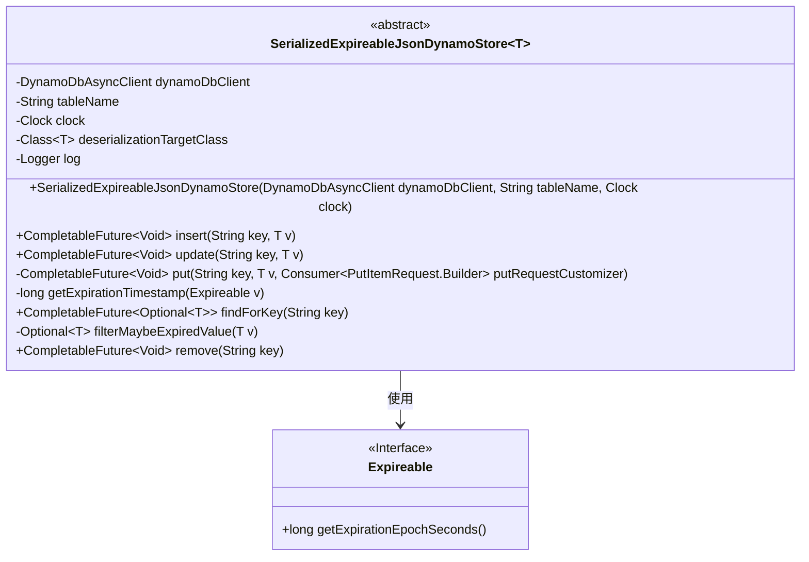
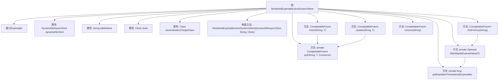

# 基础信息

|      |      |
|------|------|
| 名称 | SerializedExpireableJsonDynamoStore |
| 编码语言 | .java |
| 代码路径 | Signal-Server/service/src/main/java/org/whispersystems/textsecuregcm/storage/SerializedExpireableJsonDynamoStore.java |
| 包名 | org.whispersystems.textsecuregcm.storage |
| 依赖项 | ['com.fasterxml.jackson.annotation.JsonIgnore', 'com.fasterxml.jackson.core.JsonProcessingException', 'com.google.common.annotations.VisibleForTesting', 'java.lang.reflect.ParameterizedType', 'java.lang.reflect.Type', 'java.time.Clock', 'java.util.HashMap', 'java.util.Map', 'java.util.Optional', 'java.util.concurrent.CompletableFuture', 'java.util.function.Consumer', 'org.slf4j.Logger', 'org.slf4j.LoggerFactory', 'org.whispersystems.textsecuregcm.util.AttributeValues', 'org.whispersystems.textsecuregcm.util.SystemMapper', 'software.amazon.awssdk.services.dynamodb.DynamoDbAsyncClient', 'software.amazon.awssdk.services.dynamodb.model.AttributeValue', 'software.amazon.awssdk.services.dynamodb.model.DeleteItemRequest', 'software.amazon.awssdk.services.dynamodb.model.GetItemRequest', 'software.amazon.awssdk.services.dynamodb.model.PutItemRequest'] |
| 概述说明 | 抽象类实现DynamoDB存储，支持数据插入、更新、查询和删除操作。 |

# 说明

该内容描述了一个抽象类，该类实现了与DynamoDB存储的集成，支持对过期数据的插入、更新、查询和删除操作。抽象类提供了对这些操作的基本框架，使得开发者可以在此基础上扩展和定制具体实现。通过这种方式，系统能够有效地管理DynamoDB中的过期数据，确保数据的及时更新和清理。

# 类列表 Class Summary

| 名称   | 类型  | 说明 |
|-------|------|-------------|
| SerializedExpireableJsonDynamoStore | class | 抽象类实现DynamoDB存储，支持过期数据插入、更新、查询和删除操作。 |

## 类 SerializedExpireableJsonDynamoStore

|      |      |
|------|------|
| 访问范围 | public abstract |
| 类型 | class |
| 名称 | SerializedExpireableJsonDynamoStore |
| 说明 | 抽象类实现DynamoDB存储，支持过期数据插入、更新、查询和删除操作。 |

### UML类图

**描述：**  
`SerializedExpireableJsonDynamoStore` 是一个抽象类，用于管理与 DynamoDB 交互的存储操作，支持带有过期时间的 JSON 序列化对象。它包含插入、更新、查找和删除数据的方法，并通过 `Expireable` 接口处理过期逻辑。类内部使用 `DynamoDbAsyncClient` 进行异步操作，并通过 `Clock` 获取当前时间以验证数据是否过期。

### 内部方法调用关系图

**描述：**  
`SerializedExpireableJsonDynamoStore<T>` 是一个抽象类，用于管理存储在 DynamoDB 中的可序列化且具有过期时间的对象。它包含插入、更新、查找和删除操作。类中定义了一个 `Expireable` 接口，用于处理对象的过期时间。`put` 方法是核心方法，负责将对象序列化并存储到 DynamoDB 中。`findForKey` 方法用于查找指定键的对象，并在返回前检查对象是否已过期。`remove` 方法用于删除指定键的对象。

### 字段列表 Field List

| 名称  | 类型  | 说明 |
|-------|-------|------|
| ATTR_TTL = "E" | String | 定义私有静态常量ATTR_TTL，值为"E"。 |
| KEY_KEY = "K" | String | 测试可见的静态字符串常量KEY_KEY值为"K"。 |
| tableName | String | 定义了一个私有不可变的字符串变量tableName。 |
| clock | Clock | 私有且不可变的时钟对象。 |
| dynamoDbClient | DynamoDbAsyncClient | 私有DynamoDb异步客户端实例。 |
| ATTR_SERIALIZED_VALUE = "V" | String | 定义私有静态常量字符串ATTR_SERIALIZED_VALUE，值为"V"。 |
| log = LoggerFactory.getLogger(getClass()) | Logger | 私有日志记录器初始化，用于类日志输出。 |
| deserializationTargetClass | Class<T> | 私有最终类变量，用于反序列化目标类。 |

### 方法列表 Method List

| 名称  | 类型  | 说明 |
|-------|-------|------|
| update | CompletableFuture<Void> | 异步更新键值对，忽略返回值。 |
| insert | CompletableFuture<Void> | 异步插入键值对，确保键不存在。 |
| getExpirationTimestamp | long | 获取对象v的过期时间戳，返回其过期秒数。 |
| filterMaybeExpiredValue | Optional<T> | 过滤可能过期的值，检查时间戳后返回有效值或空。 |
| put | CompletableFuture<Void> | 异步存储数据到DynamoDB表，支持自定义请求和过期时间处理。 |
| remove | CompletableFuture<Void> | 使用DynamoDB客户端删除指定键的项，返回CompletableFuture<Void>。 |
| findForKey | CompletableFuture<Optional<T>> | 通过DynamoDB客户端查找指定键值，返回反序列化后的可选结果。 |

