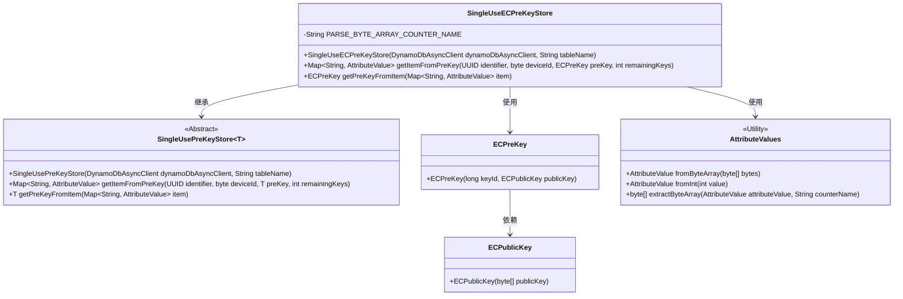
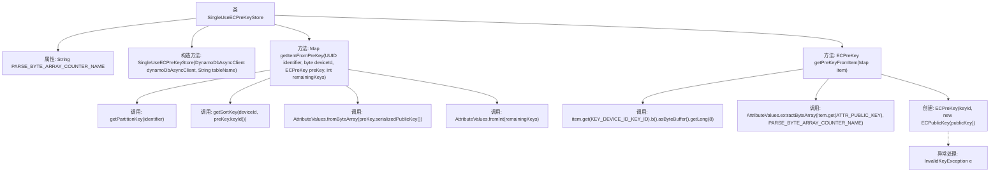

# 基础信息

|      |      |
|------|------|
| 名称 | SingleUseECPreKeyStore |
| 编码语言 | .java |
| 代码路径 | Signal-Server/service/src/main/java/org/whispersystems/textsecuregcm/storage/SingleUseECPreKeyStore.java |
| 包名 | org.whispersystems.textsecuregcm.storage |
| 依赖项 | ['org.signal.libsignal.protocol.InvalidKeyException', 'org.signal.libsignal.protocol.ecc.ECPublicKey', 'org.whispersystems.textsecuregcm.entities.ECPreKey', 'org.whispersystems.textsecuregcm.util.AttributeValues', 'software.amazon.awssdk.services.dynamodb.DynamoDbAsyncClient', 'software.amazon.awssdk.services.dynamodb.model.AttributeValue', 'java.util.Map', 'java.util.UUID', 'org.whispersystems.textsecuregcm.metrics.MetricsUtil.name'] |
| 概述说明 | SingleUseECPreKeyStore类继承SingleUsePreKeyStore，处理ECPreKey存储，使用DynamoDB异步客户端和表名初始化，实现预密钥生成与解析。 |

# 说明

SingleUseECPreKeyStore类继承自SingleUsePreKeyStore，专门用于处理ECPreKey的存储。该类通过DynamoDB异步客户端和指定的表名进行初始化，实现了从预密钥生成数据项以及从数据项解析预密钥的功能。

# 类列表 Class Summary

| 名称   | 类型  | 说明 |
|-------|------|-------------|
| SingleUseECPreKeyStore | class | SingleUseECPreKeyStore类继承SingleUsePreKeyStore，处理ECPreKey存储，使用DynamoDB异步客户端和表名初始化，实现从预密钥生成项和从项解析预密钥。 |

## 类 SingleUseECPreKeyStore

|      |      |
|------|------|
| 访问范围 | public |
| 类型 | class |
| 名称 | SingleUseECPreKeyStore |
| 说明 | SingleUseECPreKeyStore类继承SingleUsePreKeyStore，处理ECPreKey存储，使用DynamoDB异步客户端和表名初始化，实现从预密钥生成项和从项解析预密钥。 |

### UML类图

这段代码定义了一个`SingleUseECPreKeyStore`类，它继承自泛型类`SingleUsePreKeyStore<ECPreKey>`。`SingleUseECPreKeyStore`类主要用于存储和管理`ECPreKey`对象，通过`DynamoDbAsyncClient`与DynamoDB进行交互。类中包含两个主要方法：`getItemFromPreKey`用于将`ECPreKey`对象转换为DynamoDB的`AttributeValue`映射，`getPreKeyFromItem`则用于从DynamoDB的`AttributeValue`映射中还原`ECPreKey`对象。此外，`ECPreKey`类依赖于`ECPublicKey`类，而`SingleUseECPreKeyStore`类则依赖于`AttributeValues`工具类来处理字节数组和整数的转换。

### 内部方法调用关系图

这段代码定义了一个名为 `SingleUseECPreKeyStore` 的类，该类继承自 `SingleUsePreKeyStore<ECPreKey>`。它包含两个主要方法：`getItemFromPreKey` 和 `getPreKeyFromItem`。`getItemFromPreKey` 方法用于从预密钥生成一个包含多个属性的 `Map`，而 `getPreKeyFromItem` 方法则从 `Map` 中提取并重新构造 `ECPreKey` 对象。代码还处理了潜在的 `InvalidKeyException` 异常，确保在密钥无效时抛出 `IllegalArgumentException`。

### 字段列表 Field List

| 名称  | 类型  | 说明 |
|-------|-------|------|
| PARSE_BYTE_ARRAY_COUNTER_NAME = name(SingleUseECPreKeyStore.class, "parseByteArray") | String | 单例类中定义解析字节数组计数器名称。 |

### 方法列表 Method List

| 名称  | 类型  | 说明 |
|-------|-------|------|
| getPreKeyFromItem | ECPreKey | 从Map中提取ECPreKey，包含keyId和publicKey，处理InvalidKeyException异常。 |
| getItemFromPreKey | Map<String, AttributeValue> | 方法通过UUID、设备ID和预密钥生成包含账户UUID、设备ID、公钥和剩余密钥的映射。 |

