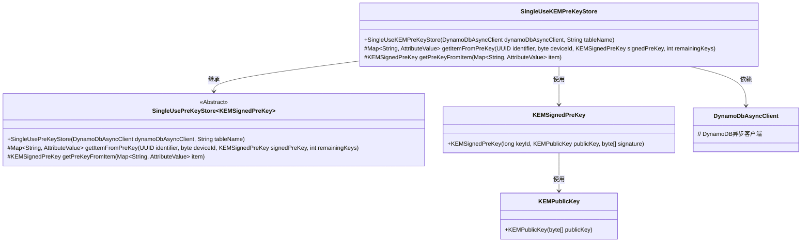
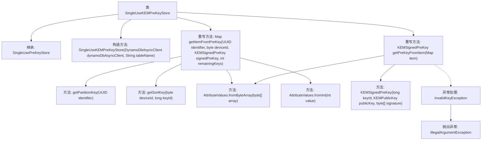

# 基础信息

|      |      |
|------|------|
| 名称 | SingleUseKEMPreKeyStore |
| 编码语言 | .java |
| 代码路径 | Signal-Server/service/src/main/java/org/whispersystems/textsecuregcm/storage/SingleUseKEMPreKeyStore.java |
| 包名 | org.whispersystems.textsecuregcm.storage |
| 依赖项 | ['org.signal.libsignal.protocol.InvalidKeyException', 'org.signal.libsignal.protocol.kem.KEMPublicKey', 'org.whispersystems.textsecuregcm.entities.KEMSignedPreKey', 'org.whispersystems.textsecuregcm.util.AttributeValues', 'software.amazon.awssdk.services.dynamodb.DynamoDbAsyncClient', 'software.amazon.awssdk.services.dynamodb.model.AttributeValue', 'java.util.Map', 'java.util.UUID'] |
| 概述说明 | SingleUseKEMPreKeyStore继承SingleUsePreKeyStore，管理KEMSignedPreKey，支持DynamoDB操作。 |

# 说明

SingleUseKEMPreKeyStore类继承自SingleUsePreKeyStore，专门用于存储和获取KEMSignedPreKey。该类支持与DynamoDB的交互操作，提供了对KEMSignedPreKey的持久化存储和检索功能，确保数据的可靠性和高效访问。

# 类列表 Class Summary

| 名称   | 类型  | 说明 |
|-------|------|-------------|
| SingleUseKEMPreKeyStore | class | SingleUseKEMPreKeyStore类继承SingleUsePreKeyStore，用于存储和获取KEMSignedPreKey，支持DynamoDB操作。 |

## 类 SingleUseKEMPreKeyStore

|      |      |
|------|------|
| 访问范围 | public |
| 类型 | class |
| 名称 | SingleUseKEMPreKeyStore |
| 说明 | SingleUseKEMPreKeyStore类继承SingleUsePreKeyStore，用于存储和获取KEMSignedPreKey，支持DynamoDB操作。 |

### UML类图

### 描述
`SingleUseKEMPreKeyStore`类继承自`SingleUsePreKeyStore<KEMSignedPreKey>`，用于存储和管理KEM（Key Encapsulation Mechanism）签名预密钥。它通过`DynamoDbAsyncClient`与DynamoDB进行交互，提供了将`KEMSignedPreKey`对象转换为DynamoDB属性映射的方法，以及从DynamoDB属性映射中重建`KEMSignedPreKey`对象的功能。`KEMSignedPreKey`类包含密钥ID、公钥和签名信息，依赖于`KEMPublicKey`类来表示公钥。

### 内部方法调用关系图

这段代码定义了一个名为 `SingleUseKEMPreKeyStore` 的类，它继承自 `SingleUsePreKeyStore<KEMSignedPreKey>`。该类包含两个重写的方法：`getItemFromPreKey` 和 `getPreKeyFromItem`。`getItemFromPreKey` 方法用于从预密钥中获取项目，并返回一个包含多个属性的 `Map`。`getPreKeyFromItem` 方法则从 `Map` 中提取数据并构造一个新的 `KEMSignedPreKey` 对象。代码中还包含异常处理逻辑，当遇到无效的密钥时，会抛出 `IllegalArgumentException` 异常。

### 字段列表 Field List

| 名称  | 类型  | 说明 |
|-------|-------|------|

### 方法列表 Method List

| 名称  | 类型  | 说明 |
|-------|-------|------|
| getPreKeyFromItem | KEMSignedPreKey | 从Map中提取KEMSignedPreKey，包含keyId、publicKey和signature。 |
| getItemFromPreKey | Map<String, AttributeValue> | 根据标识符和设备ID获取预密钥项，返回包含公钥、签名和剩余密钥数量的映射。 |

