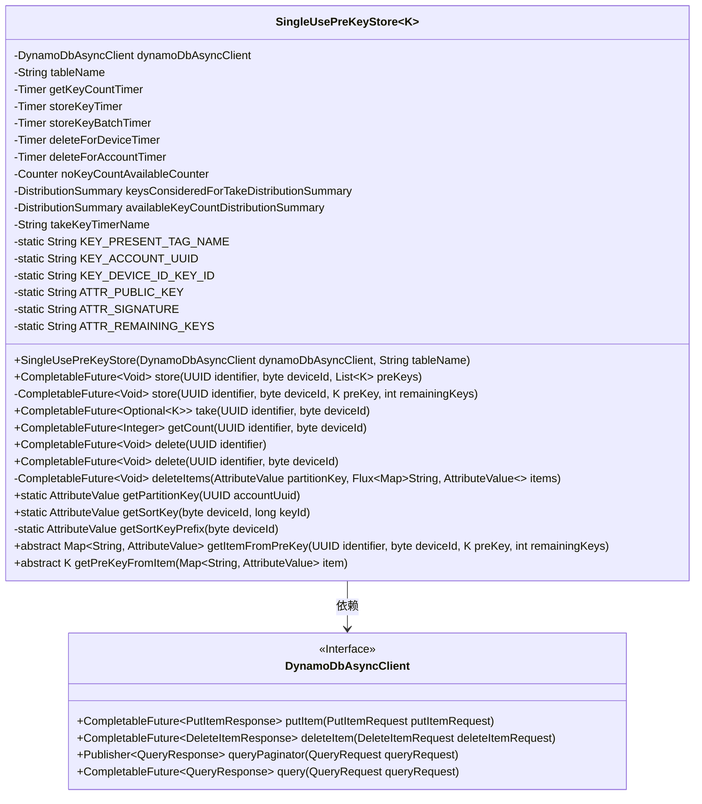

# 基础信息

|      |      |
|------|------|
| 名称 | SingleUsePreKeyStore |
| 编码语言 | .java |
| 代码路径 | Signal-Server/service/src/main/java/org/whispersystems/textsecuregcm/storage/SingleUsePreKeyStore.java |
| 包名 | org.whispersystems.textsecuregcm.storage |
| 依赖项 | ['org.whispersystems.textsecuregcm.metrics.MetricsUtil.name', 'org.whispersystems.textsecuregcm.storage.AbstractDynamoDbStore.DYNAMO_DB_MAX_BATCH_SIZE', 'io.micrometer.core.instrument.Counter', 'io.micrometer.core.instrument.DistributionSummary', 'io.micrometer.core.instrument.Metrics', 'io.micrometer.core.instrument.Timer', 'java.nio.ByteBuffer', 'java.time.Duration', 'java.util.Comparator', 'java.util.List', 'java.util.Map', 'java.util.Optional', 'java.util.UUID', 'java.util.concurrent.CompletableFuture', 'java.util.concurrent.atomic.AtomicInteger', 'org.whispersystems.textsecuregcm.entities.PreKey', 'org.whispersystems.textsecuregcm.util.AttributeValues', 'org.whispersystems.textsecuregcm.util.Util', 'reactor.core.publisher.Flux', 'reactor.core.publisher.Mono', 'software.amazon.awssdk.services.dynamodb.DynamoDbAsyncClient', 'software.amazon.awssdk.services.dynamodb.model.AttributeValue', 'software.amazon.awssdk.services.dynamodb.model.DeleteItemRequest', 'software.amazon.awssdk.services.dynamodb.model.DeleteItemResponse', 'software.amazon.awssdk.services.dynamodb.model.PutItemRequest', 'software.amazon.awssdk.services.dynamodb.model.QueryRequest', 'software.amazon.awssdk.services.dynamodb.model.ReturnValue'] |
| 概述说明 | SingleUsePreKeyStore类管理DynamoDB单次预密钥，支持存储、删除和检索。 |

# 说明

SingleUsePreKeyStore类负责在DynamoDB中管理单次使用的预密钥，主要功能包括存储、删除和检索这些密钥。该类确保预密钥在使用后被及时删除，以维护系统的安全性和效率。

# 类列表 Class Summary

| 名称   | 类型  | 说明 |
|-------|------|-------------|
| SingleUsePreKeyStore | class | SingleUsePreKeyStore类用于管理DynamoDB中的单次使用预密钥，提供存储、删除和检索功能。 |

## 类 SingleUsePreKeyStore

|      |      |
|------|------|
| 访问范围 | public abstract |
| 类型 | class |
| 名称 | SingleUsePreKeyStore |
| 说明 | SingleUsePreKeyStore类用于管理DynamoDB中的单次使用预密钥，提供存储、删除和检索功能。 |

### UML类图

**类图描述**：`SingleUsePreKeyStore` 是一个抽象类，用于管理单次使用的预密钥。它依赖于 `DynamoDbAsyncClient` 来与 DynamoDB 进行异步交互，提供了存储、获取、删除预密钥的方法。类中包含多个计时器和计数器，用于监控和记录操作性能。抽象方法 `getItemFromPreKey` 和 `getPreKeyFromItem` 需要子类实现，用于处理预密钥与 DynamoDB 条目之间的转换。

### 内部方法调用关系图

```mermaid
graph TD
    A["类SingleUsePreKeyStore"]
    B["属性: DynamoDbAsyncClient dynamoDbAsyncClient"]
    C["属性: String tableName"]
    D["属性: Timer getKeyCountTimer"]
    E["属性: Timer storeKeyTimer"]
    F["属性: Timer storeKeyBatchTimer"]
    G["属性: Timer deleteForDeviceTimer"]
    H["属性: Timer deleteForAccountTimer"]
    I["属性: Counter noKeyCountAvailableCounter"]
    J["属性: DistributionSummary keysConsideredForTakeDistributionSummary"]
    K["属性: DistributionSummary availableKeyCountDistributionSummary"]
    L["属性: String takeKeyTimerName"]
    M["属性: String KEY_PRESENT_TAG_NAME"]
    N["属性: String KEY_ACCOUNT_UUID"]
    O["属性: String KEY_DEVICE_ID_KEY_ID"]
    P["属性: String ATTR_PUBLIC_KEY"]
    Q["属性: String ATTR_SIGNATURE"]
    R["属性: String ATTR_REMAINING_KEYS"]
    S["构造方法: SingleUsePreKeyStore(DynamoDbAsyncClient dynamoDbAsyncClient, String tableName)"]
    T["方法: CompletableFuture<Void> store(UUID identifier, byte deviceId, List<K> preKeys)"]
    U["方法: CompletableFuture<Void> store(UUID identifier, byte deviceId, K preKey, int remainingKeys)"]
    V["方法: CompletableFuture<Optional<K>> take(UUID identifier, byte deviceId)"]
    W["方法: CompletableFuture<Integer> getCount(UUID identifier, byte deviceId)"]
    X["方法: CompletableFuture<Void> delete(UUID identifier)"]
    Y["方法: CompletableFuture<Void> delete(UUID identifier, byte deviceId)"]
    Z["方法: CompletableFuture<Void> deleteItems(AttributeValue partitionKey, Flux<Map<String, AttributeValue>> items)"]
    AA["方法: static AttributeValue getPartitionKey(UUID accountUuid)"]
    AB["方法: static AttributeValue getSortKey(byte deviceId, long keyId)"]
    AC["方法: static AttributeValue getSortKeyPrefix(byte deviceId)"]
    AD["抽象方法: Map<String, AttributeValue> getItemFromPreKey(UUID identifier, byte deviceId, K preKey, int remainingKeys)"]
    AE["抽象方法: K getPreKeyFromItem(Map<String, AttributeValue> item)"]

    A --> B
    A --> C
    A --> D
    A --> E
    A --> F
    A --> G
    A --> H
    A --> I
    A --> J
    A --> K
    A --> L
    A --> M
    A --> N
    A --> O
    A --> P
    A --> Q
    A --> R
    A --> S
    A --> T
    A --> U
    A --> V
    A --> W
    A --> X
    A --> Y
    A --> Z
    A --> AA
    A --> AB
    A --> AC
    A --> AD
    A --> AE
```

**描述：**
该流程图展示了`SingleUsePreKeyStore`类的结构和主要方法。该类用于管理一次性预密钥的存储和检索，包含多个属性如`DynamoDbAsyncClient`、`String tableName`和各种计时器和计数器。主要方法包括`store`、`take`、`getCount`、`delete`等，用于存储、检索、计数和删除一次性预密钥。此外，还包含一些辅助方法如`getPartitionKey`、`getSortKey`和抽象方法`getItemFromPreKey`、`getPreKeyFromItem`，用于处理密钥的生成和转换。

### 字段列表 Field List

| 名称  | 类型  | 说明 |
|-------|-------|------|
| tableName | String | 私有字符串变量tableName。 |
| ATTR_SIGNATURE = "S" | String | 定义静态常量ATTR_SIGNATURE，值为"S"。 |
| deleteForAccountTimer = Metrics.timer(name(getClass(), "deleteForAccount")) | Timer | 私有计时器用于记录账户删除操作的执行时间。 |
| deleteForDeviceTimer = Metrics.timer(name(getClass(), "deleteForDevice")) | Timer | 私有计时器用于监控设备删除操作的性能。 |
| dynamoDbAsyncClient | DynamoDbAsyncClient | 私有DynamoDb异步客户端实例。 |
| KEY_ACCOUNT_UUID = "U" | String | 定义常量KEY_ACCOUNT_UUID，值为"U"。 |
| getKeyCountTimer = Metrics.timer(name(getClass(), "getCount")) | Timer | 使用Metrics.timer创建名为getCount的计时器。 |
| KEY_PRESENT_TAG_NAME = "keyPresent" | String | 定义常量KEY_PRESENT_TAG_NAME，值为"keyPresent"。 |
| KEY_DEVICE_ID_KEY_ID = "DK" | String | 定义静态常量KEY_DEVICE_ID_KEY_ID，值为"DK"。 |
| noKeyCountAvailableCounter = Metrics.counter(name(getClass(), "noKeyCountAvailable")) | Counter | 定义私有计数器变量noKeyCountAvailableCounter。 |
| ATTR_REMAINING_KEYS = "R" | String | 定义静态常量ATTR_REMAINING_KEYS，值为"R"。 |
| storeKeyBatchTimer = Metrics.timer(name(getClass(), "storeKeyBatch")) | Timer | 定义并初始化了一个名为storeKeyBatchTimer的私有定时器。 |
| takeKeyTimerName = name(getClass(), "takeKey") | String | 类中定义了一个私有常量字符串，用于获取计时器名称。 |
| availableKeyCountDistributionSummary = DistributionSummary      .builder(name(getClass(), "availableKeyCount"))      .publishPercentiles(0.5, 0.75, 0.95, 0.99, 0.999)      .distributionStatisticExpiry(Duration.ofMinutes(10))      .register(Metrics.globalRegistry) | DistributionSummary | 创建可用密钥计数分布摘要，发布百分位数，设置统计过期时间为10分钟。 |
| keysConsideredForTakeDistributionSummary = DistributionSummary      .builder(name(getClass(), "keysConsideredForTake"))      .publishPercentiles(0.5, 0.75, 0.95, 0.99, 0.999)      .distributionStatisticExpiry(Duration.ofMinutes(10))      .register(Metrics.globalRegistry) | DistributionSummary | 创建名为"keysConsideredForTake"的分布统计对象，发布百分位数，有效期10分钟。 |
| storeKeyTimer = Metrics.timer(name(getClass(), "storeKey")) | Timer | 定义私有定时器storeKeyTimer，用于度量存储键操作的耗时。 |
| ATTR_PUBLIC_KEY = "P" | String | 静态常量ATTR_PUBLIC_KEY赋值为"P"。 |

### 方法列表 Method List

| 名称  | 类型  | 说明 |
|-------|-------|------|
| deleteItems | CompletableFuture<Void> | 异步删除DynamoDB表中指定分区键的多个项目。 |
| getPartitionKey | AttributeValue | 静态方法`getPartitionKey`通过UUID生成分区键。 |
| store | CompletableFuture<Void> | 异步存储UUID、设备ID、预密钥及剩余密钥，使用DynamoDB并计时。 |
| delete | CompletableFuture<Void> | 异步删除指定UUID和设备ID的DynamoDB条目并计时。 |
| take | CompletableFuture<Optional<K>> | 异步查询并删除DynamoDB表项，返回处理结果。 |
| delete | CompletableFuture<Void> | 删除指定UUID的DynamoDB记录并计时。 |
| getItemFromPreKey | Map<String, AttributeValue> | 该方法通过标识符、设备ID和预密钥获取项目，并返回属性值映射。 |
| getSortKey | AttributeValue | 该方法生成排序键，结合设备ID和键ID，返回字节缓冲区的属性值。 |
| getSortKeyPrefix | AttributeValue | 该方法根据设备ID生成排序键前缀，使用ByteBuffer处理并返回AttributeValue对象。 |
| store | CompletableFuture<Void> | 异步存储UUID、设备ID和预密钥列表，排序后分批存储并计时。 |
| getCount | CompletableFuture<Integer> | 异步查询DynamoDB表，根据UUID和设备ID获取剩余密钥数量，处理响应并记录指标。 |
| getPreKeyFromItem | K | 从映射项中提取预键的受保护抽象方法。 |

