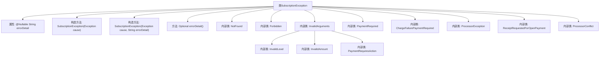

# 基础信息

|      |      |
|------|------|
| 名称 | SubscriptionException |
| 编码语言 | .java |
| 代码路径 | Signal-Server/service/src/main/java/org/whispersystems/textsecuregcm/storage/SubscriptionException.java |
| 包名 | org.whispersystems.textsecuregcm.storage |
| 依赖项 | ['java.util.Optional', 'javax.annotation.Nullable', 'org.whispersystems.textsecuregcm.subscriptions.ChargeFailure', 'org.whispersystems.textsecuregcm.subscriptions.PaymentProvider'] |
| 概述说明 | SubscriptionException及其子类处理订阅错误，包含错误详情和多种特定异常。 |

# 说明

SubscriptionException及其子类专门用于处理与订阅相关的错误。这些异常类提供了详细的错误信息，帮助开发者识别和解决订阅过程中出现的问题。通过多种特定的异常类型，SubscriptionException能够精确地捕捉和处理不同类型的订阅错误，确保系统在面对订阅相关问题时能够进行有效的错误管理和恢复。

# 类列表 Class Summary

| 名称   | 类型  | 说明 |
|-------|------|-------------|
| SubscriptionException | class | SubscriptionException及其子类处理订阅相关错误，包含错误详情和多种特定异常类型。 |

## 类 SubscriptionException

|      |      |
|------|------|
| 访问范围 | public |
| 类型 | class |
| 名称 | SubscriptionException |
| 说明 | SubscriptionException及其子类处理订阅相关错误，包含错误详情和多种特定异常类型。 |

### UML类图

```mermaid
classDiagram
    class SubscriptionException {
        -String errorDetail
        +SubscriptionException(Exception cause)
        +SubscriptionException(Exception cause, String errorDetail)
        +Optional~String~ errorDetail()
    }

    class NotFound {
        +NotFound()
        +NotFound(Exception cause)
    }

    class Forbidden {
        +Forbidden(String message)
    }

    class InvalidArguments {
        +InvalidArguments(String message, Exception cause)
        +InvalidArguments(String message)
    }

    class InvalidLevel {
        +InvalidLevel()
    }

    class InvalidAmount {
        -String errorCode
        +InvalidAmount(String errorCode)
        +String getErrorCode()
    }

    class PaymentRequiresAction {
        +PaymentRequiresAction(String message)
        +PaymentRequiresAction()
    }

    class PaymentRequired {
        +PaymentRequired()
        +PaymentRequired(String message)
    }

    class ChargeFailurePaymentRequired {
        -ChargeFailure chargeFailure
        +ChargeFailurePaymentRequired(ChargeFailure chargeFailure)
        +ChargeFailure getChargeFailure()
    }

    class ProcessorException {
        -PaymentProvider processor
        -ChargeFailure chargeFailure
        +ProcessorException(PaymentProvider processor, ChargeFailure chargeFailure)
        +PaymentProvider getProcessor()
        +ChargeFailure getChargeFailure()
    }

    class ReceiptRequestedForOpenPayment {
        +ReceiptRequestedForOpenPayment()
    }

    class ProcessorConflict {
        +ProcessorConflict()
        +ProcessorConflict(String message)
    }

    SubscriptionException <|-- NotFound
    SubscriptionException <|-- Forbidden
    SubscriptionException <|-- InvalidArguments
    SubscriptionException <|-- PaymentRequired
    SubscriptionException <|-- ChargeFailurePaymentRequired
    SubscriptionException <|-- ProcessorException
    SubscriptionException <|-- ReceiptRequestedForOpenPayment
    SubscriptionException <|-- ProcessorConflict
    InvalidArguments <|-- InvalidLevel
    InvalidArguments <|-- InvalidAmount
    InvalidArguments <|-- PaymentRequiresAction
```

这段代码定义了一个 `SubscriptionException` 类及其多个子类，用于处理不同类型的订阅异常。`SubscriptionException` 是一个自定义异常类，包含一个可选的错误详情字段。其子类如 `NotFound`、`Forbidden`、`InvalidArguments` 等分别表示不同的异常情况，如资源未找到、权限不足、参数无效等。每个子类通过构造函数传递不同的参数来初始化异常对象。代码结构清晰，层次分明，便于扩展和维护。

### 内部方法调用关系图

这段代码定义了一个名为 `SubscriptionException` 的异常类及其多个内部类。`SubscriptionException` 类包含一个可空的 `errorDetail` 属性和两个构造方法，分别用于处理异常原因和错误详情。内部类如 `NotFound`、`Forbidden`、`InvalidArguments` 等继承自 `SubscriptionException`，并各自定义了不同的构造方法和属性，用于处理不同类型的订阅异常。这些内部类通过继承和构造方法的调用，实现了对不同异常情况的处理。

### 字段列表 Field List

| 名称  | 类型  | 说明 |
|-------|-------|------|
| errorDetail | String | 私有可空字符串变量，用于存储错误详情。 |

### 方法列表 Method List

| 名称  | 类型  | 说明 |
|-------|-------|------|
| errorDetail | Optional<String> | 返回可能包含错误详情的可选字符串。 |

