# 基础信息

|      |      |
|------|------|
| 名称 | SubscriptionManager |
| 编码语言 | .java |
| 代码路径 | Signal-Server/service/src/main/java/org/whispersystems/textsecuregcm/storage/SubscriptionManager.java |
| 包名 | org.whispersystems.textsecuregcm.storage |
| 依赖项 | ['com.stripe.exception.StripeException', 'java.time.Instant', 'java.util.EnumMap', 'java.util.List', 'java.util.Locale', 'java.util.Objects', 'java.util.Optional', 'java.util.concurrent.CompletableFuture', 'java.util.function.BiFunction', 'java.util.function.Function', 'java.util.stream.Collectors', 'javax.annotation.Nonnull', 'org.signal.libsignal.zkgroup.InvalidInputException', 'org.signal.libsignal.zkgroup.VerificationFailedException', 'org.signal.libsignal.zkgroup.receipts.ReceiptCredentialRequest', 'org.signal.libsignal.zkgroup.receipts.ReceiptCredentialResponse', 'org.signal.libsignal.zkgroup.receipts.ServerZkReceiptOperations', 'org.whispersystems.textsecuregcm.controllers.SubscriptionController', 'org.whispersystems.textsecuregcm.subscriptions.AppleAppStoreManager', 'org.whispersystems.textsecuregcm.subscriptions.CustomerAwareSubscriptionPaymentProcessor', 'org.whispersystems.textsecuregcm.subscriptions.GooglePlayBillingManager', 'org.whispersystems.textsecuregcm.subscriptions.PaymentProvider', 'org.whispersystems.textsecuregcm.subscriptions.ProcessorCustomer', 'org.whispersystems.textsecuregcm.subscriptions.SubscriptionInformation', 'org.whispersystems.textsecuregcm.subscriptions.SubscriptionPaymentProcessor', 'org.whispersystems.textsecuregcm.util.ExceptionUtils', 'org.whispersystems.textsecuregcm.util.Util', 'org.whispersystems.textsecuregcm.util.ua.ClientPlatform'] |
| 概述说明 | SubscriptionManager负责订阅的支付、取消、更新及信息获取。 |

# 说明

SubscriptionManager是一个用于管理订阅的模块，主要功能包括处理支付、取消订阅、更新订阅信息以及获取订阅相关的详细信息。它通过集中管理订阅生命周期中的各种操作，确保用户能够方便地进行订阅的维护和查询。

# 类列表 Class Summary

| 名称   | 类型  | 说明 |
|-------|------|-------------|
| SubscriptionManager | class | SubscriptionManager管理订阅，处理支付、取消、更新及获取订阅信息。 |

## 类 SubscriptionManager

|      |      |
|------|------|
| 访问范围 | public |
| 类型 | class |
| 名称 | SubscriptionManager |
| 说明 | SubscriptionManager管理订阅，处理支付、取消、更新及获取订阅信息。 |

### UML类图

```mermaid
classDiagram
    class SubscriptionManager {
        -Subscriptions subscriptions
        -EnumMap~PaymentProvider, SubscriptionPaymentProcessor~ processors
        -ServerZkReceiptOperations zkReceiptOperations
        -IssuedReceiptsManager issuedReceiptsManager
        +SubscriptionManager(Subscriptions, List~SubscriptionPaymentProcessor~, ServerZkReceiptOperations, IssuedReceiptsManager)
        +CompletableFuture~Void~ deleteSubscriber(SubscriberCredentials)
        +CompletableFuture~Void~ updateSubscriber(SubscriberCredentials)
        +CompletableFuture~Optional~SubscriptionInformation~~ getSubscriptionInformation(SubscriberCredentials)
        +CompletableFuture~Subscriptions.Record~ getSubscriber(SubscriberCredentials)
        +CompletableFuture~ReceiptResult~ createReceiptCredentials(SubscriberCredentials, SubscriptionController.GetReceiptCredentialsRequest, Function~CustomerAwareSubscriptionPaymentProcessor.ReceiptItem, Instant~)
        +CompletableFuture~R~ addPaymentMethodToCustomer(SubscriberCredentials, T, ClientPlatform, BiFunction~T, String, CompletableFuture~R~~)
        +CompletableFuture~Void~ updateSubscriptionLevelForCustomer(SubscriberCredentials, Subscriptions.Record, CustomerAwareSubscriptionPaymentProcessor, long, String, String, String, LevelTransitionValidator)
        +CompletableFuture~Long~ updatePlayBillingPurchaseToken(SubscriberCredentials, GooglePlayBillingManager, String)
        +CompletableFuture~Long~ updateAppStoreTransactionId(SubscriberCredentials, AppleAppStoreManager, String)
        -SubscriptionPaymentProcessor getProcessor(PaymentProvider)
    }

    class Subscriptions {
        <<Interface>>
        +CompletableFuture~GetResult~ get(String, String)
        +CompletableFuture~Void~ setCanceledAt(String, Instant)
        +CompletableFuture~Record~ create(String, String, Instant)
        +CompletableFuture~Void~ accessedAt(String, Instant)
        +CompletableFuture~Void~ subscriptionLevelChanged(String, Instant, long, String)
        +CompletableFuture~Void~ subscriptionCreated(String, String, Instant, long)
        +CompletableFuture~Void~ setIapPurchase(Record, ProcessorCustomer, String, long, Instant)
    }

    class SubscriptionPaymentProcessor {
        <<Interface>>
        +PaymentProvider getProvider()
        +CompletableFuture~Void~ cancelAllActiveSubscriptions(String)
        +CompletableFuture~Optional~SubscriptionInformation~~ getSubscriptionInformation(String)
        +CompletableFuture~CustomerAwareSubscriptionPaymentProcessor.ReceiptItem~ getReceiptItem(String)
    }

    class CustomerAwareSubscriptionPaymentProcessor {
        <<Interface>>
        +CompletableFuture~String~ createCustomer(String, ClientPlatform)
        +CompletableFuture~Void~ updateSubscription(String, String, long, String)
        +CompletableFuture~CustomerAwareSubscriptionPaymentProcessor.LevelAndCurrency~ getLevelAndCurrencyForSubscription(String)
    }

    class IssuedReceiptsManager {
        <<Interface>>
        +CompletableFuture~Void~ recordIssuance(String, PaymentProvider, ReceiptCredentialRequest, Instant)
    }

    class ServerZkReceiptOperations {
        <<Interface>>
        +ReceiptCredentialResponse issueReceiptCredential(ReceiptCredentialRequest, long, long)
    }

    class GooglePlayBillingManager {
        <<Interface>>
        +CompletableFuture~Void~ cancelAllActiveSubscriptions(String)
        +CompletableFuture~ValidatedToken~ validateToken(String)
    }

    class AppleAppStoreManager {
        <<Interface>>
        +CompletableFuture~Long~ validateTransaction(String)
    }

    class SubscriberCredentials {
        +String subscriberUser()
        +String hmac()
        +Instant now()
    }

    class ProcessorCustomer {
        +String customerId()
        +PaymentProvider processor()
    }

    class ReceiptResult {
        +ReceiptCredentialResponse receiptCredentialResponse
        +CustomerAwareSubscriptionPaymentProcessor.ReceiptItem receiptItem
        +PaymentProvider paymentProvider
    }

    class ValidatedToken {
        +long getLevel()
        +CompletableFuture~Void~ acknowledgePurchase()
    }

    class LevelTransitionValidator {
        <<Interface>>
        +boolean isTransitionValid(long, long)
    }

    SubscriptionManager --> Subscriptions : 依赖
    SubscriptionManager --> SubscriptionPaymentProcessor : 依赖
    SubscriptionManager --> CustomerAwareSubscriptionPaymentProcessor : 依赖
    SubscriptionManager --> IssuedReceiptsManager : 依赖
    SubscriptionManager --> ServerZkReceiptOperations : 依赖
    SubscriptionManager --> GooglePlayBillingManager : 依赖
    SubscriptionManager --> AppleAppStoreManager : 依赖
    SubscriptionManager --> SubscriberCredentials : 依赖
    SubscriptionManager --> ProcessorCustomer : 依赖
    SubscriptionManager --> ReceiptResult : 依赖
    SubscriptionManager --> ValidatedToken : 依赖
    SubscriptionManager --> LevelTransitionValidator : 依赖
    CustomerAwareSubscriptionPaymentProcessor --|> SubscriptionPaymentProcessor : 实现
```

### 描述
`SubscriptionManager` 是一个管理订阅的核心类，负责处理订阅的创建、更新、取消等操作。它依赖于多个接口和类，如 `Subscriptions`、`SubscriptionPaymentProcessor`、`CustomerAwareSubscriptionPaymentProcessor` 等，来完成与支付提供商的交互、订阅信息的存储和验证。`SubscriptionManager` 提供了多种方法，如 `deleteSubscriber`、`updateSubscriber`、`getSubscriptionInformation` 等，用于处理订阅相关的业务逻辑。

### 内部方法调用关系图

```mermaid
graph TD
    A["类SubscriptionManager"]
    B["属性: Subscriptions subscriptions"]
    C["属性: EnumMap<PaymentProvider, SubscriptionPaymentProcessor> processors"]
    D["属性: ServerZkReceiptOperations zkReceiptOperations"]
    E["属性: IssuedReceiptsManager issuedReceiptsManager"]
    F["构造方法: SubscriptionManager(Subscriptions, List<SubscriptionPaymentProcessor>, ServerZkReceiptOperations, IssuedReceiptsManager)"]
    G["方法: CompletableFuture<Void> deleteSubscriber(SubscriberCredentials)"]
    H["方法: CompletableFuture<Void> updateSubscriber(SubscriberCredentials)"]
    I["方法: CompletableFuture<Optional<SubscriptionInformation>> getSubscriptionInformation(SubscriberCredentials)"]
    J["方法: CompletableFuture<Subscriptions.Record> getSubscriber(SubscriberCredentials)"]
    K["方法: CompletableFuture<ReceiptResult> createReceiptCredentials(SubscriberCredentials, GetReceiptCredentialsRequest, Function<ReceiptItem, Instant>)"]
    L["方法: <T extends CustomerAwareSubscriptionPaymentProcessor, R> CompletableFuture<R> addPaymentMethodToCustomer(SubscriberCredentials, T, ClientPlatform, BiFunction<T, String, CompletableFuture<R>>)"]
    M["方法: CompletableFuture<Void> updateSubscriptionLevelForCustomer(SubscriberCredentials, Subscriptions.Record, CustomerAwareSubscriptionPaymentProcessor, long, String, String, String, LevelTransitionValidator)"]
    N["方法: CompletableFuture<Long> updatePlayBillingPurchaseToken(SubscriberCredentials, GooglePlayBillingManager, String)"]
    O["方法: CompletableFuture<Long> updateAppStoreTransactionId(SubscriberCredentials, AppleAppStoreManager, String)"]
    P["方法: SubscriptionPaymentProcessor getProcessor(PaymentProvider)"]

    A --> B
    A --> C
    A --> D
    A --> E
    A --> F
    A --> G
    A --> H
    A --> I
    A --> J
    A --> K
    A --> L
    A --> M
    A --> N
    A --> O
    A --> P
```

**描述：**  
`SubscriptionManager` 类负责管理用户的订阅信息，包括订阅的创建、更新、取消、支付方式的添加以及订阅级别的更新等操作。该类通过多个异步方法处理与订阅相关的各种操作，确保订阅信息与支付处理器之间的同步。它还提供了处理来自不同支付平台（如Google Play和Apple App Store）的订阅信息的功能，并通过验证和记录订阅凭证来确保订阅的合法性。

### 字段列表 Field List

| 名称  | 类型  | 说明 |
|-------|-------|------|
| subscriptions | Subscriptions | 私有且不可变的订阅对象实例。 |
| issuedReceiptsManager | IssuedReceiptsManager | 私有且不可变的票据管理器实例。 |
| processors | EnumMap<PaymentProvider, SubscriptionPaymentProcessor> | 私有枚举映射存储支付处理器实例。 |
| zkReceiptOperations | ServerZkReceiptOperations | 私有成员变量zkReceiptOperations，类型为ServerZkReceiptOperations。 |

### 方法列表 Method List

| 名称  | 类型  | 说明 |
|-------|-------|------|
| getProcessor | SubscriptionPaymentProcessor | 获取指定支付提供商的订阅支付处理器。 |
| deleteSubscriber | CompletableFuture<Void> | 删除订阅者并取消其所有活动订阅，处理异常情况。 |
| updateAppStoreTransactionId | CompletableFuture<Long> | 更新应用商店交易ID，验证交易并设置订阅信息。 |
| getSubscriptionInformation | CompletableFuture<Optional<SubscriptionInformation>> | 获取订阅信息的方法，根据用户凭证查询并返回订阅详情。 |
| createReceiptCredentials | CompletableFuture<ReceiptResult> | 创建收据凭证方法，处理订阅凭证和请求，验证并返回收据结果。 |
| updateSubscriptionLevelForCustomer | CompletableFuture<Void> | 更新或创建客户订阅级别，验证级别和货币，处理异常并记录订阅ID。 |
| addPaymentMethodToCustomer | CompletableFuture<R> | 方法为订阅者添加支付方式，处理客户信息和支付处理器匹配。 |
| updateSubscriber | CompletableFuture<Void> | 更新订阅者信息，处理密码不匹配、未存储及已存在情况。 |
| getSubscriber | CompletableFuture<Subscriptions.Record> | 获取订阅者信息，处理密码不匹配和未存储异常，返回记录。 |
| updatePlayBillingPurchaseToken | CompletableFuture<Long> | 方法更新Google Play购买令牌，验证并存储新令牌，确保与现有订阅无冲突。 |

