# 基础信息

|      |      |
|------|------|
| 名称 | Subscriptions |
| 编码语言 | .java |
| 代码路径 | Signal-Server/service/src/main/java/org/whispersystems/textsecuregcm/storage/Subscriptions.java |
| 包名 | org.whispersystems.textsecuregcm.storage |
| 依赖项 | ['org.whispersystems.textsecuregcm.util.AttributeValues.b', 'org.whispersystems.textsecuregcm.util.AttributeValues.n', 'org.whispersystems.textsecuregcm.util.AttributeValues.s', 'com.google.common.annotations.VisibleForTesting', 'com.google.common.base.Throwables', 'jakarta.ws.rs.ClientErrorException', 'jakarta.ws.rs.core.Response', 'java.nio.charset.StandardCharsets', 'java.security.MessageDigest', 'java.time.Instant', 'java.util.Map', 'java.util.Objects', 'java.util.Optional', 'java.util.concurrent.CompletableFuture', 'java.util.concurrent.CompletionException', 'javax.annotation.Nonnull', 'javax.annotation.Nullable', 'org.slf4j.Logger', 'org.slf4j.LoggerFactory', 'org.whispersystems.textsecuregcm.subscriptions.PaymentProvider', 'org.whispersystems.textsecuregcm.subscriptions.ProcessorCustomer', 'org.whispersystems.textsecuregcm.util.Pair', 'org.whispersystems.textsecuregcm.util.Util', 'software.amazon.awssdk.services.dynamodb.DynamoDbAsyncClient', 'software.amazon.awssdk.services.dynamodb.model.AttributeValue', 'software.amazon.awssdk.services.dynamodb.model.ConditionalCheckFailedException', 'software.amazon.awssdk.services.dynamodb.model.GetItemRequest', 'software.amazon.awssdk.services.dynamodb.model.GetItemResponse', 'software.amazon.awssdk.services.dynamodb.model.QueryRequest', 'software.amazon.awssdk.services.dynamodb.model.ReturnValue', 'software.amazon.awssdk.services.dynamodb.model.UpdateItemRequest'] |
| 概述说明 | Subscriptions类管理用户订阅信息，支持增删改查操作。 |

# 说明

Subscriptions类用于管理用户的订阅信息，包含用户、密码、订阅ID和创建时间等关键字段。该类支持多种操作，包括创建新的订阅、更新现有订阅信息、查询订阅详情以及取消订阅。通过这些功能，Subscriptions类能够有效地管理和维护用户的订阅状态，确保数据的一致性和完整性。

# 类列表 Class Summary

| 名称   | 类型  | 说明 |
|-------|------|-------------|
| Subscriptions | class | Subscriptions类管理用户订阅信息，包含用户、密码、订阅ID、创建时间等字段，支持创建、更新、查询和取消订阅操作。 |


## 类 Subscriptions

|      |      |
|------|------|
| 访问范围 | public |
| 类型 | class |
| 名称 | Subscriptions |
| 说明 | Subscriptions类管理用户订阅信息，包含用户、密码、订阅ID、创建时间等字段，支持创建、更新、查询和取消订阅操作。 |


### UML类图

```mermaid
classDiagram
    class Subscriptions {
        -Logger logger
        -int USER_LENGTH
        -byte[] EMPTY_PROCESSOR
        +String KEY_USER
        +String KEY_PASSWORD
        +String KEY_PROCESSOR_ID_CUSTOMER_ID
        +String KEY_CREATED_AT
        +String KEY_SUBSCRIPTION_ID
        +String KEY_SUBSCRIPTION_CREATED_AT
        +String KEY_SUBSCRIPTION_LEVEL
        +String KEY_SUBSCRIPTION_LEVEL_CHANGED_AT
        +String KEY_ACCESSED_AT
        +String KEY_CANCELED_AT
        +String KEY_CURRENT_PERIOD_ENDS_AT
        +String INDEX_NAME
        -String table
        -DynamoDbAsyncClient client
        +Subscriptions(String table, DynamoDbAsyncClient client)
        +CompletableFuture~byte[]~ getSubscriberUserByProcessorCustomer(ProcessorCustomer processorCustomer)
        +CompletableFuture~GetResult~ get(byte[] user, byte[] hmac)
        +CompletableFuture~Record~ create(byte[] user, byte[] password, Instant createdAt)
        +CompletableFuture~Record~ setProcessorAndCustomerId(Record userRecord, ProcessorCustomer activeProcessorCustomer, Instant updatedAt)
        +CompletableFuture~Void~ setIapPurchase(Record record, ProcessorCustomer processorCustomer, String subscriptionId, long level, Instant updatedAt)
        +CompletableFuture~Void~ accessedAt(byte[] user, Instant accessedAt)
        +CompletableFuture~Void~ setCanceledAt(byte[] user, Instant canceledAt)
        +CompletableFuture~Void~ subscriptionCreated(byte[] user, String subscriptionId, Instant subscriptionCreatedAt, long level)
        +CompletableFuture~Void~ subscriptionLevelChanged(byte[] user, Instant subscriptionLevelChangedAt, long level, String subscriptionId)
        -static byte[] checkUserLength(byte[] user)
    }

    class Record {
        +byte[] user
        +byte[] password
        +Instant createdAt
        +ProcessorCustomer processorCustomer
        +String subscriptionId
        +Instant subscriptionCreatedAt
        +Long subscriptionLevel
        +Instant subscriptionLevelChangedAt
        +Instant accessedAt
        +Instant canceledAt
        +Instant currentPeriodEndsAt
        -Record(byte[] user, byte[] password, Instant createdAt)
        +static Record from(byte[] user, Map~String, AttributeValue~ item)
        +Optional~ProcessorCustomer~ getProcessorCustomer()
        -static Pair~PaymentProvider, String~ getProcessorAndCustomer(Map~String, AttributeValue~ item)
        -static String getString(Map~String, AttributeValue~ item, String key)
        -static Long getLong(Map~String, AttributeValue~ item, String key)
        -static Instant getInstant(Map~String, AttributeValue~ item, String key)
    }

    class GetResult {
        +static GetResult NOT_STORED
        +static GetResult PASSWORD_MISMATCH
        +Type type
        +Record record
        -GetResult(Type type, Record record)
        +static GetResult found(Record record)
        <<enum>> Type {
            NOT_STORED
            PASSWORD_MISMATCH
            FOUND
        }
    }

    class ProcessorCustomer {
        +String customerId
        +PaymentProvider processor
        +ProcessorCustomer(String customerId, PaymentProvider processor)
        +byte[] toDynamoBytes()
    }

    class PaymentProvider {
        +static PaymentProvider forId(byte processorId)
    }

    Subscriptions --> Record : 使用
    Subscriptions --> GetResult : 使用
    Subscriptions --> ProcessorCustomer : 使用
    Record --> ProcessorCustomer : 使用
    Record --> PaymentProvider : 使用
    GetResult --> Record : 使用
```

### 描述
该代码定义了一个`Subscriptions`类，用于管理与订阅相关的操作。`Subscriptions`类依赖于`DynamoDbAsyncClient`与DynamoDB进行交互，并包含多个方法用于创建、查询和更新订阅记录。`Record`类表示单个订阅记录，包含用户信息、订阅状态等字段。`GetResult`类用于封装查询结果，包含类型和记录信息。`ProcessorCustomer`类表示处理器与客户ID的组合，`PaymentProvider`类用于处理支付提供商的逻辑。整体设计通过异步操作与DynamoDB进行交互，确保高效处理订阅相关业务。


### 内部方法调用关系图

```mermaid
graph TD
    A["类Subscriptions"]
    B["静态常量: Logger logger"]
    C["静态常量: int USER_LENGTH"]
    D["静态常量: byte[] EMPTY_PROCESSOR"]
    E["静态常量: String KEY_USER"]
    F["静态常量: String KEY_PASSWORD"]
    G["静态常量: String KEY_PROCESSOR_ID_CUSTOMER_ID"]
    H["静态常量: String KEY_CREATED_AT"]
    I["静态常量: String KEY_SUBSCRIPTION_ID"]
    J["静态常量: String KEY_SUBSCRIPTION_CREATED_AT"]
    K["静态常量: String KEY_SUBSCRIPTION_LEVEL"]
    L["静态常量: String KEY_SUBSCRIPTION_LEVEL_CHANGED_AT"]
    M["静态常量: String KEY_ACCESSED_AT"]
    N["静态常量: String KEY_CANCELED_AT"]
    O["静态常量: String KEY_CURRENT_PERIOD_ENDS_AT"]
    P["静态常量: String INDEX_NAME"]
    Q["内部类: Record"]
    R["属性: byte[] user"]
    S["属性: byte[] password"]
    T["属性: Instant createdAt"]
    U["属性: ProcessorCustomer processorCustomer"]
    V["属性: String subscriptionId"]
    W["属性: Instant subscriptionCreatedAt"]
    X["属性: Long subscriptionLevel"]
    Y["属性: Instant subscriptionLevelChangedAt"]
    Z["属性: Instant accessedAt"]
    AA["属性: Instant canceledAt"]
    AB["属性: Instant currentPeriodEndsAt"]
    AC["构造方法: Record(byte[] user, byte[] password, Instant createdAt)"]
    AD["静态方法: Record from(byte[] user, Map<String, AttributeValue> item)"]
    AE["方法: Optional<ProcessorCustomer> getProcessorCustomer()"]
    AF["静态方法: Pair<PaymentProvider, String> getProcessorAndCustomer(Map<String, AttributeValue> item)"]
    AG["静态方法: String getString(Map<String, AttributeValue> item, String key)"]
    AH["静态方法: Long getLong(Map<String, AttributeValue> item, String key)"]
    AI["静态方法: Instant getInstant(Map<String, AttributeValue> item, String key)"]
    AJ["属性: String table"]
    AK["属性: DynamoDbAsyncClient client"]
    AL["构造方法: Subscriptions(String table, DynamoDbAsyncClient client)"]
    AM["方法: CompletableFuture<byte[]> getSubscriberUserByProcessorCustomer(ProcessorCustomer processorCustomer)"]
    AN["内部类: GetResult"]
    AO["静态常量: GetResult NOT_STORED"]
    AP["静态常量: GetResult PASSWORD_MISMATCH"]
    AQ["枚举: Type"]
    AR["属性: Type type"]
    AS["属性: Record record"]
    AT["构造方法: GetResult(Type type, Record record)"]
    AU["静态方法: GetResult found(Record record)"]
    AV["方法: CompletableFuture<GetResult> get(byte[] user, byte[] hmac)"]
    AW["方法: CompletableFuture<GetItemResponse> getUser(byte[] user)"]
    AX["方法: CompletableFuture<Record> create(byte[] user, byte[] password, Instant createdAt)"]
    AY["方法: CompletableFuture<Record> setProcessorAndCustomerId(Record userRecord, ProcessorCustomer activeProcessorCustomer, Instant updatedAt)"]
    AZ["方法: CompletableFuture<Void> setIapPurchase(Record record, ProcessorCustomer processorCustomer, String subscriptionId, long level, Instant updatedAt)"]
    BA["方法: CompletableFuture<Void> accessedAt(byte[] user, Instant accessedAt)"]
    BB["方法: CompletableFuture<Void> setCanceledAt(byte[] user, Instant canceledAt)"]
    BC["方法: CompletableFuture<Void> subscriptionCreated(byte[] user, String subscriptionId, Instant subscriptionCreatedAt, long level)"]
    BD["方法: CompletableFuture<Void> subscriptionLevelChanged(byte[] user, Instant subscriptionLevelChangedAt, long level, String subscriptionId)"]
    BE["静态方法: byte[] checkUserLength(byte[] user)"]

    A --> B
    A --> C
    A --> D
    A --> E
    A --> F
    A --> G
    A --> H
    A --> I
    A --> J
    A --> K
    A --> L
    A --> M
    A --> N
    A --> O
    A --> P
    A --> Q
    Q --> R
    Q --> S
    Q --> T
    Q --> U
    Q --> V
    Q --> W
    Q --> X
    Q --> Y
    Q --> Z
    Q --> AA
    Q --> AB
    Q --> AC
    Q --> AD
    Q --> AE
    Q --> AF
    Q --> AG
    Q --> AH
    Q --> AI
    A --> AJ
    A --> AK
    A --> AL
    A --> AM
    A --> AN
    AN --> AO
    AN --> AP
    AN --> AQ
    AN --> AR
    AN --> AS
    AN --> AT
    AN --> AU
    A --> AV
    A --> AW
    A --> AX
    A --> AY
    A --> AZ
    A --> BA
    A --> BB
    A --> BC
    A --> BD
    A --> BE
```



这段代码定义了一个名为`Subscriptions`的类，用于管理与用户订阅相关的数据操作。该类包含多个静态常量、内部类`Record`和`GetResult`，以及多个方法用于处理用户订阅的创建、更新、查询等操作。`Record`类用于表示订阅记录，包含用户信息、密码、创建时间等属性。`GetResult`类用于表示查询结果，包含类型和记录信息。`Subscriptions`类通过`DynamoDbAsyncClient`与DynamoDB进行交互，提供了丰富的API来处理订阅数据的增删改查操作。

### 字段列表 Field List

| 名称  | 类型  | 说明 |
|-------|-------|------|
| KEY_PASSWORD = "P" | String | 常量KEY_PASSWORD值为"P"。 |
| table | String | 私有不可变的字符串变量`table`。 |
| KEY_USER = "U" | String | 定义常量KEY_USER，值为"U"。 |
| client | DynamoDbAsyncClient | 私有异步DynamoDB客户端实例。 |
| INDEX_NAME = "pc_to_u" | String | 定义常量字符串"pc_to_u"。 |
| KEY_CREATED_AT = "R" | String | 静态常量KEY_CREATED_AT的值为"R"。 |
| KEY_SUBSCRIPTION_LEVEL_CHANGED_AT = "V" | String | KEY_SUBSCRIPTION_LEVEL_CHANGED_AT常量定义为"V"。 |
| logger = LoggerFactory.getLogger(Subscriptions.class) | Logger | Subscriptions类中定义了私有的静态Logger对象。 |
| USER_LENGTH = 16 | int | 定义常量USER_LENGTH，值为16。 |
| KEY_PROCESSOR_ID_CUSTOMER_ID = "PC" | String | 定义常量KEY_PROCESSOR_ID_CUSTOMER_ID，值为"PC"。 |
| EMPTY_PROCESSOR = new byte[0] | byte[] | 定义空字节数组常量EMPTY_PROCESSOR。 |
| KEY_ACCESSED_AT = "A" | String | 定义常量KEY_ACCESSED_AT，值为"A"。 |
| KEY_SUBSCRIPTION_LEVEL = "L" | String | 定义常量字符串KEY_SUBSCRIPTION_LEVEL，值为"L"。 |
| KEY_CANCELED_AT = "B" | String | 定义常量KEY_CANCELED_AT，值为"B"。 |
| KEY_CURRENT_PERIOD_ENDS_AT = "D" | String | 定义常量KEY_CURRENT_PERIOD_ENDS_AT，值为"D"。 |
| KEY_SUBSCRIPTION_ID = "S" | String | 定义常量KEY_SUBSCRIPTION_ID，值为"S"。 |
| KEY_SUBSCRIPTION_CREATED_AT = "T" | String | 定义常量KEY_SUBSCRIPTION_CREATED_AT，值为"T"。 |

### 方法列表 Method List

| 名称  | 类型  | 说明 |
|-------|-------|------|
| accessedAt | CompletableFuture<Void> | 更新用户访问时间的方法，使用DynamoDB更新表项，返回CompletableFuture<Void>。 |
| checkUserLength | byte[] | 检查用户字节数组长度，不符则抛出异常。 |
| get | CompletableFuture<GetResult> | 异步获取用户数据并验证密码，返回结果状态。 |
| subscriptionLevelChanged | CompletableFuture<Void> | 更新用户订阅信息，包括级别、时间、ID，并移除取消时间。 |
| setProcessorAndCustomerId | CompletableFuture<Record> | 方法设置处理器和客户ID，更新DynamoDB记录并处理异常。 |
| setCanceledAt | CompletableFuture<Void> | 异步方法设置用户取消时间，更新数据库并移除订阅ID。 |
| getUser | CompletableFuture<GetItemResponse> | 方法获取用户数据，检查长度后构建请求并返回结果。 |
| setIapPurchase | CompletableFuture<Void> | 方法更新订阅信息，验证处理器并设置新值，异常处理冲突。 |
| getSubscriberUserByProcessorCustomer | CompletableFuture<byte[]> | 通过处理器客户信息异步获取订阅用户数据，并处理查询结果。 |
| create | CompletableFuture<Record> | 创建用户记录，检查用户长度，更新或插入密码和创建时间，处理异常。 |
| subscriptionCreated | CompletableFuture<Void> | 更新用户订阅信息，设置访问时间、订阅ID、创建时间、订阅等级及变更时间，移除取消时间。 |


