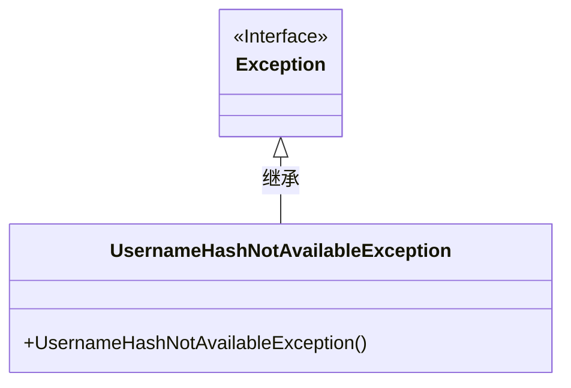
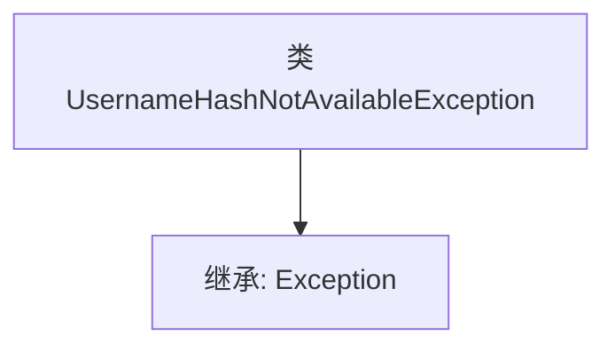

# 基础信息

|      |      |
|------|------|
| 名称 | UsernameHashNotAvailableException |
| 编码语言 | .java |
| 代码路径 | Signal-Server/service/src/main/java/org/whispersystems/textsecuregcm/storage/UsernameHashNotAvailableException.java |
| 包名 | org.whispersystems.textsecuregcm.storage |
| 依赖项 | [] |
| 概述说明 | 自定义异常类用于处理用户名哈希不可用的情况。 |

# 说明

自定义异常类用于表示用户名哈希不可用的情况。该异常类专门处理与用户名哈希相关的错误，帮助开发者在遇到哈希不可用的问题时进行明确的错误捕获和处理。通过定义此类异常，可以提高代码的健壮性和可维护性，确保在哈希操作失败时能够及时响应并提供清晰的错误信息。

# 类列表 Class Summary

| 名称   | 类型  | 说明 |
|-------|------|-------------|
| UsernameHashNotAvailableException | class | 自定义异常类，表示用户名哈希不可用。 |

## 类 UsernameHashNotAvailableException

|      |      |
|------|------|
| 访问范围 | public |
| 类型 | class |
| 名称 | UsernameHashNotAvailableException |
| 说明 | 自定义异常类，表示用户名哈希不可用。 |

### UML类图

这段代码定义了一个名为 `UsernameHashNotAvailableException` 的异常类，它继承自 `Exception` 类。该异常类用于表示当用户名哈希不可用时抛出的异常。类图中展示了 `UsernameHashNotAvailableException` 类与 `Exception` 类之间的继承关系，表明 `UsernameHashNotAvailableException` 是 `Exception` 的子类。这种设计使得该异常可以像其他标准异常一样被捕获和处理。

### 内部方法调用关系图

这段代码定义了一个名为 `UsernameHashNotAvailableException` 的类，它继承自 `Exception` 类。这个类是一个自定义异常类，用于在用户名哈希不可用时抛出异常。由于它继承了 `Exception`，因此具备了所有异常类的基本功能，可以通过 `throw` 语句抛出并在 `try-catch` 块中捕获。这种设计通常用于处理特定的错误情况，增强代码的可读性和可维护性。

### 字段列表 Field List

| 名称  | 类型  | 说明 |
|-------|-------|------|

### 方法列表 Method List

| 名称  | 类型  | 说明 |
|-------|-------|------|

