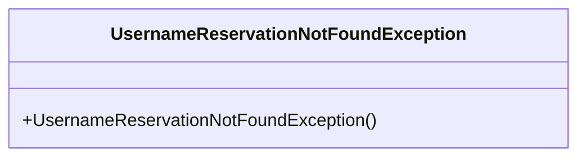
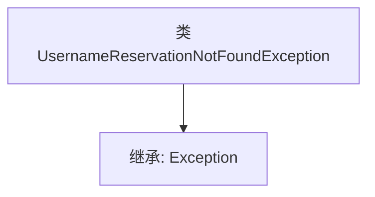

# 基础信息

|      |      |
|------|------|
| 名称 | UsernameReservationNotFoundException |
| 编码语言 | .java |
| 代码路径 | Signal-Server/service/src/main/java/org/whispersystems/textsecuregcm/storage/UsernameReservationNotFoundException.java |
| 包名 | org.whispersystems.textsecuregcm.storage |
| 依赖项 | [] |
| 概述说明 | 自定义异常类用于处理用户名预留未找到的情况。 |

# 说明

自定义异常类专门用于处理用户名预留未找到的情况。当系统在预留用户名列表中查找某个用户名时，如果该用户名不存在，将抛出此异常。该异常类旨在提供明确的错误信息，帮助开发人员快速定位并处理相关问题，确保系统在处理用户名预留时能够准确识别和响应异常情况。

# 类列表 Class Summary

| 名称   | 类型  | 说明 |
|-------|------|-------------|
| UsernameReservationNotFoundException | class | 自定义异常类，用于处理用户名预留未找到的情况。 |

## 类 UsernameReservationNotFoundException

|      |      |
|------|------|
| 访问范围 | public |
| 类型 | class |
| 名称 | UsernameReservationNotFoundException |
| 说明 | 自定义异常类，用于处理用户名预留未找到的情况。 |

### UML类图

`UsernameReservationNotFoundException` 是一个自定义异常类，继承自 `Exception`。它用于在系统中捕获和处理用户名预留未找到的情况。该类通常用于指示在尝试查找或操作用户名预留时，未找到相应的记录。通过继承 `Exception`，它具备了标准异常的所有功能，并可以根据需要进行扩展。

### 内部方法调用关系图

这段代码定义了一个名为 `UsernameReservationNotFoundException` 的类，该类继承自 `Exception`。这个类用于表示在用户名保留过程中未找到相关记录的异常情况。通过继承 `Exception`，该类可以作为一个自定义异常被抛出，以便在程序中处理特定的错误情况。

### 字段列表 Field List

| 名称  | 类型  | 说明 |
|-------|-------|------|

### 方法列表 Method List

| 名称  | 类型  | 说明 |
|-------|-------|------|

