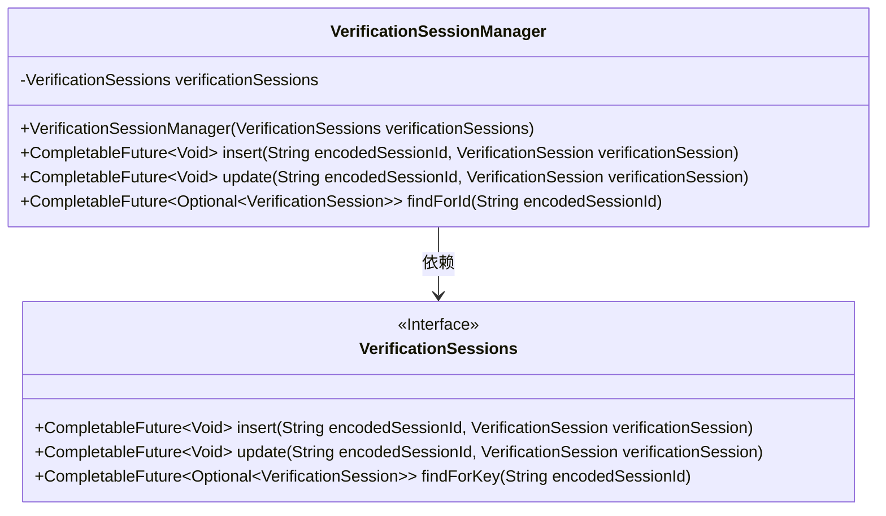
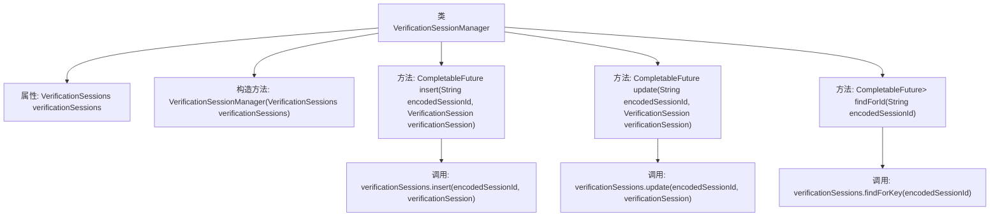

# 基础信息

|      |      |
|------|------|
| 名称 | VerificationSessionManager |
| 编码语言 | .java |
| 代码路径 | Signal-Server/service/src/main/java/org/whispersystems/textsecuregcm/storage/VerificationSessionManager.java |
| 包名 | org.whispersystems.textsecuregcm.storage |
| 依赖项 | ['java.util.Optional', 'java.util.concurrent.CompletableFuture', 'org.whispersystems.textsecuregcm.registration.VerificationSession'] |
| 概述说明 | VerificationSessionManager类负责验证会话的增删改查操作。 |

# 说明

VerificationSessionManager类负责处理验证会话的相关操作，包括插入新的验证会话、更新现有会话的状态或信息，以及查找特定会话的详细信息。该类确保验证会话的有效管理和数据的准确维护，为系统提供可靠的会话管理功能。

# 类列表 Class Summary

| 名称   | 类型  | 说明 |
|-------|------|-------------|
| VerificationSessionManager | class | VerificationSessionManager类管理验证会话的插入、更新和查找操作。 |

## 类 VerificationSessionManager

|      |      |
|------|------|
| 访问范围 | public |
| 类型 | class |
| 名称 | VerificationSessionManager |
| 说明 | VerificationSessionManager类管理验证会话的插入、更新和查找操作。 |

### UML类图

这段代码定义了一个`VerificationSessionManager`类，它依赖于`VerificationSessions`接口来管理验证会话。`VerificationSessionManager`提供了插入、更新和查找验证会话的方法，这些方法都返回`CompletableFuture`对象，表示异步操作的结果。`VerificationSessions`接口定义了这些操作的具体实现，`VerificationSessionManager`通过调用这些方法来完成对验证会话的管理。

### 内部方法调用关系图

这段代码描述了一个名为`VerificationSessionManager`的类，它管理验证会话的插入、更新和查找操作。类中包含一个`VerificationSessions`类型的属性，并通过构造方法进行初始化。类提供了三个主要方法：`insert`、`update`和`findForId`，分别用于插入、更新和查找验证会话。这些方法通过调用`VerificationSessions`类的相应方法来实现其功能。

### 字段列表 Field List

| 名称  | 类型  | 说明 |
|-------|-------|------|
| verificationSessions | VerificationSessions | 私有且不可变的验证会话对象。 |

### 方法列表 Method List

| 名称  | 类型  | 说明 |
|-------|-------|------|
| insert | CompletableFuture<Void> | 异步插入验证会话到指定编码会话ID。 |
| update | CompletableFuture<Void> | 更新验证会话的异步方法，传入编码会话ID和验证会话对象。 |
| findForId | CompletableFuture<Optional<VerificationSession>> | 方法`findForId`根据`encodedSessionId`查找`VerificationSession`并返回`CompletableFuture<Optional<VerificationSession>>`。 |

