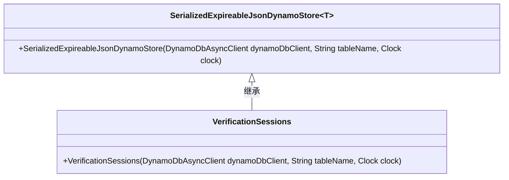
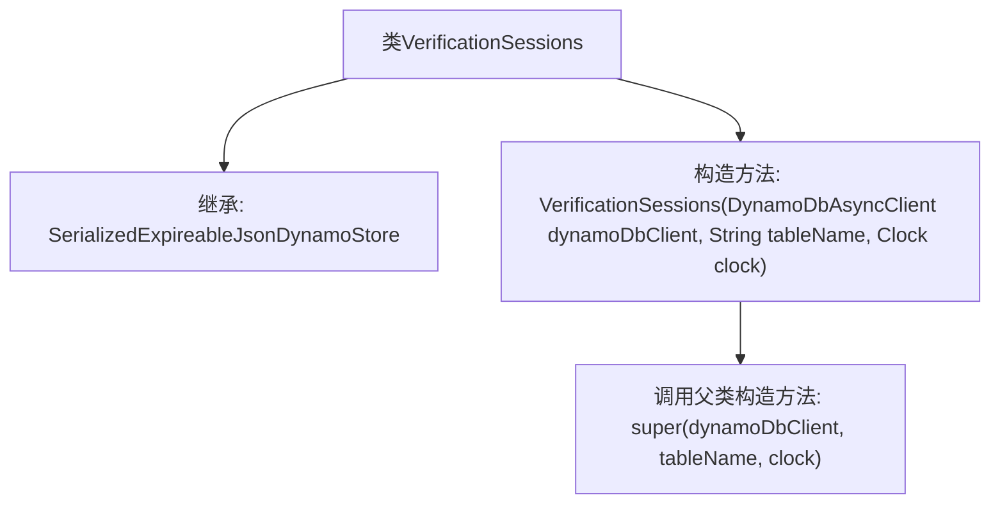

# 基础信息

|      |      |
|------|------|
| 名称 | VerificationSessions |
| 编码语言 | .java |
| 代码路径 | Signal-Server/service/src/main/java/org/whispersystems/textsecuregcm/storage/VerificationSessions.java |
| 包名 | org.whispersystems.textsecuregcm.storage |
| 依赖项 | ['java.time.Clock', 'org.whispersystems.textsecuregcm.registration.VerificationSession', 'software.amazon.awssdk.services.dynamodb.DynamoDbAsyncClient'] |
| 概述说明 | VerificationSessions类继承SerializedExpireableJsonDynamoStore，管理验证会话。 |

# 说明

VerificationSessions类继承自SerializedExpireableJsonDynamoStore，主要用于管理验证会话。该类通过继承SerializedExpireableJsonDynamoStore，具备了序列化、过期处理以及与DynamoDB存储交互的能力，确保验证会话数据的高效管理与存储。

# 类列表 Class Summary

| 名称   | 类型  | 说明 |
|-------|------|-------------|
| VerificationSessions | class | VerificationSessions类继承SerializedExpireableJsonDynamoStore，用于管理验证会话。 |

## 类 VerificationSessions

|      |      |
|------|------|
| 访问范围 | public |
| 类型 | class |
| 名称 | VerificationSessions |
| 说明 | VerificationSessions类继承SerializedExpireableJsonDynamoStore，用于管理验证会话。 |

### UML类图

类图描述：  
`VerificationSessions` 类继承自泛型类 `SerializedExpireableJsonDynamoStore<VerificationSession>`，用于管理与 `VerificationSession` 相关的会话数据。`SerializedExpireableJsonDynamoStore` 是一个泛型类，支持异步 DynamoDB 操作，并包含与 JSON 序列化和过期时间管理相关的功能。`VerificationSessions` 类的构造函数接受 `DynamoDbAsyncClient`、表名和 `Clock` 作为参数，初始化父类的存储逻辑。

### 内部方法调用关系图

这段代码定义了一个名为 `VerificationSessions` 的类，该类继承自 `SerializedExpireableJsonDynamoStore<VerificationSession>`。类的构造方法接收三个参数：`DynamoDbAsyncClient`、`String` 和 `Clock`，并在内部调用父类的构造方法。这段代码主要用于初始化一个与DynamoDB异步客户端交互的会话存储对象。

### 字段列表 Field List

| 名称  | 类型  | 说明 |
|-------|-------|------|

### 方法列表 Method List

| 名称  | 类型  | 说明 |
|-------|-------|------|

