# 基础信息

|      |      |
|------|------|
| 名称 | AppleDeviceCheckManager |
| 编码语言 | .java |
| 代码路径 | Signal-Server/service/src/main/java/org/whispersystems/textsecuregcm/storage/devicecheck/AppleDeviceCheckManager.java |
| 包名 | org.whispersystems.textsecuregcm.storage.devicecheck |
| 依赖项 | ['com.google.common.annotations.VisibleForTesting', 'com.webauthn4j.appattest.DeviceCheckManager', 'com.webauthn4j.appattest.authenticator.DCAppleDevice', 'com.webauthn4j.appattest.authenticator.DCAppleDeviceImpl', 'com.webauthn4j.appattest.data.DCAssertionParameters', 'com.webauthn4j.appattest.data.DCAssertionRequest', 'com.webauthn4j.appattest.data.DCAttestationData', 'com.webauthn4j.appattest.data.DCAttestationParameters', 'com.webauthn4j.appattest.data.DCAttestationRequest', 'com.webauthn4j.appattest.server.DCServerProperty', 'com.webauthn4j.data.attestation.AttestationObject', 'com.webauthn4j.data.client.challenge.DefaultChallenge', 'com.webauthn4j.verifier.exception.MaliciousCounterValueException', 'com.webauthn4j.verifier.exception.VerificationException', 'io.lettuce.core.RedisException', 'io.lettuce.core.SetArgs', 'io.lettuce.core.cluster.api.sync.RedisAdvancedClusterCommands', 'java.nio.charset.StandardCharsets', 'java.security.MessageDigest', 'java.security.NoSuchAlgorithmException', 'java.security.SecureRandom', 'java.time.Duration', 'java.util.Base64', 'java.util.List', 'java.util.UUID', 'javax.annotation.Nullable', 'org.slf4j.Logger', 'org.slf4j.LoggerFactory', 'org.whispersystems.textsecuregcm.controllers.RateLimitExceededException', 'org.whispersystems.textsecuregcm.limits.RateLimiters', 'org.whispersystems.textsecuregcm.redis.FaultTolerantRedisClusterClient', 'org.whispersystems.textsecuregcm.storage.Account'] |
| 概述说明 | Apple设备验证管理器处理认证和断言验证，支持Redis存储挑战和密钥管理。 |

# 说明

Apple设备验证管理器是一个用于处理设备认证和断言验证的系统，它支持通过Redis存储挑战和密钥管理。该管理器确保设备在认证过程中的安全性，通过存储和管理密钥来验证设备的合法性，同时利用Redis的高效存储能力来处理认证过程中的挑战数据。

# 类列表 Class Summary

| 名称   | 类型  | 说明 |
|-------|------|-------------|
| AppleDeviceCheckManager | class | Apple设备验证管理器，用于处理设备认证和断言验证，支持Redis存储挑战和密钥管理。 |

## 类 AppleDeviceCheckManager

|      |      |
|------|------|
| 访问范围 | public |
| 类型 | class |
| 名称 | AppleDeviceCheckManager |
| 说明 | Apple设备验证管理器，用于处理设备认证和断言验证，支持Redis存储挑战和密钥管理。 |

### UML类图

```mermaid
classDiagram
    class AppleDeviceCheckManager {
        -Logger logger
        -SecureRandom SECURE_RANDOM
        -int CHALLENGE_LENGTH
        -Duration CHALLENGE_TTL
        -int MAX_DEVICE_KEYS
        -AppleDeviceChecks appleDeviceChecks
        -FaultTolerantRedisClusterClient redisClient
        -DeviceCheckManager deviceCheckManager
        -String teamId
        -String bundleId
        +AppleDeviceCheckManager(AppleDeviceChecks appleDeviceChecks, FaultTolerantRedisClusterClient redisClient, DeviceCheckManager deviceCheckManager, String teamId, String bundleId)
        +void registerAttestation(Account account, byte[] keyId, byte[] attestBlob) throws TooManyKeysException, ChallengeNotFoundException, DeviceCheckVerificationFailedException, DuplicatePublicKeyException
        +void validateAssert(Account account, byte[] keyId, ChallengeType challengeType, String challenge, byte[] request, byte[] assertion) throws ChallengeNotFoundException, DeviceCheckVerificationFailedException, DeviceCheckKeyIdNotFoundException, RequestReuseException
        +String createChallenge(ChallengeType challengeType, Account account) throws RateLimitExceededException
        -void removeChallenge(String challengeKey)
        -static String challengeKey(ChallengeType challengeType, UUID accountIdentifier)
        -static String generateChallenge()
        -static byte[] sha256(byte[] bytes)
    }

    class AppleDeviceChecks {
        <<Interface>>
        +List<byte[]> keyIds(Account account)
        +void storeAttestation(Account account, byte[] keyId, DCAppleDevice dcAppleDevice)
        +Optional<DCAppleDevice> lookup(Account account, byte[] keyId)
        +void updateCounter(Account account, byte[] keyId, int counter)
    }

    class FaultTolerantRedisClusterClient {
        <<Interface>>
        +String withCluster(Function<RedisAdvancedClusterCommands<String, String>, String> function)
        +void useCluster(Consumer<RedisAdvancedClusterCommands<String, String>> consumer)
    }

    class DeviceCheckManager {
        <<Interface>>
        +DCAttestationData validate(DCAttestationRequest dcAttestationRequest, DCAttestationParameters dcAttestationParameters) throws VerificationException
        +void validate(DCAssertionRequest dcAssertionRequest, DCAssertionParameters dcAssertionParameters) throws VerificationException, MaliciousCounterValueException
    }

    class Account {
        +UUID getUuid()
    }

    class DCAttestationRequest {
        +byte[] keyId
        +byte[] attestBlob
        +byte[] clientDataHash
        +DCAttestationRequest(byte[] keyId, byte[] attestBlob, byte[] clientDataHash)
    }

    class DCAttestationParameters {
        +DCServerProperty dcServerProperty
        +DCAttestationParameters(DCServerProperty dcServerProperty)
    }

    class DCServerProperty {
        +String teamId
        +String bundleId
        +DefaultChallenge defaultChallenge
        +DCServerProperty(String teamId, String bundleId, DefaultChallenge defaultChallenge)
    }

    class DefaultChallenge {
        +String challenge
        +DefaultChallenge(String challenge)
    }

    class DCAttestationData {
        +AttestationObject getAttestationObject()
    }

    class AttestationObject {
        +AuthenticatorData getAuthenticatorData()
        +AttestationStatement getAttestationStatement()
        +byte[] getExtensions()
    }

    class AuthenticatorData {
        +AttestedCredentialData getAttestedCredentialData()
        +int getSignCount()
    }

    class AttestedCredentialData {
        +byte[] getCredentialId()
    }

    class AttestationStatement {
        +byte[] getSignature()
    }

    class DCAppleDeviceImpl {
        +AttestedCredentialData attestedCredentialData
        +AttestationStatement attestationStatement
        +int signCount
        +byte[] extensions
        +DCAppleDeviceImpl(AttestedCredentialData attestedCredentialData, AttestationStatement attestationStatement, int signCount, byte[] extensions)
    }

    class DCAssertionRequest {
        +byte[] keyId
        +byte[] assertion
        +byte[] clientDataHash
        +DCAssertionRequest(byte[] keyId, byte[] assertion, byte[] clientDataHash)
    }

    class DCAssertionParameters {
        +DCServerProperty dcServerProperty
        +DCAppleDevice appleDevice
        +DCAssertionParameters(DCServerProperty dcServerProperty, DCAppleDevice appleDevice)
    }

    class DCAppleDevice {
        <<Interface>>
        +int getCounter()
    }

    AppleDeviceCheckManager --> AppleDeviceChecks : 依赖
    AppleDeviceCheckManager --> FaultTolerantRedisClusterClient : 依赖
    AppleDeviceCheckManager --> DeviceCheckManager : 依赖
    AppleDeviceCheckManager --> Account : 依赖
    AppleDeviceCheckManager --> DCAttestationRequest : 依赖
    AppleDeviceCheckManager --> DCAttestationParameters : 依赖
    AppleDeviceCheckManager --> DCAssertionRequest : 依赖
    AppleDeviceCheckManager --> DCAssertionParameters : 依赖
    DCAttestationParameters --> DCServerProperty : 依赖
    DCServerProperty --> DefaultChallenge : 依赖
    DCAttestationData --> AttestationObject : 依赖
    AttestationObject --> AuthenticatorData : 依赖
    AttestationObject --> AttestationStatement : 依赖
    AuthenticatorData --> AttestedCredentialData : 依赖
    DCAppleDeviceImpl --> AttestedCredentialData : 依赖
    DCAppleDeviceImpl --> AttestationStatement : 依赖
    DCAssertionParameters --> DCServerProperty : 依赖
    DCAssertionParameters --> DCAppleDevice : 依赖
```

**描述**：`AppleDeviceCheckManager` 类负责管理与Apple设备验证相关的操作，包括生成挑战、验证设备的证明和断言。它依赖于多个接口和类，如 `AppleDeviceChecks`、`FaultTolerantRedisClusterClient` 和 `DeviceCheckManager`，通过这些依赖完成与Redis的交互、设备验证和挑战管理。代码中还定义了多个数据类，如 `DCAttestationRequest` 和 `DCAssertionRequest`，用于封装验证请求的参数。整体设计旨在确保设备验证的安全性和可靠性。

### 内部方法调用关系图

```mermaid
graph TD
    A["类AppleDeviceCheckManager"]
    B["属性: Logger logger"]
    C["属性: SecureRandom SECURE_RANDOM"]
    D["属性: int CHALLENGE_LENGTH"]
    E["属性: Duration CHALLENGE_TTL"]
    F["属性: int MAX_DEVICE_KEYS"]
    G["属性: AppleDeviceChecks appleDeviceChecks"]
    H["属性: FaultTolerantRedisClusterClient redisClient"]
    I["属性: DeviceCheckManager deviceCheckManager"]
    J["属性: String teamId"]
    K["属性: String bundleId"]
    L["构造方法: AppleDeviceCheckManager(AppleDeviceChecks, FaultTolerantRedisClusterClient, DeviceCheckManager, String, String)"]
    M["枚举: ChallengeType"]
    N["方法: registerAttestation(Account, byte[], byte[])"]
    O["方法: createDcAppleDevice(DCAttestationData)"]
    P["方法: validateAssert(Account, byte[], ChallengeType, String, byte[], byte[])"]
    Q["方法: createChallenge(ChallengeType, Account)"]
    R["方法: removeChallenge(String)"]
    S["方法: challengeKey(ChallengeType, UUID)"]
    T["方法: generateChallenge()"]
    U["方法: sha256(byte[])"]

    A --> B
    A --> C
    A --> D
    A --> E
    A --> F
    A --> G
    A --> H
    A --> I
    A --> J
    A --> K
    A --> L
    A --> M
    A --> N
    A --> O
    A --> P
    A --> Q
    A --> R
    A --> S
    A --> T
    A --> U
```

这段代码描述了一个名为 `AppleDeviceCheckManager` 的类，主要用于管理与Apple设备验证相关的操作。类中包含多个属性、构造方法、枚举类型以及多个方法。其中，`registerAttestation` 方法用于注册设备的密钥和验证数据，`validateAssert` 方法用于验证设备的断言请求，`createChallenge` 方法用于生成验证挑战，`removeChallenge` 方法用于移除Redis中的挑战。类中还包含一些辅助方法，如 `generateChallenge` 用于生成随机挑战，`sha256` 用于计算SHA-256哈希值。这些方法共同协作，确保设备验证过程的安全性和可靠性。

### 字段列表 Field List

| 名称  | 类型  | 说明 |
|-------|-------|------|
| bundleId | String | 私有字符串变量bundleId。 |
| deviceCheckManager | DeviceCheckManager | 私有且不可变的设备检查管理器实例。 |
| SECURE_RANDOM = new SecureRandom() | SecureRandom | 定义了一个私有的、静态的、不可变的SecureRandom实例。 |
| redisClient | FaultTolerantRedisClusterClient | 私有不可变的FaultTolerantRedisClusterClient实例redisClient。 |
| logger = LoggerFactory.getLogger(AppleDeviceCheckManager.class) | Logger | AppleDeviceCheckManager类中定义了私有的静态日志记录器。 |
| CHALLENGE_LENGTH = 16 | int | 定义了一个私有静态常量CHALLENGE_LENGTH，值为16。 |
| appleDeviceChecks | AppleDeviceChecks | 私有且不可变的Apple设备检查实例。 |
| teamId | String | 定义私有不可变字符串变量teamId。 |
| CHALLENGE_TTL = Duration.ofHours(1) | Duration | 测试可见的静态常量CHALLENGE_TTL，时长为1小时。 |
| MAX_DEVICE_KEYS = 100 | int | 测试可见的静态常量MAX_DEVICE_KEYS值为100。 |

### 方法列表 Method List

| 名称  | 类型  | 说明 |
|-------|-------|------|
| createDcAppleDevice | DCAppleDeviceImpl | 创建DCAppleDevice实例，验证并提取认证数据，若缺失则抛出异常。 |
| generateChallenge | String | 生成随机挑战码并返回Base64编码字符串。 |
| sha256 | byte[] | 私有方法sha256使用SHA-256算法计算字节数组的哈希值。 |
| removeChallenge | void | 删除Redis中的挑战键，失败则等待TTL过期。 |
| challengeKey | String | 生成测试用挑战键，结合挑战类型和账户标识符。 |
| validateAssert | void | 验证设备检查断言，匹配挑战并更新计数器，处理异常情况。 |
| createChallenge | String | 根据账户和挑战类型生成挑战，若存在则返回原挑战并更新TTL，否则返回新挑战。 |
| registerAttestation | void | 注册设备认证，检查密钥、挑战和验证，存储认证并移除挑战。 |

