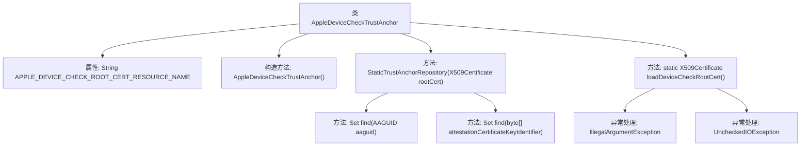

# 基础信息

|      |      |
|------|------|
| 名称 | AppleDeviceCheckTrustAnchor |
| 编码语言 | .java |
| 代码路径 | Signal-Server/service/src/main/java/org/whispersystems/textsecuregcm/storage/devicecheck/AppleDeviceCheckTrustAnchor.java |
| 包名 | org.whispersystems.textsecuregcm.storage.devicecheck |
| 依赖项 | ['com.webauthn4j.anchor.TrustAnchorRepository', 'com.webauthn4j.data.attestation.authenticator.AAGUID', 'com.webauthn4j.util.CertificateUtil', 'com.webauthn4j.verifier.attestation.trustworthiness.certpath.DefaultCertPathTrustworthinessVerifier', 'java.io.IOException', 'java.io.InputStream', 'java.io.UncheckedIOException', 'java.security.cert.TrustAnchor', 'java.security.cert.X509Certificate', 'java.util.Collections', 'java.util.Set'] |
| 概述说明 | AppleDeviceCheckTrustAnchor类加载并验证Apple设备检查根证书的信任路径。 |

# 说明

AppleDeviceCheckTrustAnchor类负责加载Apple设备检查所需的根证书，并验证其信任路径，确保设备检查过程的安全性和可靠性。

# 类列表 Class Summary

| 名称   | 类型  | 说明 |
|-------|------|-------------|
| AppleDeviceCheckTrustAnchor | class | AppleDeviceCheckTrustAnchor类加载Apple设备检查根证书并验证信任路径。 |


## 类 AppleDeviceCheckTrustAnchor

|      |      |
|------|------|
| 访问范围 | public |
| 类型 | class |
| 名称 | AppleDeviceCheckTrustAnchor |
| 说明 | AppleDeviceCheckTrustAnchor类加载Apple设备检查根证书并验证信任路径。 |


### UML类图

```mermaid
classDiagram
    class AppleDeviceCheckTrustAnchor {
        -static String APPLE_DEVICE_CHECK_ROOT_CERT_RESOURCE_NAME
        +AppleDeviceCheckTrustAnchor()
        -static X509Certificate loadDeviceCheckRootCert()
    }

    class DefaultCertPathTrustworthinessVerifier {
        // 基类，未显示具体成员
    }

    class StaticTrustAnchorRepository {
        -X509Certificate rootCert
        +Set~TrustAnchor~ find(AAGUID aaguid)
        +Set~TrustAnchor~ find(byte[] attestationCertificateKeyIdentifier)
    }

    interface TrustAnchorRepository {
        <<Interface>>
        +Set~TrustAnchor~ find(AAGUID aaguid)
        +Set~TrustAnchor~ find(byte[] attestationCertificateKeyIdentifier)
    }

    AppleDeviceCheckTrustAnchor --> DefaultCertPathTrustworthinessVerifier : 继承
    AppleDeviceCheckTrustAnchor --> StaticTrustAnchorRepository : 依赖
    StaticTrustAnchorRepository ..|> TrustAnchorRepository : 实现
```

**描述：**
`AppleDeviceCheckTrustAnchor`类继承自`DefaultCertPathTrustworthinessVerifier`，用于验证Apple设备检查证书的信任锚点。它通过`StaticTrustAnchorRepository`类实现`TrustAnchorRepository`接口，加载并管理Apple设备检查根证书。`StaticTrustAnchorRepository`类提供了根据AAGUID和证书标识符查找信任锚点的功能。`loadDeviceCheckRootCert`方法负责从资源文件中加载证书。


### 内部方法调用关系图



这段代码定义了一个名为 `AppleDeviceCheckTrustAnchor` 的类，该类继承自 `DefaultCertPathTrustworthinessVerifier`。类中包含一个静态字符串属性 `APPLE_DEVICE_CHECK_ROOT_CERT_RESOURCE_NAME`，用于存储Apple设备检查根证书的资源名称。构造方法 `AppleDeviceCheckTrustAnchor()` 初始化时调用 `loadDeviceCheckRootCert()` 方法加载证书，并将其传递给 `StaticTrustAnchorRepository` 内部类。`StaticTrustAnchorRepository` 类实现了 `TrustAnchorRepository` 接口，提供了两个 `find` 方法，用于查找信任锚点。`loadDeviceCheckRootCert()` 方法负责从资源文件中加载证书，并在资源未找到或发生IO异常时抛出相应的异常。

### 字段列表 Field List

| 名称  | 类型  | 说明 |
|-------|-------|------|
| APPLE_DEVICE_CHECK_ROOT_CERT_RESOURCE_NAME = "apple_device_check.pem" | String | 私有静态字符串变量定义苹果设备检查根证书资源名。 |

### 方法列表 Method List

| 名称  | 类型  | 说明 |
|-------|-------|------|
| loadDeviceCheckRootCert | X509Certificate | 加载Apple设备检查根证书，若资源不存在则抛出异常。 |


