# 基础信息

|      |      |
|------|------|
| 名称 | AppleDeviceChecks |
| 编码语言 | .java |
| 代码路径 | Signal-Server/service/src/main/java/org/whispersystems/textsecuregcm/storage/devicecheck/AppleDeviceChecks.java |
| 包名 | org.whispersystems.textsecuregcm.storage.devicecheck |
| 依赖项 | ['com.fasterxml.jackson.annotation.JsonCreator', 'com.fasterxml.jackson.annotation.JsonProperty', 'com.fasterxml.jackson.annotation.JsonTypeInfo', 'com.webauthn4j.appattest.authenticator.DCAppleDevice', 'com.webauthn4j.appattest.authenticator.DCAppleDeviceImpl', 'com.webauthn4j.appattest.data.attestation.statement.AppleAppAttestAttestationStatement', 'com.webauthn4j.converter.AttestedCredentialDataConverter', 'com.webauthn4j.converter.util.ObjectConverter', 'com.webauthn4j.data.attestation.authenticator.AttestedCredentialData', 'com.webauthn4j.data.attestation.statement.AttestationStatement', 'com.webauthn4j.data.extension.authenticator.AuthenticationExtensionsAuthenticatorOutputs', 'com.webauthn4j.data.extension.authenticator.RegistrationExtensionAuthenticatorOutput', 'java.security.PublicKey', 'java.util.List', 'java.util.Map', 'java.util.Objects', 'java.util.Optional', 'org.whispersystems.textsecuregcm.storage.Account', 'org.whispersystems.textsecuregcm.util.AttributeValues', 'software.amazon.awssdk.services.dynamodb.DynamoDbClient', 'software.amazon.awssdk.services.dynamodb.model.AttributeValue', 'software.amazon.awssdk.services.dynamodb.model.CancellationReason', 'software.amazon.awssdk.services.dynamodb.model.ConditionalCheckFailedException', 'software.amazon.awssdk.services.dynamodb.model.GetItemRequest', 'software.amazon.awssdk.services.dynamodb.model.GetItemResponse', 'software.amazon.awssdk.services.dynamodb.model.Put', 'software.amazon.awssdk.services.dynamodb.model.QueryRequest', 'software.amazon.awssdk.services.dynamodb.model.TransactWriteItem', 'software.amazon.awssdk.services.dynamodb.model.TransactWriteItemsRequest', 'software.amazon.awssdk.services.dynamodb.model.TransactionCanceledException', 'software.amazon.awssdk.services.dynamodb.model.UpdateItemRequest'] |
| 概述说明 | AppleDeviceChecks类管理Apple设备的存储、查询和更新认证信息。 |

# 说明

AppleDeviceChecks类是一个用于管理Apple设备检查的工具，主要负责存储、查询和更新设备的认证信息。通过该类，用户可以有效地处理与设备认证相关的数据，确保设备信息的准确性和及时性。

# 类列表 Class Summary

| 名称   | 类型  | 说明 |
|-------|------|-------------|
| AppleDeviceChecks | class | AppleDeviceChecks类用于管理Apple设备检查，包括存储、查询和更新设备认证信息。 |

## 类 AppleDeviceChecks

|      |      |
|------|------|
| 访问范围 | public |
| 类型 | class |
| 名称 | AppleDeviceChecks |
| 说明 | AppleDeviceChecks类用于管理Apple设备检查，包括存储、查询和更新设备认证信息。 |

### UML类图

```mermaid
classDiagram
    class AppleDeviceChecks {
        +String KEY_ACCOUNT_UUID
        +String KEY_PUBLIC_KEY_ID
        -String ATTR_COUNTER
        -String ATTR_CRED_DATA
        -String ATTR_STATEMENT
        -String ATTR_AUTHENTICATOR_EXTENSIONS
        +String KEY_PUBLIC_KEY
        -String CONDITIONAL_CHECK_FAILED
        -DynamoDbClient dynamoDbClient
        -String deviceCheckTableName
        -String publicKeyConstraintTableName
        -ObjectConverter objectConverter
        +AppleDeviceChecks(DynamoDbClient dynamoDbClient, ObjectConverter objectConverter, String deviceCheckTableName, String publicKeyConstraintTableName)
        +List~byte[]~ keyIds(Account account)
        +boolean storeAttestation(Account account, byte[] keyId, DCAppleDevice appleDevice) throws DuplicatePublicKeyException
        +Optional~DCAppleDevice~ lookup(Account account, byte[] keyId)
        +boolean updateCounter(Account account, byte[] keyId, long newCounter)
        -Map~String, AttributeValue~ toItem(Account account, byte[] keyId, DCAppleDevice appleDevice)
        -DCAppleDevice fromItem(Map~String, AttributeValue~ item)
        -PublicKey extractPublicKey(DCAppleDevice appleDevice)
        -boolean conditionalCheckFailed(CancellationReason reason)
        -Optional~byte[]~ getByteArray(Map~String, AttributeValue~ item, String key)
    }

    class AttestationStatementEnvelope {
        -AttestationStatement attestationStatement
        +AttestationStatementEnvelope(AttestationStatement attestationStatement)
        +String getFormat()
        +AttestationStatement getAttestationStatement()
    }

    class DynamoDbClient {
        <<Interface>>
        +QueryPaginator queryPaginator(QueryRequest request)
        +TransactWriteItemsResponse transactWriteItems(TransactWriteItemsRequest request)
        +GetItemResponse getItem(GetItemRequest request)
        +UpdateItemResponse updateItem(UpdateItemRequest request)
    }

    class ObjectConverter {
        <<Interface>>
        +CborConverter getCborConverter()
    }

    class Account {
        +UUID getUuid()
    }

    class DCAppleDevice {
        <<Interface>>
        +AttestedCredentialData getAttestedCredentialData()
        +AttestationStatement getAttestationStatement()
        +long getCounter()
        +AuthenticationExtensionsAuthenticatorOutputs getAuthenticatorExtensions()
    }

    class DCAppleDeviceImpl {
        +DCAppleDeviceImpl(AttestedCredentialData credData, AttestationStatement statement, long counter, AuthenticationExtensionsAuthenticatorOutputs extensions)
    }

    class AttestationStatement {
        <<Interface>>
        +String getFormat()
    }

    class AppleAppAttestAttestationStatement {
        +List~X509Certificate~ getX5c()
    }

    class AttestedCredentialDataConverter {
        +AttestedCredentialDataConverter(ObjectConverter objectConverter)
        +byte[] convert(AttestedCredentialData data)
        +AttestedCredentialData convert(byte[] data)
    }

    AppleDeviceChecks --> DynamoDbClient : 依赖
    AppleDeviceChecks --> ObjectConverter : 依赖
    AppleDeviceChecks --> Account : 依赖
    AppleDeviceChecks --> DCAppleDevice : 依赖
    AppleDeviceChecks --> AttestationStatementEnvelope : 依赖
    AppleDeviceChecks --> AttestedCredentialDataConverter : 依赖
    DCAppleDevice --> DCAppleDeviceImpl : 实现
    AttestationStatement --> AppleAppAttestAttestationStatement : 实现
```

### 描述
`AppleDeviceChecks` 类用于管理与Apple设备检查相关的操作，包括存储和检索设备认证信息、更新计数器等。它依赖于`DynamoDbClient`和`ObjectConverter`接口来执行数据库操作和数据转换。`DCAppleDevice`接口定义了设备认证信息的结构，其实现类为`DCAppleDeviceImpl`。`AttestationStatement`接口用于表示认证声明的格式，其实现类为`AppleAppAttestAttestationStatement`。`AttestedCredentialDataConverter`类用于转换认证数据。

### 内部方法调用关系图

```mermaid
graph TD
    A["类AppleDeviceChecks"]
    B["常量: KEY_ACCOUNT_UUID"]
    C["常量: KEY_PUBLIC_KEY_ID"]
    D["常量: ATTR_COUNTER"]
    E["常量: ATTR_CRED_DATA"]
    F["常量: ATTR_STATEMENT"]
    G["常量: ATTR_AUTHENTICATOR_EXTENSIONS"]
    H["常量: KEY_PUBLIC_KEY"]
    I["常量: CONDITIONAL_CHECK_FAILED"]
    J["属性: DynamoDbClient dynamoDbClient"]
    K["属性: String deviceCheckTableName"]
    L["属性: String publicKeyConstraintTableName"]
    M["属性: ObjectConverter objectConverter"]
    N["构造方法: AppleDeviceChecks(DynamoDbClient, ObjectConverter, String, String)"]
    O["方法: List<byte[]> keyIds(Account account)"]
    P["方法: boolean storeAttestation(Account account, byte[] keyId, DCAppleDevice appleDevice)"]
    Q["方法: Optional<DCAppleDevice> lookup(Account account, byte[] keyId)"]
    R["方法: boolean updateCounter(Account account, byte[] keyId, long newCounter)"]
    S["方法: Map<String, AttributeValue> toItem(Account account, byte[] keyId, DCAppleDevice appleDevice)"]
    T["方法: DCAppleDevice fromItem(Map<String, AttributeValue> item)"]
    U["方法: PublicKey extractPublicKey(DCAppleDevice appleDevice)"]
    V["方法: boolean conditionalCheckFailed(CancellationReason reason)"]
    W["方法: Optional<byte[]> getByteArray(Map<String, AttributeValue> item, String key)"]
    X["内部类: AttestationStatementEnvelope"]

    A --> B
    A --> C
    A --> D
    A --> E
    A --> F
    A --> G
    A --> H
    A --> I
    A --> J
    A --> K
    A --> L
    A --> M
    A --> N
    A --> O
    A --> P
    A --> Q
    A --> R
    A --> S
    A --> T
    A --> U
    A --> V
    A --> W
    A --> X
```

这段代码定义了一个名为 `AppleDeviceChecks` 的类，用于管理与 Apple 设备检查相关的操作。该类包含多个常量、属性、构造方法和多个功能方法，用于处理设备检查的密钥、认证信息、计数器更新等操作。`AppleDeviceChecks` 类通过 `DynamoDbClient` 与 DynamoDB 数据库进行交互，提供了存储、查询、更新设备检查信息的功能。代码中还包含一个内部类 `AttestationStatementEnvelope`，用于封装和反序列化认证声明。

### 字段列表 Field List

| 名称  | 类型  | 说明 |
|-------|-------|------|
| KEY_ACCOUNT_UUID = "U" | String | 定义常量KEY_ACCOUNT_UUID，值为"U"。 |
| deviceCheckTableName | String | 私有字符串变量deviceCheckTableName。 |
| ATTR_COUNTER = "C" | String | 定义私有静态常量字符串ATTR_COUNTER，值为"C"。 |
| objectConverter | ObjectConverter | 私有且不可变的ObjectConverter对象实例。 |
| publicKeyConstraintTableName | String | 私有常量字符串存储公钥约束表名。 |
| CONDITIONAL_CHECK_FAILED = "ConditionalCheckFailed" | String | 定义常量字符串表示条件检查失败。 |
| ATTR_CRED_DATA = "CD" | String | 定义私有静态常量ATTR_CRED_DATA，值为"CD"。 |
| dynamoDbClient | DynamoDbClient | 私有且不可变的DynamoDb客户端实例。 |
| KEY_PUBLIC_KEY = "PK" | String | 定义常量字符串KEY_PUBLIC_KEY，值为"PK"。 |
| KEY_PUBLIC_KEY_ID = "KID" | String | 定义常量KEY_PUBLIC_KEY_ID，值为"KID"。 |
| ATTR_STATEMENT = "S" | String | 定义私有静态常量ATTR_STATEMENT，值为"S"。 |
| ATTR_AUTHENTICATOR_EXTENSIONS = "AE" | String | 定义常量字符串ATTR_AUTHENTICATOR_EXTENSIONS值为"AE"。 |

### 方法列表 Method List

| 名称  | 类型  | 说明 |
|-------|-------|------|
| toItem | Map<String, AttributeValue> | 将账户和设备数据序列化为属性映射。 |
| conditionalCheckFailed | boolean | 私有方法检查取消原因是否为条件检查失败。 |
| lookup | Optional<DCAppleDevice> | 通过DynamoDB查询设备信息，返回对应账户和密钥ID的设备数据。 |
| getByteArray | Optional<byte[]> | 静态方法获取Map中指定键的字节数组。 |
| storeAttestation | boolean | 存储设备认证信息，确保公钥唯一性，处理事务异常。 |
| extractPublicKey | PublicKey | 提取苹果设备公钥，验证SHA256匹配，返回终端实体证书公钥。 |
| updateCounter | boolean | 更新计数器，确保新值不小于当前值，成功返回true，失败返回false。 |
| keyIds | List<byte[]> | 查询DynamoDB表，根据账户UUID获取公钥ID列表。 |
| fromItem | DCAppleDevice | 从DynamoDB反序列化设备数据，包括凭证、声明、计数器和扩展信息。 |

