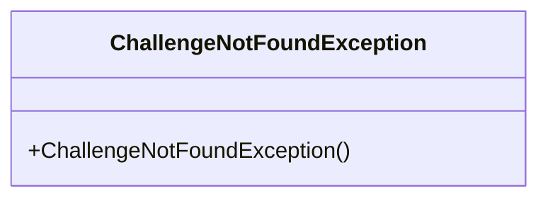
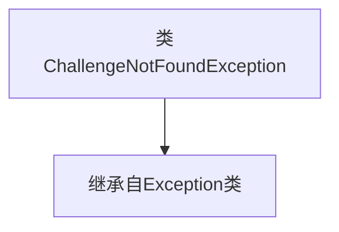

# 基础信息

|      |      |
|------|------|
| 名称 | ChallengeNotFoundException |
| 编码语言 | .java |
| 代码路径 | Signal-Server/service/src/main/java/org/whispersystems/textsecuregcm/storage/devicecheck/ChallengeNotFoundException.java |
| 包名 | org.whispersystems.textsecuregcm.storage.devicecheck |
| 依赖项 | [] |
| 概述说明 | ChallengeNotFoundException是Exception的子类。 |

# 说明

ChallengeNotFoundException是一个自定义异常类，它继承自Java标准库中的Exception类。这意味着它属于检查型异常，需要在代码中显式处理或声明抛出。该异常通常用于在特定条件下，当预期的挑战或任务未被找到时抛出，以提醒调用者处理此类异常情况。通过继承Exception，它具备了异常类的基本特性，如可捕获、可抛出，并可以携带自定义的错误信息。

# 类列表 Class Summary

| 名称   | 类型  | 说明 |
|-------|------|-------------|
| ChallengeNotFoundException | class | ChallengeNotFoundException继承自Exception异常类。 |

## 类 ChallengeNotFoundException

|      |      |
|------|------|
| 访问范围 | public |
| 类型 | class |
| 名称 | ChallengeNotFoundException |
| 说明 | ChallengeNotFoundException继承自Exception异常类。 |

### UML类图

**描述：**  
`ChallengeNotFoundException` 是一个自定义异常类，继承自 `Exception`。它用于在程序中抛出特定的异常，通常在遇到挑战未找到的情况下使用。该类提供了一个默认的无参构造函数，用于创建异常实例。这种设计使得代码在遇到特定错误时能够抛出明确的异常，便于错误处理和调试。

### 内部方法调用关系图

这段代码定义了一个名为 `ChallengeNotFoundException` 的类，它继承自 `Exception` 类。这意味着 `ChallengeNotFoundException` 是一个自定义的异常类，用于在程序中抛出和处理特定的异常情况。通过继承 `Exception`，`ChallengeNotFoundException` 具备了异常处理的基本功能，可以在需要时被抛出并捕获。

### 字段列表 Field List

| 名称  | 类型  | 说明 |
|-------|-------|------|

### 方法列表 Method List

| 名称  | 类型  | 说明 |
|-------|-------|------|

