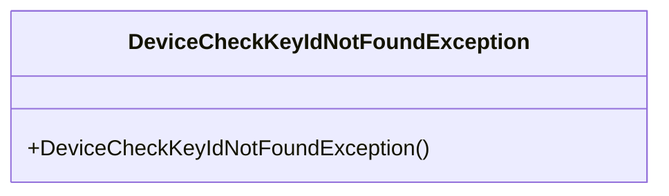
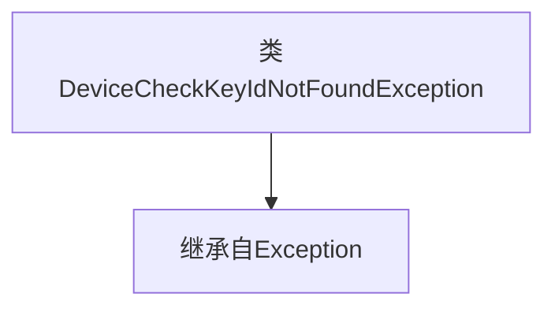

# 基础信息

|      |      |
|------|------|
| 名称 | DeviceCheckKeyIdNotFoundException |
| 编码语言 | .java |
| 代码路径 | Signal-Server/service/src/main/java/org/whispersystems/textsecuregcm/storage/devicecheck/DeviceCheckKeyIdNotFoundException.java |
| 包名 | org.whispersystems.textsecuregcm.storage.devicecheck |
| 依赖项 | [] |
| 概述说明 | DeviceCheckKeyIdNotFoundException是继承自Exception的自定义异常类。 |

# 说明

DeviceCheckKeyIdNotFoundException是一个自定义的异常类，它继承自Exception类。该异常类用于在特定情况下捕获和处理与设备检查键ID相关的错误或异常情况。通过继承Exception类，它具备了基本的异常处理功能，并可以根据需要进行扩展和定制。

# 类列表 Class Summary

| 名称   | 类型  | 说明 |
|-------|------|-------------|
| DeviceCheckKeyIdNotFoundException | class | DeviceCheckKeyIdNotFoundException是一个继承自Exception的自定义异常类。 |

## 类 DeviceCheckKeyIdNotFoundException

|      |      |
|------|------|
| 访问范围 | public |
| 类型 | class |
| 名称 | DeviceCheckKeyIdNotFoundException |
| 说明 | DeviceCheckKeyIdNotFoundException是一个继承自Exception的自定义异常类。 |

### UML类图

**描述：**  
`DeviceCheckKeyIdNotFoundException` 是一个自定义异常类，继承自 `Exception`。它用于在设备检查过程中，当无法找到指定的 `KeyId` 时抛出异常。该类没有定义额外的成员变量或方法，仅通过构造函数来创建异常实例。这种设计使得在捕获和处理特定异常时更加清晰和方便。

### 内部方法调用关系图

这段代码定义了一个名为 `DeviceCheckKeyIdNotFoundException` 的类，该类继承自 `Exception` 类。这表明 `DeviceCheckKeyIdNotFoundException` 是一个自定义的异常类，用于在特定情况下抛出异常，例如当设备检查的键ID未找到时。通过继承 `Exception` 类，该类可以像标准异常一样被捕获和处理。

### 字段列表 Field List

| 名称  | 类型  | 说明 |
|-------|-------|------|

### 方法列表 Method List

| 名称  | 类型  | 说明 |
|-------|-------|------|

