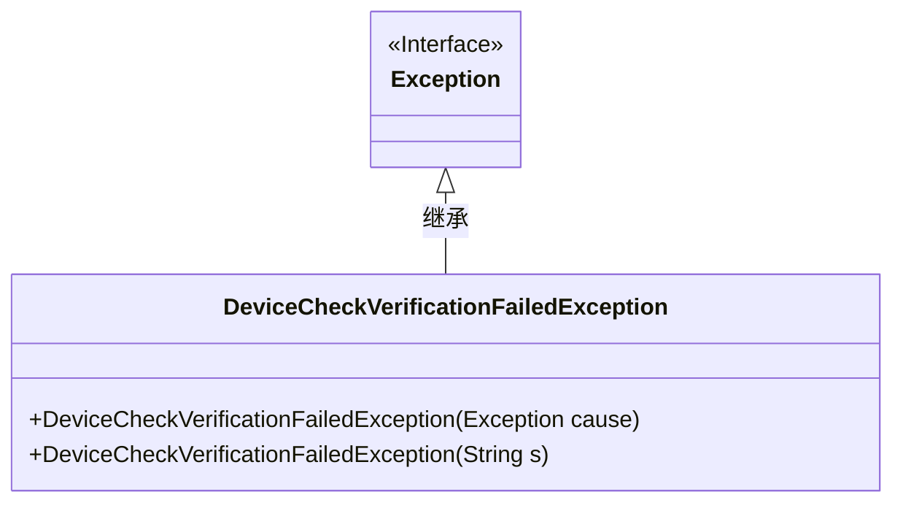
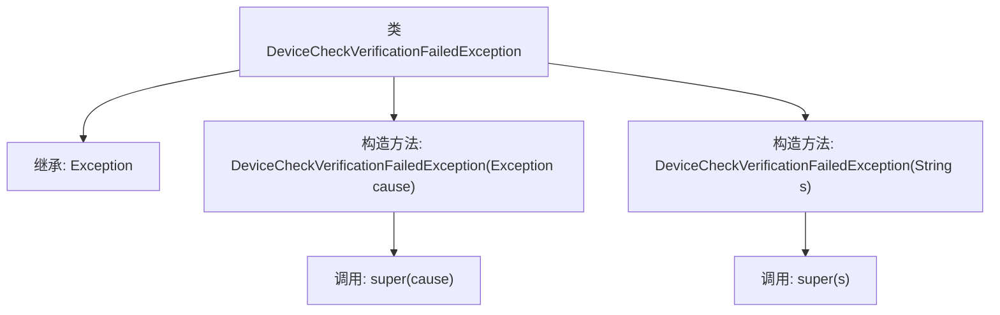

# 基础信息

|      |      |
|------|------|
| 名称 | DeviceCheckVerificationFailedException |
| 编码语言 | .java |
| 代码路径 | Signal-Server/service/src/main/java/org/whispersystems/textsecuregcm/storage/devicecheck/DeviceCheckVerificationFailedException.java |
| 包名 | org.whispersystems.textsecuregcm.storage.devicecheck |
| 依赖项 | [] |
| 概述说明 | DeviceCheck验证失败异常类继承Exception，提供两种构造方法。 |

# 说明

DeviceCheck验证失败异常类是一个继承自Exception的自定义异常类，用于处理设备验证失败的情况。该类提供了两种构造方法，方便在不同场景下创建异常实例。第一种构造方法允许直接传入错误信息字符串，第二种构造方法则支持传入错误信息字符串和导致异常的原始异常对象。这两种构造方法使得异常处理更加灵活，能够更好地捕获和传递验证失败的具体原因，便于开发者进行调试和错误处理。

# 类列表 Class Summary

| 名称   | 类型  | 说明 |
|-------|------|-------------|
| DeviceCheckVerificationFailedException | class | DeviceCheck验证失败异常类，继承Exception，支持两种构造方法。 |

## 类 DeviceCheckVerificationFailedException

|      |      |
|------|------|
| 访问范围 | public |
| 类型 | class |
| 名称 | DeviceCheckVerificationFailedException |
| 说明 | DeviceCheck验证失败异常类，继承Exception，支持两种构造方法。 |

### UML类图

**描述：**  
`DeviceCheckVerificationFailedException` 是一个自定义异常类，继承自 `Exception` 类。它提供了两个构造函数，一个接受 `Exception` 类型的参数，用于包装另一个异常；另一个接受 `String` 类型的参数，用于传递异常信息。该类用于在设备检查验证失败时抛出异常，并支持传递异常原因或自定义错误信息。

### 内部方法调用关系图

这段代码定义了一个名为 `DeviceCheckVerificationFailedException` 的异常类，它继承自 `Exception` 类。该类有两个构造方法：一个接受 `Exception` 类型的参数，并调用父类的构造方法传递该参数；另一个接受 `String` 类型的参数，并调用父类的构造方法传递该字符串。这个异常类用于处理设备检查验证失败的情况，通过不同的构造方法可以灵活地传递异常原因或错误信息。

### 字段列表 Field List

| 名称  | 类型  | 说明 |
|-------|-------|------|

### 方法列表 Method List

| 名称  | 类型  | 说明 |
|-------|-------|------|

