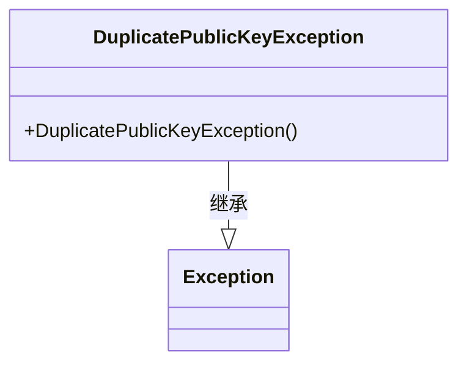
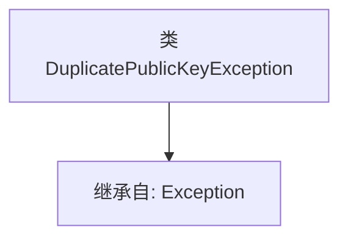

# 基础信息

|      |      |
|------|------|
| 名称 | DuplicatePublicKeyException |
| 编码语言 | .java |
| 代码路径 | Signal-Server/service/src/main/java/org/whispersystems/textsecuregcm/storage/devicecheck/DuplicatePublicKeyException.java |
| 包名 | org.whispersystems.textsecuregcm.storage.devicecheck |
| 依赖项 | [] |
| 概述说明 | DuplicatePublicKeyException是Exception类的子类。 |

# 说明

DuplicatePublicKeyException是一个继承自Exception类的异常类。该异常类主要用于处理与公钥重复相关的错误情况，表示在特定上下文中检测到了重复的公钥。通过继承Exception类，DuplicatePublicKeyException具备了标准异常的基本特性，可以在程序中捕获并处理，以确保系统在遇到公钥重复问题时能够进行适当的错误处理和恢复。

# 类列表 Class Summary

| 名称   | 类型  | 说明 |
|-------|------|-------------|
| DuplicatePublicKeyException | class | DuplicatePublicKeyException继承自Exception类。 |

## 类 DuplicatePublicKeyException

|      |      |
|------|------|
| 访问范围 | public |
| 类型 | class |
| 名称 | DuplicatePublicKeyException |
| 说明 | DuplicatePublicKeyException继承自Exception类。 |

### UML类图

这段代码定义了一个名为 `DuplicatePublicKeyException` 的异常类，它继承自 `Exception` 类。该类用于表示在某种情况下发生的公钥重复异常。由于没有定义任何构造函数，因此默认会有一个无参构造函数。该类的主要作用是提供一个自定义的异常类型，以便在程序中能够更具体地处理公钥重复的情况。

### 内部方法调用关系图

该流程图展示了 `DuplicatePublicKeyException` 类的结构，该类继承自 `Exception` 类。`DuplicatePublicKeyException` 是一个自定义异常类，用于处理与重复公钥相关的异常情况。通过继承 `Exception`，该类具备了异常处理的基本功能，可以在程序中抛出和捕获此类异常。

### 字段列表 Field List

| 名称  | 类型  | 说明 |
|-------|-------|------|

### 方法列表 Method List

| 名称  | 类型  | 说明 |
|-------|-------|------|

