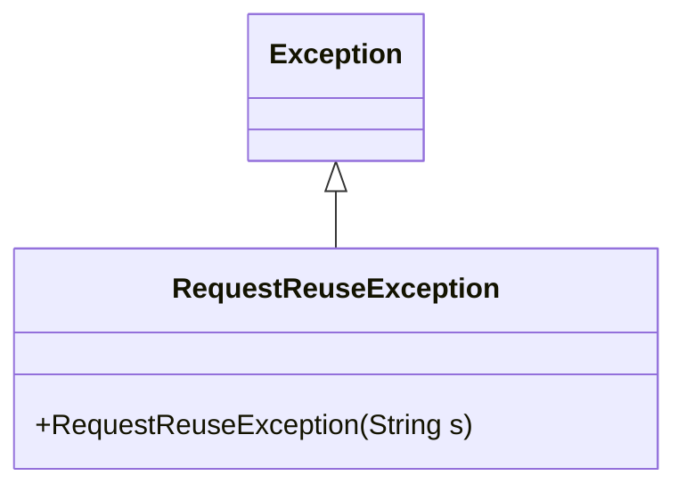
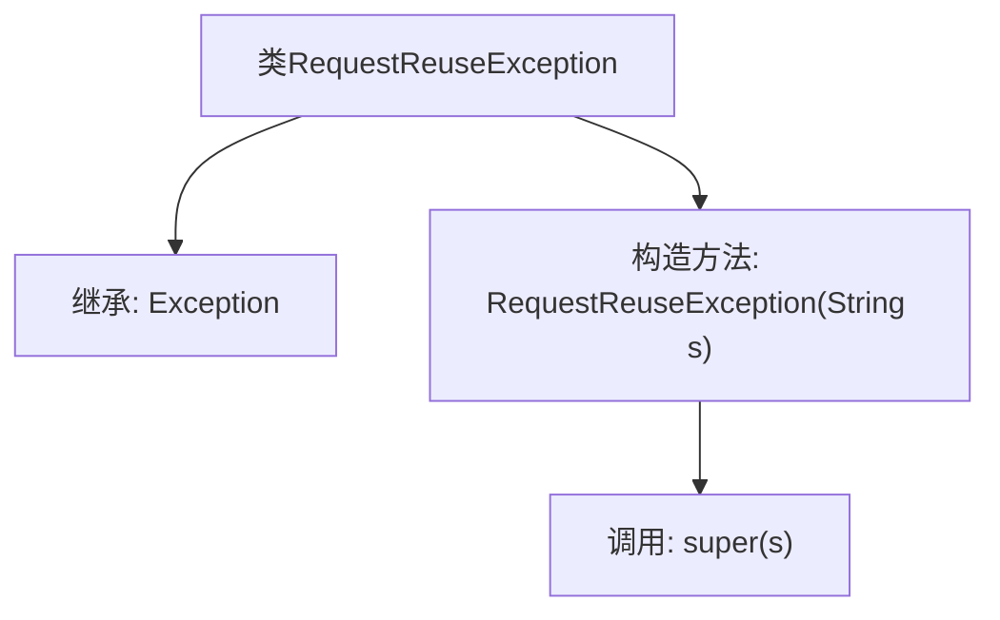

# 基础信息

|      |      |
|------|------|
| 名称 | RequestReuseException |
| 编码语言 | .java |
| 代码路径 | Signal-Server/service/src/main/java/org/whispersystems/textsecuregcm/storage/devicecheck/RequestReuseException.java |
| 包名 | org.whispersystems.textsecuregcm.storage.devicecheck |
| 依赖项 | [] |
| 概述说明 | RequestReuseException继承Exception，含字符串参数构造函数。 |

# 说明

RequestReuseException是一个继承自Exception的异常类，它包含一个带字符串参数的构造函数。该构造函数允许在创建异常实例时传递一个字符串参数，通常用于描述异常的具体信息或原因。这种设计使得异常处理更加灵活，能够根据不同的上下文提供详细的错误信息。

# 类列表 Class Summary

| 名称   | 类型  | 说明 |
|-------|------|-------------|
| RequestReuseException | class | RequestReuseException继承Exception，带字符串参数的构造函数。 |

## 类 RequestReuseException

|      |      |
|------|------|
| 访问范围 | public |
| 类型 | class |
| 名称 | RequestReuseException |
| 说明 | RequestReuseException继承Exception，带字符串参数的构造函数。 |

### UML类图

这段代码定义了一个名为 `RequestReuseException` 的异常类，它继承自 `Exception` 类。`RequestReuseException` 类包含一个构造函数，该构造函数接受一个字符串参数 `s`，并将其传递给父类 `Exception` 的构造函数。这个异常类通常用于表示请求被重复使用或重用的错误情况。通过继承 `Exception`，`RequestReuseException` 可以被抛出并在程序中进行捕获和处理。

### 内部方法调用关系图

这段代码定义了一个名为 `RequestReuseException` 的类，它继承自 `Exception` 类。`RequestReuseException` 类包含一个构造方法，该方法接受一个字符串参数 `s`，并通过 `super(s)` 调用父类 `Exception` 的构造方法。这个类通常用于表示请求重用的异常情况，通过传递错误信息 `s` 来初始化异常对象。

### 字段列表 Field List

| 名称  | 类型  | 说明 |
|-------|-------|------|

### 方法列表 Method List

| 名称  | 类型  | 说明 |
|-------|-------|------|

