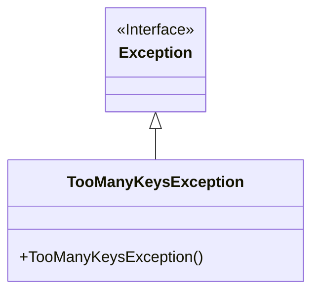
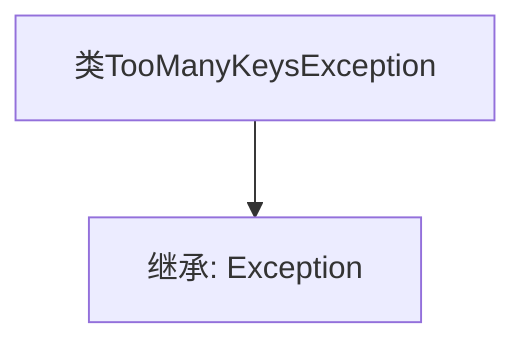

# 基础信息

|      |      |
|------|------|
| 名称 | TooManyKeysException |
| 编码语言 | .java |
| 代码路径 | Signal-Server/service/src/main/java/org/whispersystems/textsecuregcm/storage/devicecheck/TooManyKeysException.java |
| 包名 | org.whispersystems.textsecuregcm.storage.devicecheck |
| 依赖项 | [] |
| 概述说明 | TooManyKeysException类继承自Exception类。 |

# 说明

TooManyKeysException类是一个自定义异常类，它继承自Python内置的Exception异常类。该类的设计目的是在特定情况下抛出异常，通常用于处理与键数量过多相关的错误场景。通过继承Exception类，TooManyKeysException具备了标准异常的基本功能，同时可以根据需要扩展其行为或添加自定义的错误处理逻辑。这种设计使得开发者能够在代码中明确地捕获和处理与键数量相关的异常情况，从而提高代码的健壮性和可维护性。

# 类列表 Class Summary

| 名称   | 类型  | 说明 |
|-------|------|-------------|
| TooManyKeysException | class | TooManyKeysException类继承自Exception异常类。 |

## 类 TooManyKeysException

|      |      |
|------|------|
| 访问范围 | public |
| 类型 | class |
| 名称 | TooManyKeysException |
| 说明 | TooManyKeysException类继承自Exception异常类。 |

### UML类图

**描述**：`TooManyKeysException` 是一个自定义异常类，继承自 `Exception` 类。它用于在程序中抛出异常，表示发生了“过多键”的错误情况。通过继承 `Exception`，`TooManyKeysException` 具备了标准异常的基本功能，并可以通过构造函数进行实例化。

### 内部方法调用关系图

这段代码定义了一个名为 `TooManyKeysException` 的类，该类继承自 `Exception`。`TooManyKeysException` 是一个自定义异常类，用于在程序中处理特定情况下的异常。通过继承 `Exception`，`TooManyKeysException` 类具备了异常处理的基本功能，可以在需要时抛出和捕获该异常。这种设计通常用于处理程序中的特定错误情况，使得代码更加模块化和易于维护。

### 字段列表 Field List

| 名称  | 类型  | 说明 |
|-------|-------|------|

### 方法列表 Method List

| 名称  | 类型  | 说明 |
|-------|-------|------|

