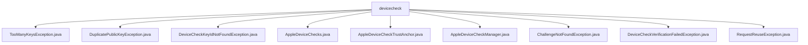

# 基础信息

|      |      |
|------|------|
| 名称 | devicecheck |
| 编码语言 | .java |
| 代码路径 | Signal-Server/service/src/main/java/org/whispersystems/textsecuregcm/storage/devicecheck |
| 包名 | Signal-Server.service.src.main.java.org.whispersystems.textsecuregcm.storage.devicecheck |
| 概述说明 | 多个自定义异常类用于处理设备检查错误，包括键数量、公钥重复等，提升代码健壮性。 |

# 说明

## 概述
该代码模块主要围绕Apple设备检查（DeviceCheck）功能展开，提供了一系列用于管理设备认证、验证和处理相关异常的工具和类。模块的核心功能包括设备认证信息的存储、查询和更新，Apple设备检查根证书的加载与验证，以及设备验证过程中的挑战和密钥管理。此外，模块还定义了一系列自定义异常类，用于处理设备检查过程中可能出现的各种错误情况，如键数量过多、公钥重复、设备检查键ID未找到、挑战未找到、设备验证失败等。这些异常类继承自Java标准库中的`Exception`类，具备基本的异常处理功能，并可以根据需要进行扩展和定制。

## 主要业务场景
1. **设备认证管理**：通过`AppleDeviceChecks`类和`AppleDeviceCheckManager`类，模块能够有效地管理Apple设备的认证信息，确保设备信息的准确性和及时性。`AppleDeviceCheckManager`还利用Redis存储挑战和密钥，支持设备认证过程中的挑战管理和密钥验证。

2. **根证书验证**：`AppleDeviceCheckTrustAnchor`类负责加载Apple设备检查所需的根证书，并验证其信任路径，确保设备检查过程的安全性和可靠性。

3. **异常处理**：模块定义了一系列自定义异常类，用于处理设备检查过程中可能出现的各种错误情况。例如，`TooManyKeysException`用于处理键数量过多的情况，`DuplicatePublicKeyException`用于处理公钥重复的情况，`DeviceCheckKeyIdNotFoundException`用于处理设备检查键ID未找到的情况，`ChallengeNotFoundException`用于处理挑战未找到的情况，`DeviceCheckVerificationFailedException`用于处理设备验证失败的情况，`RequestReuseException`用于处理请求重复的情况。这些异常类使得开发者能够在代码中明确地捕获和处理这些异常情况，从而提高代码的健壮性和可维护性。

4. **设备验证**：`AppleDeviceCheckManager`类通过存储和管理密钥来验证设备的合法性，确保设备在认证过程中的安全性。同时，利用Redis的高效存储能力来处理认证过程中的挑战数据，提高系统的性能和可靠性。

### 包内部结构视图

该流程图展示了`devicecheck`目录下的所有文件及其层级关系。`devicecheck`作为根节点，直接连接到多个异常类和设备检查相关的类文件，包括`TooManyKeysException.java`、`DuplicatePublicKeyException.java`、`DeviceCheckKeyIdNotFoundException.java`等。每个文件都作为`devicecheck`的子节点，清晰地反映了它们在同一目录下的组织结构和依赖关系。

# 文件列表 File List

| 名称   | 类型  | 说明 |
|-------|------|-------------|
| [DeviceCheckKeyIdNotFoundException.java](DeviceCheckKeyIdNotFoundException.md) | file | DeviceCheckKeyIdNotFoundException是继承自Exception的自定义异常类。 |
| [RequestReuseException.java](RequestReuseException.md) | file | RequestReuseException继承Exception，含字符串参数构造函数。 |
| [DeviceCheckVerificationFailedException.java](DeviceCheckVerificationFailedException.md) | file | DeviceCheck验证失败异常类继承Exception，提供两种构造方法。 |
| [ChallengeNotFoundException.java](ChallengeNotFoundException.md) | file | ChallengeNotFoundException是Exception的子类。 |
| [AppleDeviceCheckManager.java](AppleDeviceCheckManager.md) | file | Apple设备验证管理器处理认证和断言验证，支持Redis存储挑战和密钥管理。 |
| [AppleDeviceCheckTrustAnchor.java](AppleDeviceCheckTrustAnchor.md) | file | AppleDeviceCheckTrustAnchor类加载并验证Apple设备检查根证书的信任路径。 |
| [AppleDeviceChecks.java](AppleDeviceChecks.md) | file | AppleDeviceChecks类管理Apple设备的存储、查询和更新认证信息。 |
| [DuplicatePublicKeyException.java](DuplicatePublicKeyException.md) | file | DuplicatePublicKeyException是Exception类的子类。 |
| [TooManyKeysException.java](TooManyKeysException.md) | file | TooManyKeysException类继承自Exception类。 |

