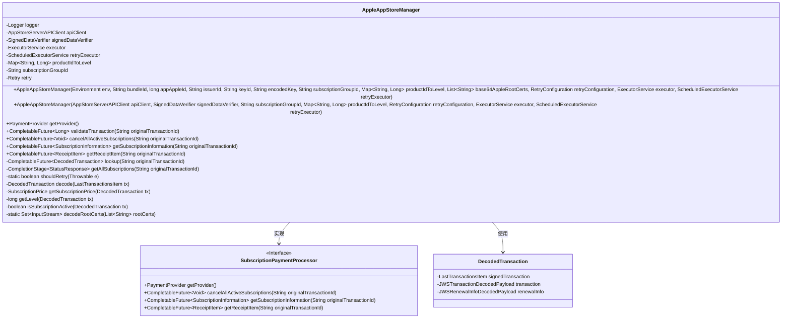
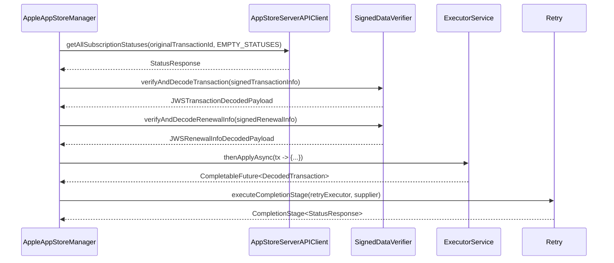

# 基础信息

|      |      |
|------|------|
| 名称 | AppleAppStoreManager |
| 编码语言 | .java |
| 代码路径 | Signal-Server/service/src/main/java/org/whispersystems/textsecuregcm/subscriptions/AppleAppStoreManager.java |
| 包名 | org.whispersystems.textsecuregcm.subscriptions |
| 依赖项 | ['com.apple.itunes.storekit.client.APIException', 'com.apple.itunes.storekit.client.AppStoreServerAPIClient', 'com.apple.itunes.storekit.model.AutoRenewStatus', 'com.apple.itunes.storekit.model.Environment', 'com.apple.itunes.storekit.model.JWSRenewalInfoDecodedPayload', 'com.apple.itunes.storekit.model.JWSTransactionDecodedPayload', 'com.apple.itunes.storekit.model.LastTransactionsItem', 'com.apple.itunes.storekit.model.Status', 'com.apple.itunes.storekit.model.StatusResponse', 'com.apple.itunes.storekit.model.SubscriptionGroupIdentifierItem', 'com.apple.itunes.storekit.verification.SignedDataVerifier', 'com.apple.itunes.storekit.verification.VerificationException', 'com.google.common.annotations.VisibleForTesting', 'io.github.resilience4j.retry.Retry', 'io.micrometer.core.instrument.Metrics', 'java.io.ByteArrayInputStream', 'java.io.IOException', 'java.io.InputStream', 'java.math.BigDecimal', 'java.time.Instant', 'java.util.Base64', 'java.util.List', 'java.util.Locale', 'java.util.Map', 'java.util.Objects', 'java.util.Set', 'java.util.concurrent.CompletableFuture', 'java.util.concurrent.CompletionStage', 'java.util.concurrent.ExecutorService', 'java.util.concurrent.ScheduledExecutorService', 'java.util.function.Supplier', 'java.util.stream.Collectors', 'org.slf4j.Logger', 'org.slf4j.LoggerFactory', 'org.whispersystems.textsecuregcm.configuration.RetryConfiguration', 'org.whispersystems.textsecuregcm.controllers.RateLimitExceededException', 'org.whispersystems.textsecuregcm.metrics.MetricsUtil', 'org.whispersystems.textsecuregcm.storage.PaymentTime', 'org.whispersystems.textsecuregcm.storage.SubscriptionException', 'org.whispersystems.textsecuregcm.util.ExceptionUtils'] |
| 概述说明 | AppleAppStoreManager类处理订阅支付，验证交易，管理订阅信息和收据，支持重试。 |

# 说明

AppleAppStoreManager类专注于处理订阅支付相关功能，包括交易验证、取消订阅、获取订阅信息及收据项。该类还支持重试机制，确保在支付过程中遇到问题时能够自动重试，提高支付成功率。通过这些功能，开发者能够有效管理应用的订阅支付流程，确保用户支付体验的流畅性和可靠性。

# 类列表 Class Summary

| 名称   | 类型  | 说明 |
|-------|------|-------------|
| AppleAppStoreManager | class | AppleAppStoreManager类实现订阅支付处理，验证交易、取消订阅、获取订阅信息和收据项，支持重试机制。 |

## 类 AppleAppStoreManager

|      |      |
|------|------|
| 访问范围 | public |
| 类型 | class |
| 名称 | AppleAppStoreManager |
| 说明 | AppleAppStoreManager类实现订阅支付处理，验证交易、取消订阅、获取订阅信息和收据项，支持重试机制。 |

### UML类图

### 描述
`AppleAppStoreManager` 是一个实现了 `SubscriptionPaymentProcessor` 接口的类，用于处理与 Apple App Store 相关的订阅支付逻辑。它通过 `AppStoreServerAPIClient` 与 Apple 服务器进行交互，并使用 `SignedDataVerifier` 验证和解码交易数据。类中的方法包括验证交易、取消订阅、获取订阅信息等，同时提供了重试机制来处理可能发生的错误。`DecodedTransaction` 是一个记录类，用于存储解码后的交易信息。

### 内部方法调用关系图

```mermaid
graph TD
    A["类AppleAppStoreManager"]
    B["属性: Logger logger"]
    C["属性: AppStoreServerAPIClient apiClient"]
    D["属性: SignedDataVerifier signedDataVerifier"]
    E["属性: ExecutorService executor"]
    F["属性: ScheduledExecutorService retryExecutor"]
    G["属性: Map<String, Long> productIdToLevel"]
    H["属性: String subscriptionGroupId"]
    I["属性: Retry retry"]
    J["构造方法: AppleAppStoreManager(Environment env, String bundleId, long appAppleId, String issuerId, String keyId, String encodedKey, String subscriptionGroupId, Map<String, Long> productIdToLevel, List<String> base64AppleRootCerts, RetryConfiguration retryConfiguration, ExecutorService executor, ScheduledExecutorService retryExecutor)"]
    K["构造方法: AppleAppStoreManager(AppStoreServerAPIClient apiClient, SignedDataVerifier signedDataVerifier, String subscriptionGroupId, Map<String, Long> productIdToLevel, RetryConfiguration retryConfiguration, ExecutorService executor, ScheduledExecutorService retryExecutor)"]
    L["方法: PaymentProvider getProvider()"]
    M["方法: CompletableFuture<Long> validateTransaction(String originalTransactionId)"]
    N["方法: CompletableFuture<Void> cancelAllActiveSubscriptions(String originalTransactionId)"]
    O["方法: CompletableFuture<SubscriptionInformation> getSubscriptionInformation(String originalTransactionId)"]
    P["方法: CompletableFuture<ReceiptItem> getReceiptItem(String originalTransactionId)"]
    Q["方法: CompletableFuture<DecodedTransaction> lookup(String originalTransactionId)"]
    R["方法: CompletionStage<StatusResponse> getAllSubscriptions(String originalTransactionId)"]
    S["方法: boolean shouldRetry(Throwable e)"]
    T["方法: DecodedTransaction decode(LastTransactionsItem tx)"]
    U["方法: SubscriptionPrice getSubscriptionPrice(DecodedTransaction tx)"]
    V["方法: long getLevel(DecodedTransaction tx)"]
    W["方法: boolean isSubscriptionActive(DecodedTransaction tx)"]
    X["方法: Set<InputStream> decodeRootCerts(List<String> rootCerts)"]

    A --> B
    A --> C
    A --> D
    A --> E
    A --> F
    A --> G
    A --> H
    A --> I
    A --> J
    A --> K
    A --> L
    A --> M
    A --> N
    A --> O
    A --> P
    A --> Q
    A --> R
    A --> S
    A --> T
    A --> U
    A --> V
    A --> W
    A --> X
```

**流程图描述**：该流程图展示了`AppleAppStoreManager`类的结构及其内部方法调用关系。类包含多个属性，如`Logger`、`AppStoreServerAPIClient`、`SignedDataVerifier`等，并通过两个构造方法初始化这些属性。类中的方法包括获取支付提供商、验证交易、取消订阅、获取订阅信息等，每个方法通过箭头指向其依赖的其他方法或属性。

**时序图描述**：该时序图展示了`AppleAppStoreManager`类在执行`getAllSubscriptionStatuses`方法时的调用顺序。首先，`AppleAppStoreManager`调用`AppStoreServerAPIClient`获取订阅状态，然后通过`SignedDataVerifier`验证和解码交易信息。接着，使用`ExecutorService`异步处理解码后的交易数据，并通过`Retry`机制执行重试逻辑，最终返回处理结果。

### 字段列表 Field List

| 名称  | 类型  | 说明 |
|-------|-------|------|
| productIdToLevel | Map<String, Long> | 私有映射存储产品ID与级别的对应关系。 |
| executor | ExecutorService | 私有且不可变的线程池执行器。 |
| retry | Retry | 私有且不可变的Retry对象。 |
| apiClient | AppStoreServerAPIClient | 私有终端的AppStore服务器API客户端实例。 |
| signedDataVerifier | SignedDataVerifier | 私有不可变的SignedDataVerifier实例。 |
| subscriptionGroupId | String | 私有不可变的订阅组ID字符串。 |
| GET_SUBSCRIPTION_ERROR_COUNTER_NAME =      MetricsUtil.name(AppleAppStoreManager.class, "getSubscriptionsError") | String | 定义获取订阅错误计数器的静态常量字符串。 |
| EMPTY_STATUSES = new Status[0] | Status[] | 定义空状态数组常量EMPTY_STATUSES。 |
| retryExecutor | ScheduledExecutorService | 私有且不可变的计划重试执行器。 |
| logger = LoggerFactory.getLogger(AppleAppStoreManager.class) | Logger | AppleAppStoreManager类中定义了一个私有的静态日志记录器。 |

### 方法列表 Method List

| 名称  | 类型  | 说明 |
|-------|-------|------|
| shouldRetry | boolean | 判断异常是否可重试，基于API错误类型。 |
| getSubscriptionPrice | SubscriptionPrice | 获取交易价格并转换为订阅价格对象。 |
| getProvider | PaymentProvider | 重写方法，返回苹果应用商店支付提供者。 |
| isSubscriptionActive | boolean | 检查交易状态是否为激活或计费宽限期。 |
| validateTransaction | CompletableFuture<Long> | 异步验证交易，检查订阅状态并返回交易等级。 |
| getAllSubscriptions | CompletionStage<StatusResponse> | 异步获取订阅状态，处理异常并重试。 |
| getLevel | long | 获取交易级别，若产品ID未知则抛出异常。 |
| decode | DecodedTransaction | 解码交易信息并验证签名数据和续订信息，失败时抛出异常。 |
| getSubscriptionInformation | CompletableFuture<SubscriptionInformation> | 根据交易ID获取订阅信息，返回订阅状态、价格、等级、有效期等。 |
| decodeRootCerts | Set<InputStream> | 将Base64编码的根证书解码并转换为InputStream集合。 |
| lookup | CompletableFuture<DecodedTransaction> | 根据事务ID查找解码事务，验证订阅并返回匹配的首个事务。 |
| cancelAllActiveSubscriptions | CompletableFuture<Void> | 取消所有有效订阅，需先通过Storekit取消，否则抛出异常。 |
| getReceiptItem | CompletableFuture<ReceiptItem> | 通过原交易ID获取订阅收据项，检查订阅状态，生成新交易ID，返回包含支付时间的收据项。 |

