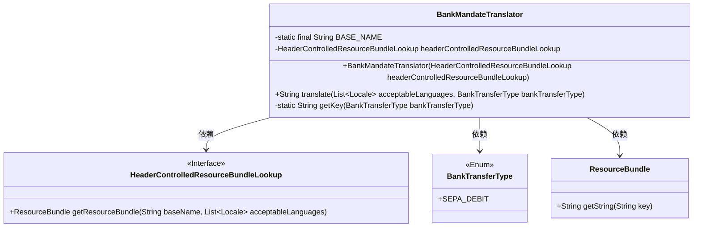
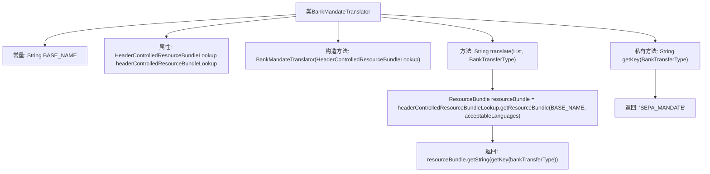

# 基础信息

|      |      |
|------|------|
| 名称 | BankMandateTranslator |
| 编码语言 | .java |
| 代码路径 | Signal-Server/service/src/main/java/org/whispersystems/textsecuregcm/subscriptions/BankMandateTranslator.java |
| 包名 | org.whispersystems.textsecuregcm.subscriptions |
| 依赖项 | ['java.util.List', 'java.util.Locale', 'java.util.Objects', 'java.util.ResourceBundle', 'javax.annotation.Nonnull', 'org.signal.i18n.HeaderControlledResourceBundleLookup'] |
| 概述说明 | BankMandateTranslator类用于翻译银行授权信息。 |

# 说明

BankMandateTranslator类的主要功能是根据指定的语言和转账类型，对银行授权信息进行翻译。该类通过接收语言和转账类型作为输入，确保生成的授权信息在语言和内容上符合特定要求，从而实现跨语言和跨转账类型的准确翻译。

# 类列表 Class Summary

| 名称   | 类型  | 说明 |
|-------|------|-------------|
| BankMandateTranslator | class | BankMandateTranslator类用于根据语言和转账类型翻译银行授权信息。 |

## 类 BankMandateTranslator

|      |      |
|------|------|
| 访问范围 | public |
| 类型 | class |
| 名称 | BankMandateTranslator |
| 说明 | BankMandateTranslator类用于根据语言和转账类型翻译银行授权信息。 |

### UML类图

**描述：**  
`BankMandateTranslator` 类负责根据可接受的语言列表和银行转账类型翻译银行授权信息。它依赖于 `HeaderControlledResourceBundleLookup` 接口来获取资源包，并使用 `BankTransferType` 枚举来确定翻译的键。`ResourceBundle` 类用于获取具体的翻译字符串。整个过程通过 `translate` 方法实现，`getKey` 方法则用于根据转账类型生成相应的键。

### 内部方法调用关系图

**描述：**  
`BankMandateTranslator`类用于根据可接受的语言列表和银行转账类型翻译银行授权信息。它包含一个常量`BASE_NAME`和一个`HeaderControlledResourceBundleLookup`属性。构造方法用于初始化`headerControlledResourceBundleLookup`。`translate`方法通过`headerControlledResourceBundleLookup`获取资源包，并返回与银行转账类型对应的翻译文本。`getKey`方法根据银行转账类型返回相应的键值。

### 字段列表 Field List

| 名称  | 类型  | 说明 |
|-------|-------|------|
| headerControlledResourceBundleLookup | HeaderControlledResourceBundleLookup | 私有HeaderControlledResourceBundleLookup实例变量。 |
| BASE_NAME = "org.signal.bankmandate.BankMandate" | String | 私有静态常量BASE_NAME赋值为"org.signal.bankmandate.BankMandate"。 |

### 方法列表 Method List

| 名称  | 类型  | 说明 |
|-------|-------|------|
| getKey | String | 根据银行转账类型返回对应的密钥。 |
| translate | String | 该方法根据语言列表和转账类型返回翻译结果。 |

