# 基础信息

|      |      |
|------|------|
| 名称 | BraintreeGraphqlClient |
| 编码语言 | .java |
| 代码路径 | Signal-Server/service/src/main/java/org/whispersystems/textsecuregcm/subscriptions/BraintreeGraphqlClient.java |
| 包名 | org.whispersystems.textsecuregcm.subscriptions |
| 依赖项 | ['com.apollographql.apollo3.api.ApolloResponse', 'com.apollographql.apollo3.api.Operation', 'com.apollographql.apollo3.api.Operations', 'com.apollographql.apollo3.api.Optional', 'com.apollographql.apollo3.api.json.BufferedSinkJsonWriter', 'com.braintree.graphql.client.type.ChargePaymentMethodInput', 'com.braintree.graphql.client.type.CreatePayPalBillingAgreementInput', 'com.braintree.graphql.client.type.CreatePayPalOneTimePaymentInput', 'com.braintree.graphql.client.type.CustomFieldInput', 'com.braintree.graphql.client.type.MonetaryAmountInput', 'com.braintree.graphql.client.type.PayPalBillingAgreementChargePattern', 'com.braintree.graphql.client.type.PayPalBillingAgreementExperienceProfileInput', 'com.braintree.graphql.client.type.PayPalBillingAgreementInput', 'com.braintree.graphql.client.type.PayPalExperienceProfileInput', 'com.braintree.graphql.client.type.PayPalIntent', 'com.braintree.graphql.client.type.PayPalLandingPageType', 'com.braintree.graphql.client.type.PayPalOneTimePaymentInput', 'com.braintree.graphql.client.type.PayPalProductAttributesInput', 'com.braintree.graphql.client.type.PayPalUserAction', 'com.braintree.graphql.client.type.TokenizePayPalBillingAgreementInput', 'com.braintree.graphql.client.type.TokenizePayPalOneTimePaymentInput', 'com.braintree.graphql.client.type.TransactionInput', 'com.braintree.graphql.client.type.VaultPaymentMethodInput', 'com.braintree.graphql.clientoperation.ChargePayPalOneTimePaymentMutation', 'com.braintree.graphql.clientoperation.CreatePayPalBillingAgreementMutation', 'com.braintree.graphql.clientoperation.CreatePayPalOneTimePaymentMutation', 'com.braintree.graphql.clientoperation.TokenizePayPalBillingAgreementMutation', 'com.braintree.graphql.clientoperation.TokenizePayPalOneTimePaymentMutation', 'com.braintree.graphql.clientoperation.VaultPaymentMethodMutation', 'jakarta.ws.rs.ServiceUnavailableException', 'java.math.BigDecimal', 'java.net.URI', 'java.net.URISyntaxException', 'java.net.http.HttpRequest', 'java.net.http.HttpResponse', 'java.util.Base64', 'java.util.List', 'java.util.concurrent.CompletableFuture', 'okio.Buffer', 'org.slf4j.Logger', 'org.slf4j.LoggerFactory', 'org.whispersystems.textsecuregcm.http.FaultTolerantHttpClient'] |
| 概述说明 | BraintreeGraphqlClient类处理PayPal支付及计费协议，支持创建、令牌化和扣款。 |

# 说明

BraintreeGraphqlClient类专门用于处理PayPal支付和计费协议的相关操作。该类支持创建支付流程、令牌化支付信息以及执行扣款操作，确保支付过程的安全性和高效性。通过这些功能，BraintreeGraphqlClient类能够简化与PayPal集成的复杂性，提供全面的支付解决方案。

# 类列表 Class Summary

| 名称   | 类型  | 说明 |
|-------|------|-------------|
| BraintreeGraphqlClient | class | BraintreeGraphqlClient类用于处理PayPal支付和计费协议，支持创建、令牌化和扣款操作。 |

## 类 BraintreeGraphqlClient

|      |      |
|------|------|
| 访问范围 | None |
| 类型 | class |
| 名称 | BraintreeGraphqlClient |
| 说明 | BraintreeGraphqlClient类用于处理PayPal支付和计费协议，支持创建、令牌化和扣款操作。 |

### UML类图

```mermaid
classDiagram
    class BraintreeGraphqlClient {
        -static final String BRAINTREE_VERSION
        -static final Logger logger
        -FaultTolerantHttpClient httpClient
        -URI graphqlUri
        -String authorizationHeader
        +BraintreeGraphqlClient(FaultTolerantHttpClient httpClient, String graphqlUri, String publicKey, String privateKey)
        +CompletableFuture~CreatePayPalOneTimePaymentMutation.CreatePayPalOneTimePayment~ createPayPalOneTimePayment(BigDecimal amount, String currency, String returnUrl, String cancelUrl, String locale)
        +CompletableFuture~TokenizePayPalOneTimePaymentMutation.TokenizePayPalOneTimePayment~ tokenizePayPalOneTimePayment(String payerId, String paymentId, String paymentToken)
        +CompletableFuture~ChargePayPalOneTimePaymentMutation.ChargePaymentMethod~ chargeOneTimePayment(String paymentMethodId, BigDecimal amount, String merchantAccount, long level)
        +CompletableFuture~CreatePayPalBillingAgreementMutation.CreatePayPalBillingAgreement~ createPayPalBillingAgreement(String returnUrl, String cancelUrl, String locale)
        +CompletableFuture~TokenizePayPalBillingAgreementMutation.TokenizePayPalBillingAgreement~ tokenizePayPalBillingAgreement(String billingAgreementToken)
        +CompletableFuture~VaultPaymentMethodMutation.VaultPaymentMethod~ vaultPaymentMethod(String customerId, String paymentMethodId)
        -CreatePayPalOneTimePaymentInput buildCreatePayPalOneTimePaymentInput(BigDecimal amount, String currency, String returnUrl, String cancelUrl, String locale)
        -ChargePaymentMethodInput buildChargePaymentMethodInput(String paymentMethodId, BigDecimal amount, String merchantAccount, List~CustomFieldInput~ customFields)
        -CreatePayPalBillingAgreementInput buildCreatePayPalBillingAgreementInput(String returnUrl, String cancelUrl, String locale)
        -VaultPaymentMethodInput buildVaultPaymentMethodInput(String customerId, String paymentMethodId)
        -~T extends Operation~U~, U extends Operation.Data~ U assertSuccessAndExtractData(HttpResponse~String~ httpResponse, T operation)
        -~T extends Operation~U~, U extends Operation.Data~ ApolloResponse~U~ extractApolloResponse(HttpResponse~String~ httpResponse, T operation)
        -~T extends Operation~U~, U extends Operation.Data~ U assertSuccessAndExtractDataFromApolloResponse(ApolloResponse~U~ response)
        -HttpRequest buildRequest(Operation~?~ operation)
    }

    class FaultTolerantHttpClient {
        <<Interface>>
        +CompletableFuture~HttpResponse~String~~ sendAsync(HttpRequest request, HttpResponse.BodyHandler~String~ responseBodyHandler)
    }

    class CreatePayPalOneTimePaymentMutation {
        +class CreatePayPalOneTimePayment
        +class Data
    }

    class TokenizePayPalOneTimePaymentMutation {
        +class TokenizePayPalOneTimePayment
        +class Data
    }

    class ChargePayPalOneTimePaymentMutation {
        +class ChargePaymentMethod
        +class Data
    }

    class CreatePayPalBillingAgreementMutation {
        +class CreatePayPalBillingAgreement
        +class Data
    }

    class TokenizePayPalBillingAgreementMutation {
        +class TokenizePayPalBillingAgreement
        +class Data
    }

    class VaultPaymentMethodMutation {
        +class VaultPaymentMethod
        +class Data
    }

    class CreatePayPalOneTimePaymentInput {
        +CreatePayPalOneTimePaymentInput(Optional~?~, Optional~?~, MonetaryAmountInput, String, Optional~?~, PayPalIntent, Optional~?~, Optional~Boolean~, Optional~?~, Optional~PayPalExperienceProfileInput~, Optional~?~, Optional~?~, String, Optional~?~, Optional~?~)
    }

    class ChargePaymentMethodInput {
        +ChargePaymentMethodInput(Optional~?~, String, TransactionInput)
    }

    class CreatePayPalBillingAgreementInput {
        +CreatePayPalBillingAgreementInput(Optional~?~, Optional~?~, String, String, Optional~?~, Optional~?~, Optional~Boolean~, Optional~?~, Optional~PayPalBillingAgreementExperienceProfileInput~, Optional~?~, Optional~PayPalProductAttributesInput~)
    }

    class VaultPaymentMethodInput {
        +VaultPaymentMethodInput(Optional~?~, String, Optional~?~, Optional~?~, Optional~String~, Optional~?~, Optional~?~)
    }

    class Operation {
        <<Interface>>
        +class Data
    }

    class ApolloResponse {
        +class Data
    }

    BraintreeGraphqlClient --> FaultTolerantHttpClient : 依赖
    BraintreeGraphqlClient --> CreatePayPalOneTimePaymentMutation : 依赖
    BraintreeGraphqlClient --> TokenizePayPalOneTimePaymentMutation : 依赖
    BraintreeGraphqlClient --> ChargePayPalOneTimePaymentMutation : 依赖
    BraintreeGraphqlClient --> CreatePayPalBillingAgreementMutation : 依赖
    BraintreeGraphqlClient --> TokenizePayPalBillingAgreementMutation : 依赖
    BraintreeGraphqlClient --> VaultPaymentMethodMutation : 依赖
    BraintreeGraphqlClient --> CreatePayPalOneTimePaymentInput : 依赖
    BraintreeGraphqlClient --> ChargePaymentMethodInput : 依赖
    BraintreeGraphqlClient --> CreatePayPalBillingAgreementInput : 依赖
    BraintreeGraphqlClient --> VaultPaymentMethodInput : 依赖
    BraintreeGraphqlClient --> Operation : 依赖
    BraintreeGraphqlClient --> ApolloResponse : 依赖
```

### 描述：
`BraintreeGraphqlClient` 类是一个用于与Braintree GraphQL API交互的客户端。它封装了与PayPal支付相关的操作，如创建一次性支付、令牌化支付、计费协议等。该类依赖于`FaultTolerantHttpClient`来发送HTTP请求，并使用多个Mutation类来处理不同的GraphQL操作。它还包含了多个输入类，用于构建GraphQL请求的输入参数。整个类的设计旨在处理复杂的支付流程，并确保与Braintree API的可靠交互。

### 内部方法调用关系图

```mermaid
graph TD
    A["类BraintreeGraphqlClient"]
    B["属性: String BRAINTREE_VERSION"]
    C["属性: Logger logger"]
    D["属性: FaultTolerantHttpClient httpClient"]
    E["属性: URI graphqlUri"]
    F["属性: String authorizationHeader"]
    G["构造方法: BraintreeGraphqlClient(FaultTolerantHttpClient, String, String, String)"]
    H["方法: CompletableFuture<CreatePayPalOneTimePaymentMutation.CreatePayPalOneTimePayment> createPayPalOneTimePayment"]
    I["方法: CompletableFuture<TokenizePayPalOneTimePaymentMutation.TokenizePayPalOneTimePayment> tokenizePayPalOneTimePayment"]
    J["方法: CompletableFuture<ChargePayPalOneTimePaymentMutation.ChargePaymentMethod> chargeOneTimePayment"]
    K["方法: CompletableFuture<CreatePayPalBillingAgreementMutation.CreatePayPalBillingAgreement> createPayPalBillingAgreement"]
    L["方法: CompletableFuture<TokenizePayPalBillingAgreementMutation.TokenizePayPalBillingAgreement> tokenizePayPalBillingAgreement"]
    M["方法: CompletableFuture<VaultPaymentMethodMutation.VaultPaymentMethod> vaultPaymentMethod"]
    N["方法: HttpRequest buildRequest(Operation<?>)"]
    O["方法: <T extends Operation<U>, U extends Operation.Data> U assertSuccessAndExtractData(HttpResponse<String>, T)"]
    P["方法: <T extends Operation<U>, U extends Operation.Data> ApolloResponse<U> extractApolloResponse(HttpResponse<String>, T)"]
    Q["方法: <T extends Operation<U>, U extends Operation.Data> U assertSuccessAndExtractDataFromApolloResponse(ApolloResponse<U>)"]

    A --> B
    A --> C
    A --> D
    A --> E
    A --> F
    A --> G
    A --> H
    A --> I
    A --> J
    A --> K
    A --> L
    A --> M
    A --> N
    A --> O
    A --> P
    A --> Q
```

这段代码定义了一个`BraintreeGraphqlClient`类，用于处理与Braintree GraphQL API的交互。类中包含多个方法，用于创建、令牌化、收费和存储PayPal支付方式。每个方法都会构建一个HTTP请求，并通过`httpClient`发送异步请求，最后处理响应。代码还包含了一些辅助方法，用于构建请求、解析响应和处理错误。

### 字段列表 Field List

| 名称  | 类型  | 说明 |
|-------|-------|------|
| graphqlUri | URI | 私有不可变的GraphQL URI变量。 |
| httpClient | FaultTolerantHttpClient | 私有不可变的容错HTTP客户端实例。 |
| logger = LoggerFactory.getLogger(BraintreeGraphqlClient.class) | Logger | BraintreeGraphqlClient类中定义了一个静态的Logger实例。 |
| authorizationHeader | String | 私有字符串变量authorizationHeader。 |
| BRAINTREE_VERSION = "2022-10-01" | String | BRAINTREE_VERSION常量值为"2022-10-01"。 |

### 方法列表 Method List

| 名称  | 类型  | 说明 |
|-------|-------|------|
| vaultPaymentMethod | CompletableFuture<VaultPaymentMethodMutation.VaultPaymentMethod> | 异步存储支付方法，返回支付方法结果。 |
| assertSuccessAndExtractData | U | 私有静态方法，断言HTTP响应成功并提取操作数据。 |
| chargeOneTimePayment | CompletableFuture<ChargePayPalOneTimePaymentMutation.ChargePaymentMethod> | 异步方法，通过HTTP请求完成PayPal一次性支付，返回支付结果。 |
| buildRequest | HttpRequest | 构建HTTP请求，包含JSON数据、授权和版本头信息。 |
| buildVaultPaymentMethodInput | VaultPaymentMethodInput | 构建支付方法输入对象，包含客户ID和支付方法ID。 |
| createPayPalBillingAgreement | CompletableFuture<CreatePayPalBillingAgreementMutation.CreatePayPalBillingAgreement> | 创建PayPal账单协议的异步方法，输入为返回URL、取消URL和语言环境。 |
| tokenizePayPalBillingAgreement | CompletableFuture<TokenizePayPalBillingAgreementMutation.TokenizePayPalBillingAgreement> | 异步方法用于通过HTTP请求处理PayPal账单协议令牌化操作。 |
| extractApolloResponse | ApolloResponse<U> | 提取Apollo响应，检查HTTP状态码，若非200则抛异常，否则解析JSON响应。 |
| buildChargePaymentMethodInput | ChargePaymentMethodInput | 构建支付方法输入，包含支付ID、金额、商户账户和自定义字段。 |
| tokenizePayPalOneTimePayment | CompletableFuture<TokenizePayPalOneTimePaymentMutation.TokenizePayPalOneTimePayment> | 该方法通过传入参数生成PayPal一次性支付请求，并异步返回支付结果。 |
| assertSuccessAndExtractDataFromApolloResponse | U | 检查Apollo响应，若无错误且数据非空则返回数据，否则记录错误并抛出异常。 |
| buildCreatePayPalOneTimePaymentInput | CreatePayPalOneTimePaymentInput | 构建PayPal一次性支付输入，包含金额、货币、返回URL、取消URL和地区信息。 |
| buildCreatePayPalBillingAgreementInput | CreatePayPalBillingAgreementInput | 构建PayPal账单协议输入，包含返回URL、取消URL、语言环境等参数。 |
| createPayPalOneTimePayment | CompletableFuture<CreatePayPalOneTimePaymentMutation.CreatePayPalOneTimePayment> | 创建PayPal一次性支付，处理输入、请求和响应，确保数据有效。 |

