# 基础信息

|      |      |
|------|------|
| 名称 | BraintreeManager |
| 编码语言 | .java |
| 代码路径 | Signal-Server/service/src/main/java/org/whispersystems/textsecuregcm/subscriptions/BraintreeManager.java |
| 包名 | org.whispersystems.textsecuregcm.subscriptions |
| 依赖项 | ['com.braintreegateway.BraintreeGateway', 'com.braintreegateway.ClientTokenRequest', 'com.braintreegateway.Customer', 'com.braintreegateway.CustomerRequest', 'com.braintreegateway.Plan', 'com.braintreegateway.ResourceCollection', 'com.braintreegateway.Result', 'com.braintreegateway.Subscription', 'com.braintreegateway.SubscriptionRequest', 'com.braintreegateway.Transaction', 'com.braintreegateway.TransactionSearchRequest', 'com.braintreegateway.exceptions.BraintreeException', 'com.braintreegateway.exceptions.NotFoundException', 'com.fasterxml.jackson.core.JsonProcessingException', 'com.google.cloud.pubsub.v1.PublisherInterface', 'com.google.common.annotations.VisibleForTesting', 'com.google.pubsub.v1.PubsubMessage', 'io.micrometer.core.instrument.Metrics', 'java.io.IOException', 'java.math.BigDecimal', 'java.time.Duration', 'java.time.Instant', 'java.util.Collections', 'java.util.Comparator', 'java.util.HexFormat', 'java.util.List', 'java.util.Locale', 'java.util.Map', 'java.util.Optional', 'java.util.Set', 'java.util.concurrent.CompletableFuture', 'java.util.concurrent.CompletionException', 'java.util.concurrent.Executor', 'java.util.concurrent.ScheduledExecutorService', 'javax.annotation.Nullable', 'org.slf4j.Logger', 'org.slf4j.LoggerFactory', 'org.whispersystems.textsecuregcm.configuration.CircuitBreakerConfiguration', 'org.whispersystems.textsecuregcm.currency.CurrencyConversionManager', 'org.whispersystems.textsecuregcm.http.FaultTolerantHttpClient', 'org.whispersystems.textsecuregcm.metrics.MetricsUtil', 'org.whispersystems.textsecuregcm.storage.PaymentTime', 'org.whispersystems.textsecuregcm.storage.SubscriptionException', 'org.whispersystems.textsecuregcm.util.ExceptionUtils', 'org.whispersystems.textsecuregcm.util.GoogleApiUtil', 'org.whispersystems.textsecuregcm.util.SystemMapper', 'org.whispersystems.textsecuregcm.util.ua.ClientPlatform'] |
| 概述说明 | BraintreeManager处理支付，支持PayPal，管理订阅、交易和货币转换，发布捐赠事件。 |

# 说明

BraintreeManager是一个支付处理模块，支持通过PayPal进行支付操作。该模块能够处理订阅和交易，并具备货币转换功能。此外，BraintreeManager还能够发布捐赠事件，用于跟踪和记录捐赠相关的操作。该模块集成了多种支付功能，适用于需要处理复杂支付场景的应用。

# 类列表 Class Summary

| 名称   | 类型  | 说明 |
|-------|------|-------------|
| BraintreeManager | class | BraintreeManager实现支付处理，支持PayPal，处理订阅、交易及货币转换，发布捐赠事件。 |

## 类 BraintreeManager

|      |      |
|------|------|
| 访问范围 | public |
| 类型 | class |
| 名称 | BraintreeManager |
| 说明 | BraintreeManager实现支付处理，支持PayPal，处理订阅、交易及货币转换，发布捐赠事件。 |

### UML类图

```mermaid
classDiagram
    class BraintreeManager {
        -Logger logger
        -String GENERIC_DECLINED_PROCESSOR_CODE
        -String PAYPAL_FUNDING_INSTRUMENT_DECLINED_PROCESSOR_CODE
        -String PAYPAL_PAYMENT_ALREADY_COMPLETED_PROCESSOR_CODE
        -BigDecimal ONE_MILLION
        -BraintreeGateway braintreeGateway
        -BraintreeGraphqlClient braintreeGraphqlClient
        -CurrencyConversionManager currencyConversionManager
        -PublisherInterface pubsubPublisher
        -Executor executor
        -Map~PaymentMethod, Set~String~~ supportedCurrenciesByPaymentMethod
        -Map~String, String~ currenciesToMerchantAccounts
        -String PUBSUB_MESSAGE_COUNTER_NAME
        +BraintreeManager(String braintreeMerchantId, String braintreePublicKey, String braintreePrivateKey, String braintreeEnvironment, Map~PaymentMethod, Set~String~~ supportedCurrenciesByPaymentMethod, Map~String, String~ currenciesToMerchantAccounts, String graphqlUri, CurrencyConversionManager currencyConversionManager, PublisherInterface pubsubPublisher, CircuitBreakerConfiguration circuitBreakerConfiguration, Executor executor, ScheduledExecutorService retryExecutor)
        +BraintreeManager(BraintreeGateway braintreeGateway, Map~PaymentMethod, Set~String~~ supportedCurrenciesByPaymentMethod, Map~String, String~ currenciesToMerchantAccounts, BraintreeGraphqlClient braintreeGraphqlClient, CurrencyConversionManager currencyConversionManager, PublisherInterface pubsubPublisher, Executor executor)
        +Set~String~ getSupportedCurrenciesForPaymentMethod(PaymentMethod paymentMethod)
        +PaymentProvider getProvider()
        +boolean supportsPaymentMethod(PaymentMethod paymentMethod)
        +CompletableFuture~PaymentDetails~ getPaymentDetails(String paymentId)
        +CompletableFuture~PayPalOneTimePaymentApprovalDetails~ createOneTimePayment(String currency, long amount, String locale, String returnUrl, String cancelUrl)
        +CompletableFuture~PayPalChargeSuccessDetails~ captureOneTimePayment(String payerId, String paymentId, String paymentToken, String currency, long amount, long level, ClientPlatform clientPlatform)
        +void publishDonationEvent(long amount, String currency, Instant timestamp, ClientPlatform clientPlatform)
        +long toMicros(BigDecimal amount)
        +static PaymentStatus getPaymentStatus(Transaction.Status status)
        +static PaymentStatus getPaymentStatus(com.braintree.graphql.client.type.PaymentStatus status)
        +static SubscriptionStatus getSubscriptionStatus(Subscription.Status status, boolean latestTransactionFailed)
        +BigDecimal convertApiAmountToBraintreeAmount(String currency, long amount)
        +CompletableFuture~ProcessorCustomer~ createCustomer(byte[] subscriberUser, ClientPlatform clientPlatform)
        +CompletableFuture~String~ createPaymentMethodSetupToken(String customerId)
        +CompletableFuture~Void~ setDefaultPaymentMethodForCustomer(String customerId, String billingAgreementToken, String currentSubscriptionId)
        +CompletableFuture~Object~ getSubscription(String subscriptionId)
        +CompletableFuture~SubscriptionId~ createSubscription(String customerId, String planId, long level, long lastSubscriptionCreatedAt)
        +CompletableFuture~SubscriptionId~ updateSubscription(Object subscriptionObj, String planId, long level, String idempotencyKey)
        +CompletableFuture~LevelAndCurrency~ getLevelAndCurrencyForSubscription(Object subscriptionObj)
        +CompletableFuture~Plan~ findPlan(String planId)
        +long getLevelForPlan(Plan plan)
        +CompletableFuture~SubscriptionInformation~ getSubscriptionInformation(String subscriptionId)
        +CompletableFuture~Void~ cancelAllActiveSubscriptions(String customerId)
        +CompletableFuture~Void~ endSubscription(Subscription subscription)
        +CompletableFuture~Void~ cancelSubscriptionAtEndOfCurrentPeriod(Subscription subscription)
        +CompletableFuture~Void~ cancelSubscriptionImmediately(Subscription subscription)
        +CompletableFuture~ReceiptItem~ getReceiptItem(String subscriptionId)
        +Optional~Transaction~ getLatestTransactionForSubscription(Subscription subscription)
        +CompletableFuture~PayPalBillingAgreementApprovalDetails~ createPayPalBillingAgreement(String returnUrl, String cancelUrl, String locale)
    }

    class BraintreeGateway {
        +BraintreeGateway(String environment, String merchantId, String publicKey, String privateKey)
        +Transaction find(String id)
        +Result~Subscription~ create(SubscriptionRequest request)
        +Result~Subscription~ update(String id, SubscriptionRequest request)
        +Result~Subscription~ cancel(String id)
        +Customer find(String id)
        +String generate(ClientTokenRequest request)
    }

    class BraintreeGraphqlClient {
        +BraintreeGraphqlClient(FaultTolerantHttpClient client, String graphqlUri, String publicKey, String privateKey)
        +CompletableFuture~PayPalOneTimePaymentResponse~ createPayPalOneTimePayment(BigDecimal amount, String currency, String returnUrl, String cancelUrl, String locale)
        +CompletableFuture~TokenizePayPalOneTimePaymentResponse~ tokenizePayPalOneTimePayment(String payerId, String paymentId, String paymentToken)
        +CompletableFuture~ChargeOneTimePaymentResponse~ chargeOneTimePayment(String paymentMethodId, BigDecimal amount, String merchantAccountId, long level)
        +CompletableFuture~TokenizePayPalBillingAgreementResponse~ tokenizePayPalBillingAgreement(String billingAgreementToken)
        +CompletableFuture~VaultPaymentMethodResponse~ vaultPaymentMethod(String customerId, String paymentMethodId)
        +CompletableFuture~CreatePayPalBillingAgreementResponse~ createPayPalBillingAgreement(String returnUrl, String cancelUrl, String locale)
    }

    class CurrencyConversionManager {
        +Optional~BigDecimal~ convertToUsd(BigDecimal amount, String currency)
    }

    class PublisherInterface {
        +CompletableFuture~String~ publish(PubsubMessage message)
    }

    class Executor {
        +void execute(Runnable command)
    }

    class CustomerAwareSubscriptionPaymentProcessor {
        <<Interface>>
        +Set~String~ getSupportedCurrenciesForPaymentMethod(PaymentMethod paymentMethod)
        +PaymentProvider getProvider()
        +boolean supportsPaymentMethod(PaymentMethod paymentMethod)
        +CompletableFuture~ProcessorCustomer~ createCustomer(byte[] subscriberUser, ClientPlatform clientPlatform)
        +CompletableFuture~String~ createPaymentMethodSetupToken(String customerId)
        +CompletableFuture~Void~ setDefaultPaymentMethodForCustomer(String customerId, String billingAgreementToken, String currentSubscriptionId)
        +CompletableFuture~Object~ getSubscription(String subscriptionId)
        +CompletableFuture~SubscriptionId~ createSubscription(String customerId, String planId, long level, long lastSubscriptionCreatedAt)
        +CompletableFuture~SubscriptionId~ updateSubscription(Object subscriptionObj, String planId, long level, String idempotencyKey)
        +CompletableFuture~LevelAndCurrency~ getLevelAndCurrencyForSubscription(Object subscriptionObj)
        +CompletableFuture~SubscriptionInformation~ getSubscriptionInformation(String subscriptionId)
        +CompletableFuture~Void~ cancelAllActiveSubscriptions(String customerId)
        +CompletableFuture~ReceiptItem~ getReceiptItem(String subscriptionId)
    }

    BraintreeManager --> BraintreeGateway : 依赖
    BraintreeManager --> BraintreeGraphqlClient : 依赖
    BraintreeManager --> CurrencyConversionManager : 依赖
    BraintreeManager --> PublisherInterface : 依赖
    BraintreeManager --> Executor : 依赖
    BraintreeManager ..|> CustomerAwareSubscriptionPaymentProcessor : 实现
```

### 类图描述
`BraintreeManager` 是一个实现 `CustomerAwareSubscriptionPaymentProcessor` 接口的类，负责处理与 Braintree 支付网关的交互。它依赖于 `BraintreeGateway`、`BraintreeGraphqlClient`、`CurrencyConversionManager`、`PublisherInterface` 和 `Executor` 等类来完成支付、订阅、货币转换、消息发布等操作。该类提供了丰富的功能，包括创建客户、生成支付方法令牌、管理订阅、获取订阅信息、取消订阅等。通过 `CompletableFuture` 实现了异步操作，确保高效处理支付和订阅流程。

### 内部方法调用关系图

```mermaid
graph TD
    A["类BraintreeManager"]
    B["属性: Logger logger"]
    C["属性: String GENERIC_DECLINED_PROCESSOR_CODE"]
    D["属性: String PAYPAL_FUNDING_INSTRUMENT_DECLINED_PROCESSOR_CODE"]
    E["属性: String PAYPAL_PAYMENT_ALREADY_COMPLETED_PROCESSOR_CODE"]
    F["属性: BigDecimal ONE_MILLION"]
    G["属性: BraintreeGateway braintreeGateway"]
    H["属性: BraintreeGraphqlClient braintreeGraphqlClient"]
    I["属性: CurrencyConversionManager currencyConversionManager"]
    J["属性: PublisherInterface pubsubPublisher"]
    K["属性: Executor executor"]
    L["属性: Map<PaymentMethod, Set<String>> supportedCurrenciesByPaymentMethod"]
    M["属性: Map<String, String> currenciesToMerchantAccounts"]
    N["属性: String PUBSUB_MESSAGE_COUNTER_NAME"]
    O["构造方法: BraintreeManager(String braintreeMerchantId, String braintreePublicKey, String braintreePrivateKey, String braintreeEnvironment, Map<PaymentMethod, Set<String>> supportedCurrenciesByPaymentMethod, Map<String, String> currenciesToMerchantAccounts, String graphqlUri, CurrencyConversionManager currencyConversionManager, PublisherInterface pubsubPublisher, CircuitBreakerConfiguration circuitBreakerConfiguration, Executor executor, ScheduledExecutorService retryExecutor)"]
    P["构造方法: BraintreeManager(BraintreeGateway braintreeGateway, Map<PaymentMethod, Set<String>> supportedCurrenciesByPaymentMethod, Map<String, String> currenciesToMerchantAccounts, BraintreeGraphqlClient braintreeGraphqlClient, CurrencyConversionManager currencyConversionManager, PublisherInterface pubsubPublisher, Executor executor)"]
    Q["方法: Set<String> getSupportedCurrenciesForPaymentMethod(PaymentMethod paymentMethod)"]
    R["方法: PaymentProvider getProvider()"]
    S["方法: boolean supportsPaymentMethod(PaymentMethod paymentMethod)"]
    T["方法: CompletableFuture<PaymentDetails> getPaymentDetails(String paymentId)"]
    U["方法: CompletableFuture<PayPalOneTimePaymentApprovalDetails> createOneTimePayment(String currency, long amount, String locale, String returnUrl, String cancelUrl)"]
    V["方法: CompletableFuture<PayPalChargeSuccessDetails> captureOneTimePayment(String payerId, String paymentId, String paymentToken, String currency, long amount, long level, @Nullable ClientPlatform clientPlatform)"]
    W["方法: void publishDonationEvent(long amount, String currency, Instant timestamp, @Nullable ClientPlatform clientPlatform)"]
    X["方法: long toMicros(BigDecimal amount)"]
    Y["方法: static PaymentStatus getPaymentStatus(Transaction.Status status)"]
    Z["方法: static PaymentStatus getPaymentStatus(com.braintree.graphql.client.type.PaymentStatus status)"]
    AA["方法: static SubscriptionStatus getSubscriptionStatus(Subscription.Status status, boolean latestTransactionFailed)"]
    AB["方法: BigDecimal convertApiAmountToBraintreeAmount(String currency, long amount)"]
    AC["方法: CompletableFuture<ProcessorCustomer> createCustomer(byte[] subscriberUser, @Nullable ClientPlatform clientPlatform)"]
    AD["方法: CompletableFuture<String> createPaymentMethodSetupToken(String customerId)"]
    AE["方法: CompletableFuture<Void> setDefaultPaymentMethodForCustomer(String customerId, String billingAgreementToken, @Nullable String currentSubscriptionId)"]
    AF["方法: CompletableFuture<Object> getSubscription(String subscriptionId)"]
    AG["方法: CompletableFuture<SubscriptionId> createSubscription(String customerId, String planId, long level, long lastSubscriptionCreatedAt)"]
    AH["方法: CompletableFuture<SubscriptionId> updateSubscription(Object subscriptionObj, String planId, long level, String idempotencyKey)"]
    AI["方法: CompletableFuture<LevelAndCurrency> getLevelAndCurrencyForSubscription(Object subscriptionObj)"]
    AJ["方法: CompletableFuture<Plan> findPlan(String planId)"]
    AK["方法: long getLevelForPlan(Plan plan)"]
    AL["方法: CompletableFuture<SubscriptionInformation> getSubscriptionInformation(String subscriptionId)"]
    AM["方法: CompletableFuture<Void> cancelAllActiveSubscriptions(String customerId)"]
    AN["方法: CompletableFuture<Void> endSubscription(Subscription subscription)"]
    AO["方法: CompletableFuture<Void> cancelSubscriptionAtEndOfCurrentPeriod(Subscription subscription)"]
    AP["方法: CompletableFuture<Void> cancelSubscriptionImmediately(Subscription subscription)"]
    AQ["方法: CompletableFuture<ReceiptItem> getReceiptItem(String subscriptionId)"]
    AR["方法: static Subscription getSubscription(Object subscriptionObj)"]
    AS["方法: Optional<Transaction> getLatestTransactionForSubscription(Subscription subscription)"]
    AT["方法: CompletableFuture<PayPalBillingAgreementApprovalDetails> createPayPalBillingAgreement(String returnUrl, String cancelUrl, String locale)"]

    A --> B
    A --> C
    A --> D
    A --> E
    A --> F
    A --> G
    A --> H
    A --> I
    A --> J
    A --> K
    A --> L
    A --> M
    A --> N
    A --> O
    A --> P
    A --> Q
    A --> R
    A --> S
    A --> T
    A --> U
    A --> V
    A --> W
    A --> X
    A --> Y
    A --> Z
    A --> AA
    A --> AB
    A --> AC
    A --> AD
    A --> AE
    A --> AF
    A --> AG
    A --> AH
    A --> AI
    A --> AJ
    A --> AK
    A --> AL
    A --> AM
    A --> AN
    A --> AO
    A --> AP
    A --> AQ
    A --> AR
    A --> AS
    A --> AT
```

**描述**：  
`BraintreeManager` 类是一个用于管理 Braintree 支付网关的复杂类，支持多种支付操作，包括创建客户、生成支付令牌、处理订阅、捕获支付等。它通过 `BraintreeGateway` 和 `BraintreeGraphqlClient` 与 Braintree API 进行交互，并提供了丰富的错误处理和状态管理功能。该类还集成了日志记录、货币转换和发布订阅事件的功能，确保支付流程的可靠性和可追溯性。

### 字段列表 Field List

| 名称  | 类型  | 说明 |
|-------|-------|------|
| braintreeGateway | BraintreeGateway | 私有Braintree网关实例。 |
| executor | Executor | 私有且不可变的执行器实例。 |
| braintreeGraphqlClient | BraintreeGraphqlClient | 私有BraintreeGraphqlClient实例变量。 |
| pubsubPublisher | PublisherInterface | 私有发布者接口实例pubsubPublisher。 |
| supportedCurrenciesByPaymentMethod | Map<PaymentMethod, Set<String>> | 私有映射，键为支付方式，值为支持的货币集合。 |
| currenciesToMerchantAccounts | Map<String, String> | 私有映射存储货币与商户账户的对应关系。 |
| ONE_MILLION = BigDecimal.valueOf(1_000_000) | BigDecimal | 定义了一个私有静态常量ONE_MILLION，值为100万。 |
| PAYPAL_FUNDING_INSTRUMENT_DECLINED_PROCESSOR_CODE = "2074" | String | PayPal支付处理器拒绝代码为2074。 |
| logger = LoggerFactory.getLogger(BraintreeManager.class) | Logger | BraintreeManager类中定义了一个静态的日志记录器。 |
| PAYPAL_PAYMENT_ALREADY_COMPLETED_PROCESSOR_CODE = "2094" | String | PayPal支付已完成处理器的代码为2094。 |
| currencyConversionManager | CurrencyConversionManager | 私有且不可变的货币转换管理器实例。 |
| PUBSUB_MESSAGE_COUNTER_NAME = MetricsUtil.name(BraintreeManager.class, "pubSubMessage") | String | BraintreeManager类中定义了一个名为pubSubMessage的指标计数器。 |
| GENERIC_DECLINED_PROCESSOR_CODE = "2046" | String | 定义静态常量GENERIC_DECLINED_PROCESSOR_CODE值为"2046"。 |

### 方法列表 Method List

| 名称  | 类型  | 说明 |
|-------|-------|------|
| getSubscription | Subscription | 检查对象是否为Subscription类型，否则抛出异常并返回对象。 |
| getSubscriptionInformation | CompletableFuture<SubscriptionInformation> | 异步获取订阅信息，包括价格、等级、计费周期、状态及支付详情。 |
| isPaymentProcessing | boolean | 判断交易状态是否为结算中。 |
| supportsPaymentMethod | boolean | 该方法仅支持PAYPAL支付方式。 |
| getSubscription | CompletableFuture<Object> | 异步获取指定ID的订阅信息。 |
| getProvider | PaymentProvider | 方法返回支付提供者为BRAINTREE。 |
| findPlan | CompletableFuture<Plan> | 异步查找指定ID的Braintree计划。 |
| getSupportedCurrenciesForPaymentMethod | Set<String> | 获取支付方式支持的货币集合，若无则返回空集。 |
| getDefaultPaymentMethod | CompletableFuture<com.braintreegateway.PaymentMethod> | 异步获取客户默认支付方式。 |
| getTransactionInfo | TransactionInfo | 获取交易信息，判断支付状态并生成交易信息对象。 |
| getLatestTransactionForSubscription | Optional<Transaction> | 获取订阅中最新交易的Java方法。 |
| cancelSubscriptionImmediately | CompletableFuture<Void> | 异步取消订阅，使用Braintree网关执行取消操作。 |
| createCustomer | CompletableFuture<ProcessorCustomer> | 异步创建客户，处理请求和平台信息，返回处理器客户对象。 |
| getLevelAndCurrencyForSubscription | CompletableFuture<LevelAndCurrency> | 方法获取订阅对象，查找计划并返回等级和货币信息。 |
| cancelSubscriptionAtEndOfCurrentPeriod | CompletableFuture<Void> | 异步取消订阅，更新计费周期为当前周期。 |
| captureOneTimePayment | CompletableFuture<PayPalChargeSuccessDetails> | 捕获一次性PayPal支付，处理支付状态并发布捐赠事件。 |
| getLevelForPlan | long | 获取计划等级：解析描述并返回元数据等级。 |
| getSubscriptionStatus | SubscriptionStatus | 根据订阅状态和最新交易失败情况返回对应的订阅状态。 |
| getReceiptItem | CompletableFuture<ReceiptItem> | 获取订阅收据项，检查支付状态，返回收据或抛出异常。 |
| updateSubscription | CompletableFuture<SubscriptionId> | 更新订阅需先结束旧订阅，再为新订阅创建交易。 |
| toMicros | long | 测试可见方法将BigDecimal金额转换为微秒数。 |
| getPaymentStatus | PaymentStatus | 根据交易状态返回支付状态：成功、失败或未知。 |
| getPaymentStatus | PaymentStatus | 私有方法将Braintree支付状态转换为内部支付状态，异常时返回未知状态。 |
| endSubscription | CompletableFuture<Void> | 根据订阅状态和最新交易失败情况，决定立即取消或当前周期结束时取消订阅。 |
| setDefaultPaymentMethodForCustomer | CompletableFuture<Void> | 设置客户默认支付方式，包括生成支付令牌、更新客户信息和订阅信息。 |
| convertApiAmountToBraintreeAmount | BigDecimal | 将API金额转换为Braintree金额，JPY直接转换，其他货币除以100。 |
| createChargeFailure | ChargeFailure | 根据交易状态创建ChargeFailure，设置代码和消息，返回新实例。 |
| publishDonationEvent | void | 发布捐赠事件，转换金额为USD，构建消息并发送至Pub/Sub，处理异常。 |
| createPaymentMethodSetupToken | CompletableFuture<String> | 创建支付方法设置令牌的异步方法，接受客户ID并生成客户端令牌。 |
| getPaymentMethodFromTransaction | PaymentMethod | 从交易中获取支付方式，若为PayPal则返回，否则记录错误并返回未知方式。 |
| cancelAllActiveSubscriptions | CompletableFuture<Void> | 异步取消指定客户所有活跃订阅，使用Braintree网关查找客户并终止其默认支付方式的所有订阅。 |
| getPaymentDetails | CompletableFuture<PaymentDetails> | 异步获取支付详情，处理交易状态及失败情况，返回支付细节或空。 |
| createSubscription | CompletableFuture<SubscriptionId> | 创建订阅方法，验证支付方式，检查现有订阅，按计划创建或返回现有订阅。 |
| createOneTimePayment | CompletableFuture<PayPalOneTimePaymentApprovalDetails> | 创建一次性支付，返回支付详情，包含审批URL和支付ID。 |
| createPayPalBillingAgreement | CompletableFuture<PayPalBillingAgreementApprovalDetails> | 创建PayPal账单协议，返回包含批准URL和协议令牌的CompletableFuture对象。 |

