# 基础信息

|      |      |
|------|------|
| 名称 | GooglePlayBillingManager |
| 编码语言 | .java |
| 代码路径 | Signal-Server/service/src/main/java/org/whispersystems/textsecuregcm/subscriptions/GooglePlayBillingManager.java |
| 包名 | org.whispersystems.textsecuregcm.subscriptions |
| 依赖项 | ['com.google.api.client.googleapis.javanet.GoogleNetHttpTransport', 'com.google.api.client.googleapis.json.GoogleJsonResponseException', 'com.google.api.client.http.HttpResponseException', 'com.google.api.client.json.gson.GsonFactory', 'com.google.api.services.androidpublisher.AndroidPublisher', 'com.google.api.services.androidpublisher.AndroidPublisherRequest', 'com.google.api.services.androidpublisher.AndroidPublisherScopes', 'com.google.api.services.androidpublisher.model.AutoRenewingPlan', 'com.google.api.services.androidpublisher.model.BasePlan', 'com.google.api.services.androidpublisher.model.OfferDetails', 'com.google.api.services.androidpublisher.model.RegionalBasePlanConfig', 'com.google.api.services.androidpublisher.model.SubscriptionPurchaseLineItem', 'com.google.api.services.androidpublisher.model.SubscriptionPurchaseV2', 'com.google.api.services.androidpublisher.model.SubscriptionPurchasesAcknowledgeRequest', 'com.google.auth.http.HttpCredentialsAdapter', 'com.google.auth.oauth2.GoogleCredentials', 'com.google.common.annotations.VisibleForTesting', 'io.micrometer.core.instrument.Metrics', 'io.micrometer.core.instrument.Tags', 'jakarta.ws.rs.core.Response', 'java.io.IOException', 'java.io.InputStream', 'java.security.GeneralSecurityException', 'java.time.Clock', 'java.time.Instant', 'java.time.format.DateTimeParseException', 'java.util.Arrays', 'java.util.List', 'java.util.Locale', 'java.util.Map', 'java.util.Objects', 'java.util.Optional', 'java.util.concurrent.CompletableFuture', 'java.util.concurrent.Executor', 'java.util.stream.Collectors', 'org.apache.commons.lang3.StringUtils', 'org.slf4j.Logger', 'org.slf4j.LoggerFactory', 'org.whispersystems.textsecuregcm.metrics.MetricsUtil', 'org.whispersystems.textsecuregcm.storage.PaymentTime', 'org.whispersystems.textsecuregcm.storage.SubscriptionException', 'org.whispersystems.textsecuregcm.util.ExceptionUtils'] |
| 概述说明 | GooglePlayBillingManager负责订阅支付的验证、取消和收据获取。 |

# 说明

GooglePlayBillingManager负责处理应用内的订阅支付流程，涵盖了订阅的验证、取消以及获取收据等功能。通过该管理器，开发者可以确保订阅状态的准确性，处理用户的取消请求，并获取订阅的支付凭证，从而为用户提供完整的订阅管理体验。

# 类列表 Class Summary

| 名称   | 类型  | 说明 |
|-------|------|-------------|
| GooglePlayBillingManager | class | GooglePlayBillingManager处理订阅支付，包括验证、取消和获取收据。 |


## 类 GooglePlayBillingManager

|      |      |
|------|------|
| 访问范围 | public |
| 类型 | class |
| 名称 | GooglePlayBillingManager |
| 说明 | GooglePlayBillingManager处理订阅支付，包括验证、取消和获取收据。 |


### UML类图

```mermaid
classDiagram
    class GooglePlayBillingManager {
        -Logger logger
        -AndroidPublisher androidPublisher
        -Executor executor
        -String packageName
        -Map~String, Long~ productIdToLevel
        -Clock clock
        -String VALIDATE_COUNTER_NAME
        -String CANCEL_COUNTER_NAME
        -String GET_RECEIPT_COUNTER_NAME
        +GooglePlayBillingManager(InputStream credentialsStream, String packageName, String applicationName, Map~String, Long~ productIdToLevel, Executor executor)
        +GooglePlayBillingManager(AndroidPublisher androidPublisher, Clock clock, String packageName, Map~String, Long~ productIdToLevel, Executor executor)
        +PaymentProvider getProvider()
        +CompletableFuture~ValidatedToken~ validateToken(String purchaseToken)
        +CompletableFuture~Void~ cancelAllActiveSubscriptions(String purchaseToken)
        +CompletableFuture~SubscriptionInformation~ getSubscriptionInformation(String purchaseToken)
        +CompletableFuture~ReceiptItem~ getReceiptItem(String purchaseToken)
        -CompletableFuture~SubscriptionPrice~ getSubscriptionPrice(SubscriptionPurchaseV2 subscriptionPurchase)
        -CompletableFuture~R~ executeAsync(ApiCall~R~ apiCall)
        -CompletableFuture~R~ executeTokenOperation(ApiCall~R~ apiCall)
        -CompletableFuture~SubscriptionPurchaseV2~ lookupSubscription(String purchaseToken)
        -long productIdToLevel(String productId)
        -SubscriptionPurchaseLineItem getLineItem(SubscriptionPurchaseV2 subscription)
        -Tags subscriptionTags(SubscriptionPurchaseV2 subscription)
        -Optional~Instant~ getStartTime(SubscriptionPurchaseV2 subscription)
        -Optional~Instant~ getExpiration(SubscriptionPurchaseLineItem purchaseLineItem)
        -Optional~Instant~ parseTimestamp(String timestamp)
    }

    class ValidatedToken {
        -long level
        -String productId
        -String purchaseToken
        -boolean requiresAck
        +ValidatedToken(long level, String productId, String purchaseToken, boolean requiresAck)
        +CompletableFuture~Void~ acknowledgePurchase()
        +long getLevel()
    }

    class SubscriptionState {
        <<enumeration>>
        -String s
        +SubscriptionState(String s)
        +Optional~SubscriptionState~ fromString(String s)
        +String apiString()
    }

    class AcknowledgementState {
        <<enumeration>>
        -String s
        +AcknowledgementState(String s)
        +Optional~AcknowledgementState~ fromString(String s)
        +String apiString()
    }

    interface ApiCall~T~ {
        <<Interface>>
        +AndroidPublisherRequest~T~ req(AndroidPublisher publisher)
    }

    GooglePlayBillingManager --> ValidatedToken : 创建
    GooglePlayBillingManager --> SubscriptionState : 使用
    GooglePlayBillingManager --> AcknowledgementState : 使用
    GooglePlayBillingManager --> ApiCall~T~ : 依赖
```

**描述**：`GooglePlayBillingManager` 类是一个用于处理 Google Play 订阅支付的复杂管理器。它实现了 `SubscriptionPaymentProcessor` 接口，负责验证订阅令牌、取消订阅、获取订阅信息和收据等操作。类中包含了多个私有方法用于处理内部逻辑，如异步执行 API 调用、查找订阅、转换产品 ID 等。`ValidatedToken` 是一个内部类，用于表示已验证的订阅令牌，并提供确认购买的功能。`SubscriptionState` 和 `AcknowledgementState` 是枚举类，分别表示订阅状态和确认状态。`ApiCall` 是一个泛型接口，用于定义异步 API 调用的请求。


### 内部方法调用关系图

```mermaid
graph TD
    A["类GooglePlayBillingManager"]
    B["属性: Logger logger"]
    C["属性: AndroidPublisher androidPublisher"]
    D["属性: Executor executor"]
    E["属性: String packageName"]
    F["属性: Map<String, Long> productIdToLevel"]
    G["属性: Clock clock"]
    H["常量: String VALIDATE_COUNTER_NAME"]
    I["常量: String CANCEL_COUNTER_NAME"]
    J["常量: String GET_RECEIPT_COUNTER_NAME"]
    K["构造方法: GooglePlayBillingManager(InputStream credentialsStream, String packageName, String applicationName, Map<String, Long> productIdToLevel, Executor executor)"]
    L["构造方法: GooglePlayBillingManager(AndroidPublisher androidPublisher, Clock clock, String packageName, Map<String, Long> productIdToLevel, Executor executor)"]
    M["方法: PaymentProvider getProvider()"]
    N["内部类: ValidatedToken"]
    O["方法: CompletableFuture<ValidatedToken> validateToken(String purchaseToken)"]
    P["方法: CompletableFuture<Void> cancelAllActiveSubscriptions(String purchaseToken)"]
    Q["方法: CompletableFuture<SubscriptionInformation> getSubscriptionInformation(String purchaseToken)"]
    R["方法: CompletableFuture<ReceiptItem> getReceiptItem(String purchaseToken)"]
    S["接口: ApiCall<T>"]
    T["方法: <R> CompletableFuture<R> executeAsync(ApiCall<R> apiCall)"]
    U["方法: <R> CompletableFuture<R> executeTokenOperation(ApiCall<R> apiCall)"]
    V["方法: CompletableFuture<SubscriptionPurchaseV2> lookupSubscription(String purchaseToken)"]
    W["方法: long productIdToLevel(String productId)"]
    X["方法: SubscriptionPurchaseLineItem getLineItem(SubscriptionPurchaseV2 subscription)"]
    Y["方法: Tags subscriptionTags(SubscriptionPurchaseV2 subscription)"]
    Z["方法: Optional<Instant> getStartTime(SubscriptionPurchaseV2 subscription)"]
    AA["方法: Optional<Instant> getExpiration(SubscriptionPurchaseLineItem purchaseLineItem)"]
    AB["方法: Optional<Instant> parseTimestamp(String timestamp)"]
    AC["枚举: SubscriptionState"]
    AD["枚举: AcknowledgementState"]

    A --> B
    A --> C
    A --> D
    A --> E
    A --> F
    A --> G
    A --> H
    A --> I
    A --> J
    A --> K
    A --> L
    A --> M
    A --> N
    A --> O
    A --> P
    A --> Q
    A --> R
    A --> S
    A --> T
    A --> U
    A --> V
    A --> W
    A --> X
    A --> Y
    A --> Z
    A --> AA
    A --> AB
    A --> AC
    A --> AD
```



**描述：**  
该流程图展示了`GooglePlayBillingManager`类的结构，包括其属性、构造方法、内部类、方法以及枚举类型。`GooglePlayBillingManager`类用于管理与Google Play订阅相关的支付操作，包括验证订阅、取消订阅、获取订阅信息等。流程图中详细列出了类的各个组成部分及其相互关系，帮助理解类的整体设计和工作流程。

### 字段列表 Field List

| 名称  | 类型  | 说明 |
|-------|-------|------|
| clock | Clock | 私有常量时钟对象 |
| executor | Executor | 私有且不可变的执行器变量。 |
| logger = LoggerFactory.getLogger(GooglePlayBillingManager.class) | Logger | GooglePlayBillingManager类中定义了一个私有的静态日志记录器。 |
| CANCEL_COUNTER_NAME = MetricsUtil.name(GooglePlayBillingManager.class, "cancel") | String | 定义GooglePlayBillingManager类的取消计数器名称。 |
| androidPublisher | AndroidPublisher | AndroidPublisher类的私有不可变实例。 |
| packageName | String | 私有字符串变量存储包名。 |
| productIdToLevel | Map<String, Long> | 私有映射存储产品ID与级别的对应关系。 |
| VALIDATE_COUNTER_NAME = MetricsUtil.name(GooglePlayBillingManager.class, "validate") | String | 定义常量VALIDATE_COUNTER_NAME用于GooglePlayBillingManager类的验证指标。 |
| GET_RECEIPT_COUNTER_NAME = MetricsUtil.name(GooglePlayBillingManager.class, "getReceipt") | String | GooglePlayBillingManager类中定义了一个私有静态常量GET_RECEIPT_COUNTER_NAME。 |

### 方法列表 Method List

| 名称  | 类型  | 说明 |
|-------|-------|------|
| getStartTime | Optional<Instant> | 获取订阅开始时间并解析为时间戳。 |
| getSubscriptionPrice | CompletableFuture<SubscriptionPrice> | 异步获取订阅价格，基于基础计划和区域配置。 |
| getProvider | PaymentProvider | 重写方法返回谷歌支付账单提供者。 |
| productIdToLevel | long | 根据产品ID获取等级，若无则报错并抛出异常。 |
| executeAsync | CompletableFuture<R> | 异步执行API调用，捕获异常并包装返回结果。 |
| validateToken | CompletableFuture<ValidatedToken> | 验证订阅令牌状态，确认有效后返回验证结果。 |
| lookupSubscription | CompletableFuture<SubscriptionPurchaseV2> | 该方法通过令牌查找订阅信息，返回异步结果。 |
| executeTokenOperation | CompletableFuture<R> | 异步执行API调用，处理404和410错误，记录异常并抛出。 |
| getExpiration | Optional<Instant> | 获取订阅购买项的过期时间，解析时间戳。 |
| subscriptionTags | Tags | 方法生成订阅标签，包含过期状态、订阅状态和确认状态。 |
| cancelAllActiveSubscriptions | CompletableFuture<Void> | 取消指定购买令牌的所有活跃订阅，处理状态并记录指标。 |
| getReceiptItem | CompletableFuture<ReceiptItem> | 根据purchaseToken获取收据项，检查订阅状态和有效期，返回收据项或抛出异常。 |
| getSubscriptionInformation | CompletableFuture<SubscriptionInformation> | 通过购买令牌获取订阅信息，包括价格、状态和自动续订等。 |
| parseTimestamp | Optional<Instant> | 解析时间戳，空或格式错误返回空。 |
| getLineItem | SubscriptionPurchaseLineItem | 获取订阅的首个购买项，若无则报错，若多则警告。 |


