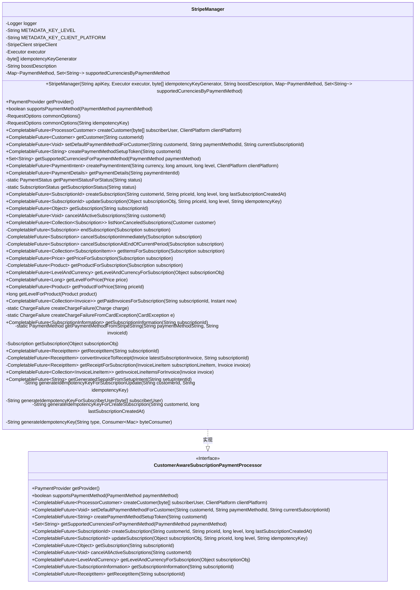

# 基础信息

|      |      |
|------|------|
| 名称 | StripeManager |
| 编码语言 | .java |
| 代码路径 | Signal-Server/service/src/main/java/org/whispersystems/textsecuregcm/subscriptions/StripeManager.java |
| 包名 | org.whispersystems.textsecuregcm.subscriptions |
| 依赖项 | ['com.google.common.base.Strings', 'com.google.common.collect.Lists', 'com.stripe.StripeClient', 'com.stripe.exception.CardException', 'com.stripe.exception.IdempotencyException', 'com.stripe.exception.InvalidRequestException', 'com.stripe.exception.StripeException', 'com.stripe.model.Charge', 'com.stripe.model.Customer', 'com.stripe.model.Invoice', 'com.stripe.model.InvoiceLineItem', 'com.stripe.model.PaymentIntent', 'com.stripe.model.Price', 'com.stripe.model.Product', 'com.stripe.model.SetupIntent', 'com.stripe.model.StripeCollection', 'com.stripe.model.Subscription', 'com.stripe.model.SubscriptionItem', 'com.stripe.net.RequestOptions', 'com.stripe.param.CustomerCreateParams', 'com.stripe.param.CustomerRetrieveParams', 'com.stripe.param.CustomerUpdateParams', 'com.stripe.param.CustomerUpdateParams.InvoiceSettings', 'com.stripe.param.InvoiceListParams', 'com.stripe.param.PaymentIntentCreateParams', 'com.stripe.param.PaymentIntentRetrieveParams', 'com.stripe.param.PriceRetrieveParams', 'com.stripe.param.SetupIntentCreateParams', 'com.stripe.param.SetupIntentRetrieveParams', 'com.stripe.param.SubscriptionCancelParams', 'com.stripe.param.SubscriptionCreateParams', 'com.stripe.param.SubscriptionItemListParams', 'com.stripe.param.SubscriptionListParams', 'com.stripe.param.SubscriptionRetrieveParams', 'com.stripe.param.SubscriptionUpdateParams', 'com.stripe.param.SubscriptionUpdateParams.BillingCycleAnchor', 'com.stripe.param.SubscriptionUpdateParams.ProrationBehavior', 'java.io.IOException', 'java.nio.charset.StandardCharsets', 'java.security.InvalidKeyException', 'java.security.NoSuchAlgorithmException', 'java.time.Duration', 'java.time.Instant', 'java.util.ArrayList', 'java.util.Base64', 'java.util.Collection', 'java.util.Collections', 'java.util.Comparator', 'java.util.HexFormat', 'java.util.List', 'java.util.Locale', 'java.util.Map', 'java.util.Objects', 'java.util.Optional', 'java.util.Set', 'java.util.concurrent.CompletableFuture', 'java.util.concurrent.CompletionException', 'java.util.concurrent.Executor', 'java.util.function.Consumer', 'javax.annotation.Nonnull', 'javax.annotation.Nullable', 'javax.crypto.Mac', 'javax.crypto.spec.SecretKeySpec', 'org.apache.commons.lang3.StringUtils', 'org.slf4j.Logger', 'org.slf4j.LoggerFactory', 'org.whispersystems.textsecuregcm.storage.PaymentTime', 'org.whispersystems.textsecuregcm.storage.SubscriptionException', 'org.whispersystems.textsecuregcm.util.Conversions', 'org.whispersystems.textsecuregcm.util.ExceptionUtils', 'org.whispersystems.textsecuregcm.util.ua.ClientPlatform'] |
| 概述说明 | StripeManager处理客户订阅支付，支持多支付方式与货币，提供订阅管理及支付详情功能。 |

# 说明

StripeManager实现了客户订阅支付处理，支持多种支付方式和货币。该工具提供创建、更新、取消订阅的功能，并能获取支付详情，确保全面管理订阅支付流程。

# 类列表 Class Summary

| 名称   | 类型  | 说明 |
|-------|------|-------------|
| StripeManager | class | StripeManager实现客户订阅支付处理，支持多种支付方式和货币，提供创建、更新、取消订阅及获取支付详情等功能。 |

## 类 StripeManager

|      |      |
|------|------|
| 访问范围 | public |
| 类型 | class |
| 名称 | StripeManager |
| 说明 | StripeManager实现客户订阅支付处理，支持多种支付方式和货币，提供创建、更新、取消订阅及获取支付详情等功能。 |

### UML类图

### 描述
`StripeManager` 类实现了 `CustomerAwareSubscriptionPaymentProcessor` 接口，用于管理与 Stripe 支付平台的交互。它提供了创建客户、订阅、支付意图、取消订阅等功能，并支持多种支付方式。类中使用了 `CompletableFuture` 来处理异步操作，并通过 `StripeClient` 与 Stripe API 进行通信。`StripeManager` 还处理了支付失败、订阅状态更新、发票管理等复杂业务逻辑，确保支付流程的可靠性和一致性。

### 内部方法调用关系图

这段代码定义了一个名为 `StripeManager` 的类，它实现了 `CustomerAwareSubscriptionPaymentProcessor` 接口，用于管理与 Stripe 支付平台相关的操作。该类包含了多个方法，用于处理客户创建、支付意图、订阅管理、发票处理等操作。代码通过异步编程模型（`CompletableFuture`）来处理与 Stripe API 的交互，并提供了丰富的异常处理机制，确保在各种情况下都能正确地处理支付和订阅相关的事务。

### 字段列表 Field List

| 名称  | 类型  | 说明 |
|-------|-------|------|
| logger = LoggerFactory.getLogger(StripeManager.class) | Logger | StripeManager类中定义了一个私有的静态Logger实例。 |
| METADATA_KEY_LEVEL = "level" | String | 定义常量METADATA_KEY_LEVEL，值为"level"。 |
| idempotencyKeyGenerator | byte[] | 私有字节数组用于生成幂等键。 |
| stripeClient | StripeClient | 私有不可变的StripeClient实例。 |
| METADATA_KEY_CLIENT_PLATFORM = "clientPlatform" | String | 定义客户端平台元数据键为"clientPlatform"。 |
| executor | Executor | 私有且不可变的执行器实例。 |
| boostDescription | String | 私有字符串变量boostDescription的声明。 |
| supportedCurrenciesByPaymentMethod | Map<PaymentMethod, Set<String>> | 私有映射存储支付方式与支持货币集的关系。 |

### 方法列表 Method List

| 名称  | 类型  | 说明 |
|-------|-------|------|
| getPaymentStatusForStatus | PaymentStatus | 根据状态字符串返回对应的支付状态枚举值。 |
| commonOptions | RequestOptions | 生成包含幂等键的请求选项。 |
| listNonCanceledSubscriptions | CompletableFuture<Collection<Subscription>> | 异步获取客户未取消的订阅列表。 |
| supportsPaymentMethod | boolean | 方法支持卡、SEPA借记和IDEAL支付方式。 |
| generateIdempotencyKeyForSubscriberUser | String | 生成订阅用户的幂等键方法。 |
| getSubscription | Subscription | 获取订阅对象，若类型不匹配则抛出异常。 |
| getReceiptItem | CompletableFuture<ReceiptItem> | 该方法通过订阅ID获取发票并转换为收据。 |
| setDefaultPaymentMethodForCustomer | CompletableFuture<Void> | 异步设置客户默认支付方式，处理异常并返回结果。 |
| getLevelForPrice | CompletableFuture<Long> | 根据价格获取产品级别，异步返回结果。 |
| getLevelAndCurrencyForSubscription | CompletableFuture<LevelAndCurrency> | 重写方法，获取订阅等级和货币信息。 |
| cancelSubscriptionAtEndOfCurrentPeriod | CompletableFuture<Subscription> | 异步取消订阅，在当前周期结束时生效。 |
| getCustomer | CompletableFuture<Customer> | 异步获取客户信息，处理异常并返回CompletableFuture。 |
| getProvider | PaymentProvider | 重写getProvider方法，返回STRIPE支付提供商。 |
| getSubscriptionStatus | SubscriptionStatus | 静态方法根据字符串状态返回订阅状态对象。 |
| getItemsForSubscription | CompletableFuture<Collection<SubscriptionItem>> | 异步获取订阅项列表，处理异常并返回结果。 |
| getPaymentMethodFromStripeString | PaymentMethod | 根据Stripe字符串获取支付方法，处理异常并记录日志。 |
| getProductForSubscription | CompletableFuture<Product> | 根据订阅获取产品，先获取价格再获取对应产品。 |
| getPaidInvoicesForSubscription | CompletableFuture<Collection<Invoice>> | 异步获取订阅的已支付发票，按创建时间倒序排列。 |
| createCustomer | CompletableFuture<ProcessorCustomer> | 异步创建客户，包含用户元数据，处理Stripe异常，返回处理器客户对象。 |
| createChargeFailureFromCardException | ChargeFailure | 静态方法根据CardException创建ChargeFailure对象，包含错误代码和消息。 |
| endSubscription | CompletableFuture<Subscription> | 根据订阅状态立即取消或当前周期结束后取消订阅。 |
| getSubscriptionInformation | CompletableFuture<SubscriptionInformation> | 获取订阅信息，包括价格、等级、计费周期、状态及支付详情。 |
| commonOptions | RequestOptions | 定义私有方法commonOptions，返回null作为参数的调用结果。 |
| getPaymentDetails | CompletableFuture<PaymentDetails> | 异步获取支付详情，包括状态、元数据及失败信息。 |
| cancelAllActiveSubscriptions | CompletableFuture<Void> | 该方法取消指定客户的所有活跃订阅，验证客户ID并处理异常。 |
| convertInvoiceToReceipt | CompletableFuture<ReceiptItem> | 将发票转换为收据，处理未支付、状态异常及行项问题。 |
| updateSubscription | CompletableFuture<SubscriptionId> | 更新订阅，若取消则创建新订阅，否则更新订阅项并设置参数。 |
| createSubscription | CompletableFuture<SubscriptionId> | 创建订阅方法，使用Stripe幂等键防止重复订阅，处理异常并返回订阅ID。 |
| generateIdempotencyKeyForCreateSubscription | String | 生成创建订阅的幂等键，使用客户ID和上次订阅时间。 |
| createPaymentMethodSetupToken | CompletableFuture<String> | 异步生成支付方法设置令牌，使用Stripe API创建SetupIntent并返回客户端密钥。 |
| generateIdempotencyKeyForSubscriptionUpdate | String | 生成订阅更新的幂等键，结合客户ID和原幂等键。 |
| getGeneratedSepaIdFromSetupIntent | CompletableFuture<String> | 异步获取SEPA ID，检查SetupIntent相关字段，处理异常。 |
| getLevelForProduct | long | 获取产品等级的方法，从元数据中提取并转换为长整型。 |
| cancelSubscriptionImmediately | CompletableFuture<Subscription> | 异步取消订阅，使用Stripe客户端执行取消操作，捕获异常并抛出。 |
| getReceiptForSubscription | CompletableFuture<ReceiptItem> | 获取订阅收据，若发票无支付时间，则使用订阅开始时间。 |
| getProductForPrice | CompletableFuture<Product> | 异步获取指定价格ID对应的产品信息，使用Stripe客户端检索并处理异常。 |
| getInvoiceLineItemsForInvoice | CompletableFuture<Collection<InvoiceLineItem>> | 异步获取发票行项目列表，处理Stripe异常并返回结果。 |
| getSubscription | CompletableFuture<Object> | 异步获取订阅信息，包含最新发票和费用，异常时抛出CompletionException。 |
| createChargeFailure | ChargeFailure | 创建ChargeFailure实例，包含失败代码、消息及可选的网络状态、原因和类型。 |
| generateIdempotencyKey | String | 生成幂等键：使用HmacSHA256算法，传入类型和字节消费者，返回Base64编码结果。 |
| createPaymentIntent | CompletableFuture<PaymentIntent> | 异步创建支付意图，设置金额、货币、描述和元数据，处理异常。 |
| getPriceForSubscription | CompletableFuture<Price> | 获取订阅价格，检查订阅项数量，返回唯一项价格或抛出异常。 |
| getSupportedCurrenciesForPaymentMethod | Set<String> | 根据支付方式返回支持的货币集合。 |

