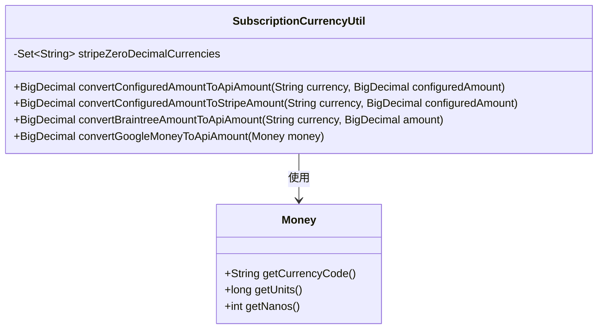

# 基础信息

|      |      |
|------|------|
| 名称 | SubscriptionCurrencyUtil |
| 编码语言 | .java |
| 代码路径 | Signal-Server/service/src/main/java/org/whispersystems/textsecuregcm/subscriptions/SubscriptionCurrencyUtil.java |
| 包名 | org.whispersystems.textsecuregcm.subscriptions |
| 依赖项 | ['com.google.api.services.androidpublisher.model.Money', 'java.math.BigDecimal', 'java.util.Locale', 'java.util.Set'] |
| 概述说明 | SubscriptionCurrencyUtil类实现多平台货币金额转换。 |

# 说明

SubscriptionCurrencyUtil类专门用于处理货币金额的转换，支持Stripe、Braintree和Google Play Billing三种API的格式。该类的核心功能是将不同支付平台的货币金额进行标准化转换，确保在不同系统之间金额的一致性和准确性。通过集成多种支付API的格式处理逻辑，SubscriptionCurrencyUtil类能够有效简化开发者在处理多平台支付时的复杂性，提升系统的兼容性和可维护性。

# 类列表 Class Summary

| 名称   | 类型  | 说明 |
|-------|------|-------------|
| SubscriptionCurrencyUtil | class | SubscriptionCurrencyUtil类处理货币金额转换，支持Stripe、Braintree和Google Play Billing的API格式。 |

## 类 SubscriptionCurrencyUtil

|      |      |
|------|------|
| 访问范围 | public |
| 类型 | class |
| 名称 | SubscriptionCurrencyUtil |
| 说明 | SubscriptionCurrencyUtil类处理货币金额转换，支持Stripe、Braintree和Google Play Billing的API格式。 |

### UML类图

**描述：**  
`SubscriptionCurrencyUtil` 类提供了一系列静态方法，用于将不同支付平台（如 Stripe、Braintree、Google Play Billing）的货币金额转换为 API 所需的格式。该类包含一个私有集合 `stripeZeroDecimalCurrencies`，用于存储 Stripe 支持的无小数位货币代码。主要方法 `convertConfiguredAmountToApiAmount` 根据货币代码判断是否需要将金额乘以 100，其他方法则基于此方法进行扩展。`Money` 类用于表示 Google Play Billing 的货币金额，`SubscriptionCurrencyUtil` 依赖 `Money` 类来实现金额转换。

### 内部方法调用关系图

```mermaid
graph TD
    A["类SubscriptionCurrencyUtil"]
    B["静态常量: Set<String> stripeZeroDecimalCurrencies"]
    C["方法: BigDecimal convertConfiguredAmountToApiAmount(String currency, BigDecimal configuredAmount)"]
    D["方法: BigDecimal convertConfiguredAmountToStripeAmount(String currency, BigDecimal configuredAmount)"]
    E["方法: BigDecimal convertBraintreeAmountToApiAmount(String currency, BigDecimal amount)"]
    F["方法: BigDecimal convertGoogleMoneyToApiAmount(Money money)"]
    G["调用: convertConfiguredAmountToApiAmount"]
    H["调用: convertConfiguredAmountToApiAmount"]
    I["调用: convertConfiguredAmountToApiAmount"]
    J["方法: Money.getCurrencyCode()"]
    K["方法: Money.getUnits()"]
    L["方法: Money.getNanos()"]
    M["计算: BigDecimal.valueOf(money.getNanos()).scaleByPowerOfTen(-9)"]
    N["计算: BigDecimal.valueOf(money.getUnits()).add(fractionalComponent)"]

    A --> B
    A --> C
    A --> D
    A --> E
    A --> F
    D --> G
    E --> H
    F --> I
    F --> J
    F --> K
    F --> L
    F --> M
    F --> N
```

该流程图展示了`SubscriptionCurrencyUtil`类的结构及其方法之间的调用关系。类中包含一个静态常量`stripeZeroDecimalCurrencies`和四个方法，其中`convertConfiguredAmountToStripeAmount`、`convertBraintreeAmountToApiAmount`和`convertGoogleMoneyToApiAmount`都调用了`convertConfiguredAmountToApiAmount`方法。`convertGoogleMoneyToApiAmount`方法还涉及对`Money`对象的操作，包括获取货币代码、单位和纳秒，并进行数值计算。

### 字段列表 Field List

| 名称  | 类型  | 说明 |
|-------|-------|------|
| stripeZeroDecimalCurrencies = Set.of("bif", "clp", "djf", "gnf", "jpy", "kmf", "krw",      "mga", "pyg", "rwf", "vnd", "vuv", "xaf", "xof", "xpf") | Set<String> | Stripe零小数货币集合包含bif等15种货币。 |

### 方法列表 Method List

| 名称  | 类型  | 说明 |
|-------|-------|------|
| convertConfiguredAmountToStripeAmount | BigDecimal | 将配置金额转换为Stripe API金额的方法。 |
| convertConfiguredAmountToApiAmount | BigDecimal | 静态方法将配置金额转换为API金额，零小数货币直接返回，其他货币乘以100。 |
| convertBraintreeAmountToApiAmount | BigDecimal | 将Braintree金额转换为API金额的函数。 |
| convertGoogleMoneyToApiAmount | BigDecimal | 将Google Money转换为API金额，整合整数和小数部分，再根据货币代码转换。 |

