# 基础信息

|      |      |
|------|------|
| 名称 | subscriptions |
| 编码语言 | .java |
| 代码路径 | Signal-Server/service/src/main/java/org/whispersystems/textsecuregcm/subscriptions |
| 包名 | Signal-Server.service.src.main.java.org.whispersystems.textsecuregcm.subscriptions |
| 概述说明 | 多个类处理订阅支付流程，涵盖验证、取消、收据获取及货币转换等功能。 |

# 说明

## 概述
该代码模块主要围绕订阅支付管理功能展开，涵盖了多种支付平台（如Google Play Billing、Apple App Store、Stripe、Braintree等）的集成与处理。模块通过多个类实现了订阅的创建、更新、取消、验证、支付凭证获取等功能，同时支持货币转换、支付重试机制、银行授权信息翻译等辅助功能。模块的设计旨在提供全面的订阅支付管理解决方案，确保支付流程的准确性、安全性和用户体验的流畅性。

## 主要业务场景
1. **订阅支付管理**：通过`GooglePlayBillingManager`、`AppleAppStoreManager`、`StripeManager`、`BraintreeManager`等类，处理订阅的创建、更新、取消、验证以及支付凭证的获取，确保订阅状态的准确性和支付流程的完整性。
2. **货币转换**：`SubscriptionCurrencyUtil`类支持多种支付平台（Stripe、Braintree、Google Play Billing）的货币金额转换，确保金额在不同系统之间的一致性和准确性。
3. **支付重试机制**：`AppleAppStoreManager`类支持支付过程中的重试机制，提高支付成功率，确保用户支付体验的可靠性。
4. **银行授权信息翻译**：`BankMandateTranslator`类根据语言和转账类型对银行授权信息进行翻译，确保跨语言和跨转账类型的准确性。
5. **PayPal支付处理**：`BraintreeGraphqlClient`类专门处理PayPal支付和计费协议，支持支付流程的创建、令牌化支付信息以及扣款操作，简化与PayPal的集成。
6. **捐赠事件跟踪**：`BraintreeManager`模块支持发布捐赠事件，用于跟踪和记录捐赠相关的操作，适用于需要处理复杂支付场景的应用。

该模块通过集成多种支付平台的功能，为开发者提供了强大的订阅支付管理工具，适用于需要处理复杂支付流程的应用场景。

### 包内部结构视图

```mermaid
graph TD
    subscriptions --> PaymentStatus.java
    subscriptions --> GooglePlayBillingManager.java
    subscriptions --> PaymentMethod.java
    subscriptions --> ChargeFailure.java
    subscriptions --> AppleAppStoreManager.java
    subscriptions --> SubscriptionInformation.java
    subscriptions --> BankTransferType.java
    subscriptions --> BraintreePlanMetadata.java
    subscriptions --> StripeManager.java
    subscriptions --> SubscriptionStatus.java
    subscriptions --> CustomerAwareSubscriptionPaymentProcessor.java
    subscriptions --> SubscriptionCurrencyUtil.java
    subscriptions --> ProcessorCustomer.java
    subscriptions --> SubscriptionPaymentProcessor.java
    subscriptions --> BraintreeGraphqlClient.java
    subscriptions --> BraintreeManager.java
    subscriptions --> PaymentDetails.java
    subscriptions --> BankMandateTranslator.java
    subscriptions --> SubscriptionPrice.java
    subscriptions --> PaymentProvider.java
```

该流程图展示了`subscriptions`目录下的所有文件及其层级关系。`subscriptions`作为根节点，包含了多个与支付、订阅管理相关的Java文件，涵盖了从支付状态到不同支付平台管理的多个方面。

# 文件列表 File List

| 名称   | 类型  | 说明 |
|-------|------|-------------|
| [ChargeFailure.java](ChargeFailure.md) | file | 信息为空，无法生成概要描述。 |
| [PaymentStatus.java](PaymentStatus.md) | file | 输入为空，无法生成概要描述。 |
| [StripeManager.java](StripeManager.md) | file | StripeManager处理客户订阅支付，支持多支付方式与货币，提供订阅管理及支付详情功能。 |
| [BraintreePlanMetadata.java](BraintreePlanMetadata.md) | file | 信息为空，无法生成概要描述。 |
| [BankTransferType.java](BankTransferType.md) | file | 暂无信息可供总结。 |
| [SubscriptionInformation.java](SubscriptionInformation.md) | file | 输入内容为空，无法生成概要描述。 |
| [PaymentProvider.java](PaymentProvider.md) | file | 信息为空，无法生成概要描述。 |
| [SubscriptionPrice.java](SubscriptionPrice.md) | file | 输入信息为空，无法生成概要描述。 |
| [PaymentDetails.java](PaymentDetails.md) | file | 无内容提供，无法生成概要描述。 |
| [SubscriptionPaymentProcessor.java](SubscriptionPaymentProcessor.md) | file | 输入信息为空，无法生成概要描述。 |
| [ProcessorCustomer.java](ProcessorCustomer.md) | file | 输入内容为空，无法生成概要描述。 |
| [CustomerAwareSubscriptionPaymentProcessor.java](CustomerAwareSubscriptionPaymentProcessor.md) | file | 信息为空，无法生成概要描述。 |
| [BankMandateTranslator.java](BankMandateTranslator.md) | file | BankMandateTranslator类用于翻译银行授权信息。 |
| [BraintreeManager.java](BraintreeManager.md) | file | BraintreeManager处理支付，支持PayPal，管理订阅、交易和货币转换，发布捐赠事件。 |
| [BraintreeGraphqlClient.java](BraintreeGraphqlClient.md) | file | BraintreeGraphqlClient类处理PayPal支付及计费协议，支持创建、令牌化和扣款。 |
| [SubscriptionCurrencyUtil.java](SubscriptionCurrencyUtil.md) | file | SubscriptionCurrencyUtil类实现多平台货币金额转换。 |
| [SubscriptionStatus.java](SubscriptionStatus.md) | file | 无内容提供，无法生成概要描述。 |
| [AppleAppStoreManager.java](AppleAppStoreManager.md) | file | AppleAppStoreManager类处理订阅支付，验证交易，管理订阅信息和收据，支持重试。 |
| [PaymentMethod.java](PaymentMethod.md) | file | 无内容提供，无法生成概要描述。 |
| [GooglePlayBillingManager.java](GooglePlayBillingManager.md) | file | GooglePlayBillingManager负责订阅支付的验证、取消和收据获取。 |

