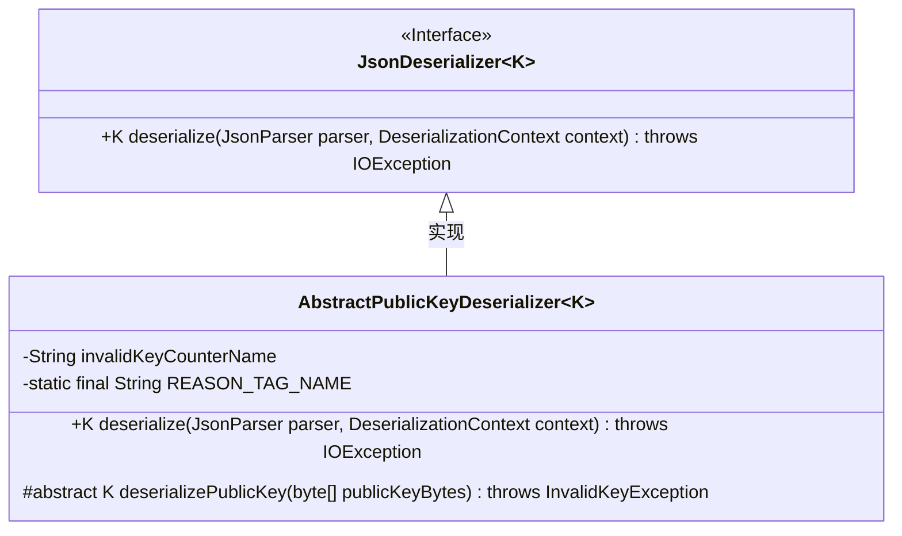
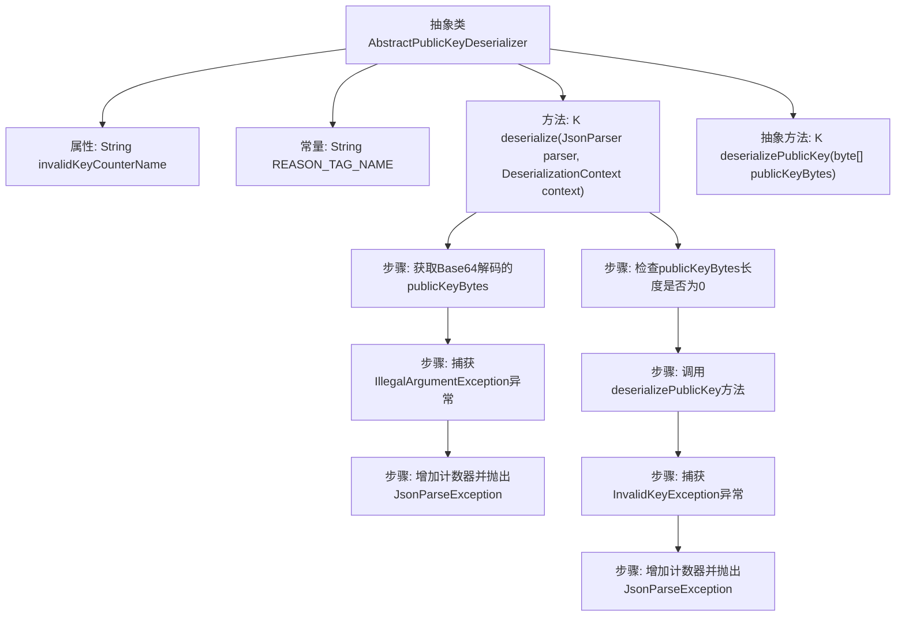

# 基础信息

|      |      |
|------|------|
| 名称 | AbstractPublicKeyDeserializer |
| 编码语言 | .java |
| 代码路径 | Signal-Server/service/src/main/java/org/whispersystems/textsecuregcm/util/AbstractPublicKeyDeserializer.java |
| 包名 | org.whispersystems.textsecuregcm.util |
| 依赖项 | ['com.fasterxml.jackson.core.JsonParseException', 'com.fasterxml.jackson.core.JsonParser', 'com.fasterxml.jackson.databind.DeserializationContext', 'com.fasterxml.jackson.databind.JsonDeserializer', 'java.io.IOException', 'java.util.Base64', 'io.micrometer.core.instrument.Metrics', 'org.signal.libsignal.protocol.InvalidKeyException', 'org.whispersystems.textsecuregcm.metrics.MetricsUtil'] |
| 概述说明 | 抽象类实现公钥反序列化，处理Base64解码和无效密钥错误。 |

# 说明

抽象类实现了公钥反序列化功能，主要负责处理Base64解码操作，并在遇到无效密钥时进行错误处理。该设计确保了对公钥数据的准确解析和异常情况的有效管理。

# 类列表 Class Summary

| 名称   | 类型  | 说明 |
|-------|------|-------------|
| AbstractPublicKeyDeserializer | class | 抽象类实现公钥反序列化，处理Base64解码和无效密钥错误。 |

## 类 AbstractPublicKeyDeserializer

|      |      |
|------|------|
| 访问范围 | abstract |
| 类型 | class |
| 名称 | AbstractPublicKeyDeserializer |
| 说明 | 抽象类实现公钥反序列化，处理Base64解码和无效密钥错误。 |

### UML类图

**描述：**
`AbstractPublicKeyDeserializer` 是一个抽象类，继承自 `JsonDeserializer` 接口，用于反序列化公钥。它包含一个抽象方法 `deserializePublicKey`，子类需要实现该方法以处理具体的公钥反序列化逻辑。类中还包含一个计数器 `invalidKeyCounterName`，用于记录无效公钥的统计信息。`deserialize` 方法负责解析 Base64 编码的公钥，并在遇到无效公钥时抛出异常。

### 内部方法调用关系图

这段代码定义了一个抽象类 `AbstractPublicKeyDeserializer<K>`，用于反序列化公钥。它首先尝试将输入的Base64字符串解码为字节数组，如果解码失败则捕获 `IllegalArgumentException` 异常并记录错误。如果解码成功但字节数组为空，则返回 `null`。否则，调用抽象方法 `deserializePublicKey` 进行进一步处理，如果处理过程中捕获到 `InvalidKeyException` 异常，则记录错误并抛出 `JsonParseException`。整个流程确保了公钥反序列化的安全性和错误处理。

### 字段列表 Field List

| 名称  | 类型  | 说明 |
|-------|-------|------|
| invalidKeyCounterName = MetricsUtil.name(getClass(), "invalidKey") | String | 类中定义了一个名为invalidKeyCounterName的私有常量。 |
| REASON_TAG_NAME = "reason" | String | 定义常量REASON_TAG_NAME，值为"reason"。 |

### 方法列表 Method List

| 名称  | 类型  | 说明 |
|-------|-------|------|
| deserialize | K | 解析JSON中的公钥，若非法或无效则记录并抛出异常。 |
| deserializePublicKey | K | 该方法将字节数组反序列化为公钥，可能抛出无效密钥异常。 |

