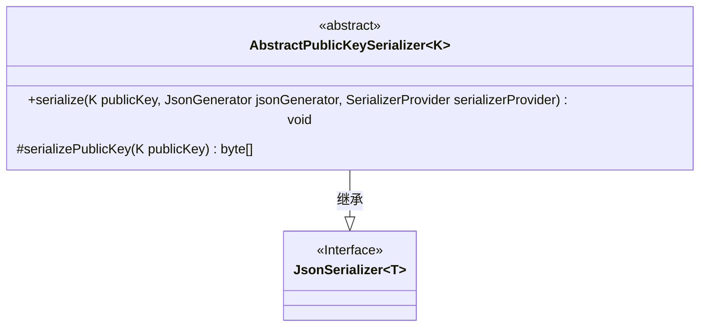
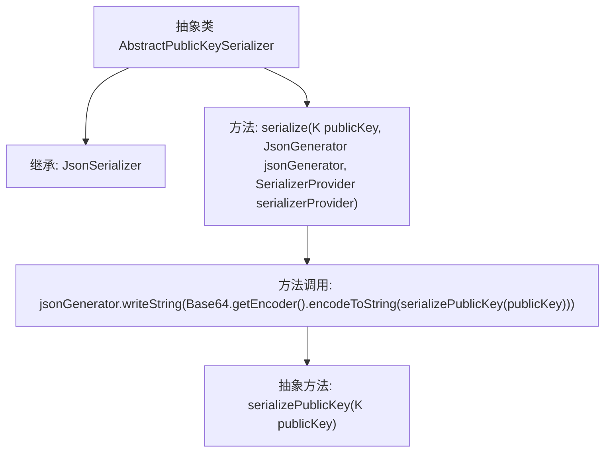

# 基础信息

|      |      |
|------|------|
| 名称 | AbstractPublicKeySerializer |
| 编码语言 | .java |
| 代码路径 | Signal-Server/service/src/main/java/org/whispersystems/textsecuregcm/util/AbstractPublicKeySerializer.java |
| 包名 | org.whispersystems.textsecuregcm.util |
| 依赖项 | ['com.fasterxml.jackson.core.JsonGenerator', 'com.fasterxml.jackson.databind.JsonSerializer', 'com.fasterxml.jackson.databind.SerializerProvider', 'java.io.IOException', 'java.util.Base64'] |
| 概述说明 | AbstractPublicKeySerializer将公钥序列化为Base64字符串。 |

# 说明

抽象类AbstractPublicKeySerializer的主要功能是将公钥序列化为Base64字符串。它提供了一个通用的框架，用于处理公钥的序列化操作，确保公钥能够以Base64编码的字符串形式进行存储或传输。该类作为抽象类，定义了序列化的核心逻辑，但具体的实现细节可能由子类完成，以适应不同的公钥类型或序列化需求。通过这种方式，AbstractPublicKeySerializer为公钥的序列化提供了一种标准化和可扩展的解决方案。

# 类列表 Class Summary

| 名称   | 类型  | 说明 |
|-------|------|-------------|
| AbstractPublicKeySerializer | class | 抽象类AbstractPublicKeySerializer用于将公钥序列化为Base64字符串。 |

## 类 AbstractPublicKeySerializer

|      |      |
|------|------|
| 访问范围 | abstract |
| 类型 | class |
| 名称 | AbstractPublicKeySerializer |
| 说明 | 抽象类AbstractPublicKeySerializer用于将公钥序列化为Base64字符串。 |

### UML类图

这段代码定义了一个抽象类 `AbstractPublicKeySerializer`，它继承自 `JsonSerializer` 接口。`AbstractPublicKeySerializer` 是一个泛型类，接受一个类型参数 `K`。它包含一个 `serialize` 方法，用于将 `K` 类型的公钥序列化为 Base64 编码的字符串，并写入到 `JsonGenerator` 中。此外，它还定义了一个抽象方法 `serializePublicKey`，子类需要实现该方法以将公钥序列化为字节数组。这段代码的主要作用是为公钥的序列化提供一个通用的框架，具体的序列化逻辑由子类实现。

### 内部方法调用关系图

这段代码定义了一个抽象类 `AbstractPublicKeySerializer<K>`，它继承自 `JsonSerializer<K>`。该类包含一个 `serialize` 方法，用于将公钥序列化为 JSON 字符串。在 `serialize` 方法中，首先调用 `serializePublicKey` 方法将公钥转换为字节数组，然后使用 Base64 编码将其转换为字符串，并通过 `jsonGenerator.writeString` 方法写入 JSON。`serializePublicKey` 是一个抽象方法，需要子类实现具体的公钥序列化逻辑。

### 字段列表 Field List

| 名称  | 类型  | 说明 |
|-------|-------|------|

### 方法列表 Method List

| 名称  | 类型  | 说明 |
|-------|-------|------|
| serializePublicKey | byte[] | 序列化公钥为字节数组。 |
| serialize | void | 重写serialize方法，将公钥序列化为Base64字符串并写入jsonGenerator。 |

