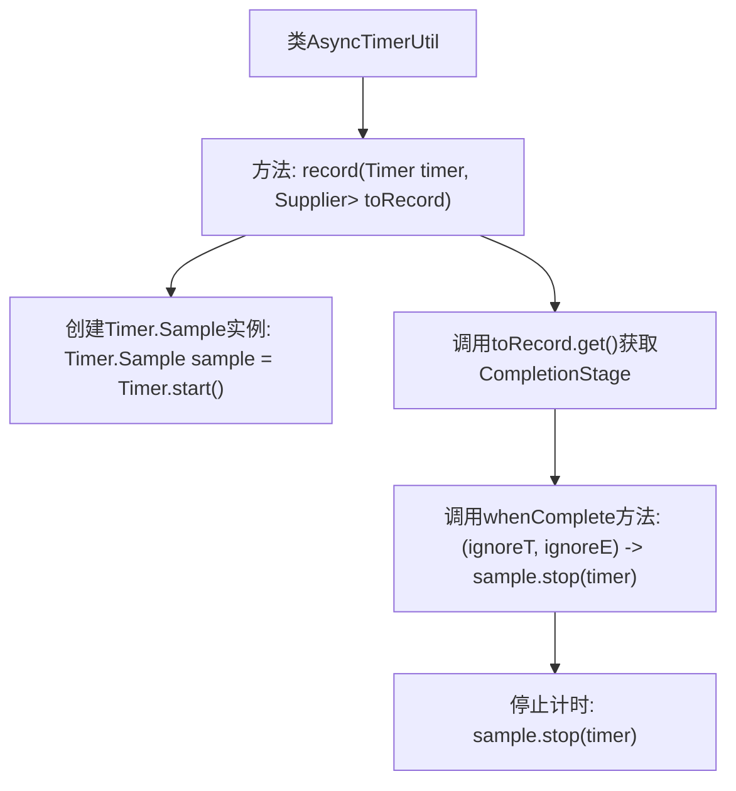

# 基础信息

|      |      |
|------|------|
| 名称 | AsyncTimerUtil |
| 编码语言 | .java |
| 代码路径 | Signal-Server/service/src/main/java/org/whispersystems/textsecuregcm/util/AsyncTimerUtil.java |
| 包名 | org.whispersystems.textsecuregcm.util |
| 依赖项 | ['io.micrometer.core.instrument.Timer', 'javax.annotation.Nonnull', 'java.util.concurrent.CompletionStage', 'java.util.function.Supplier'] |
| 概述说明 | AsyncTimerUtil类用于记录异步操作耗时。 |

# 说明

AsyncTimerUtil类是一个用于记录异步操作耗时的工具类。它提供了专门的方法来测量和记录异步任务的执行时间，帮助开发者分析和优化异步操作的性能。通过该类，开发者可以方便地获取异步操作的耗时信息，从而更好地监控和提升系统效率。

# 类列表 Class Summary

| 名称   | 类型  | 说明 |
|-------|------|-------------|
| AsyncTimerUtil | class | AsyncTimerUtil类提供记录异步操作耗时的方法。 |


## 类 AsyncTimerUtil

|      |      |
|------|------|
| 访问范围 | public |
| 类型 | class |
| 名称 | AsyncTimerUtil |
| 说明 | AsyncTimerUtil类提供记录异步操作耗时的方法。 |


### UML类图

```mermaid
classDiagram
    class AsyncTimerUtil {
        <<Utility>>
        +record(Timer timer, Supplier~CompletionStage~T~~ toRecord) CompletionStage~T~
    }
    class Timer {
        +Sample start()
    }
    class Timer.Sample {
        +stop(Timer timer)
    }
    interface Supplier~T~ {
        <<Interface>>
        +get() T
    }
    interface CompletionStage~T~ {
        <<Interface>>
        +whenComplete(BiConsumer~? super T, ? super Throwable~ action) CompletionStage~T~
    }
    AsyncTimerUtil --> Timer : 依赖
    AsyncTimerUtil --> Supplier~CompletionStage~T~~ : 依赖
    AsyncTimerUtil --> CompletionStage~T~ : 依赖
    Timer.Sample --> Timer : 依赖
```

**描述**：`AsyncTimerUtil` 是一个工具类，提供了 `record` 方法，用于记录异步操作的执行时间。该方法接受一个 `Timer` 实例和一个 `Supplier`，后者生成一个 `CompletionStage`。`record` 方法在操作开始时启动计时器，并在操作完成时停止计时器。`Timer` 类负责计时器的管理，`Timer.Sample` 用于记录时间样本。`Supplier` 和 `CompletionStage` 是接口，分别用于提供异步操作和处理异步操作的结果。


### 内部方法调用关系图



这段代码定义了一个名为`AsyncTimerUtil`的类，其中包含一个静态方法`record`。该方法用于记录异步操作的执行时间。首先，它通过`Timer.start()`创建一个计时器样本，然后调用传入的`Supplier`以获取一个`CompletionStage`对象。在`CompletionStage`完成时，无论成功或失败，都会调用`whenComplete`方法，并在其中停止计时器。这个流程确保了异步操作的执行时间能够被准确记录和测量。

### 字段列表 Field List

| 名称  | 类型  | 说明 |
|-------|-------|------|

### 方法列表 Method List

| 名称  | 类型  | 说明 |
|-------|-------|------|
| record | CompletionStage<T> | 非空静态方法记录计时器并返回完成阶段。 |


