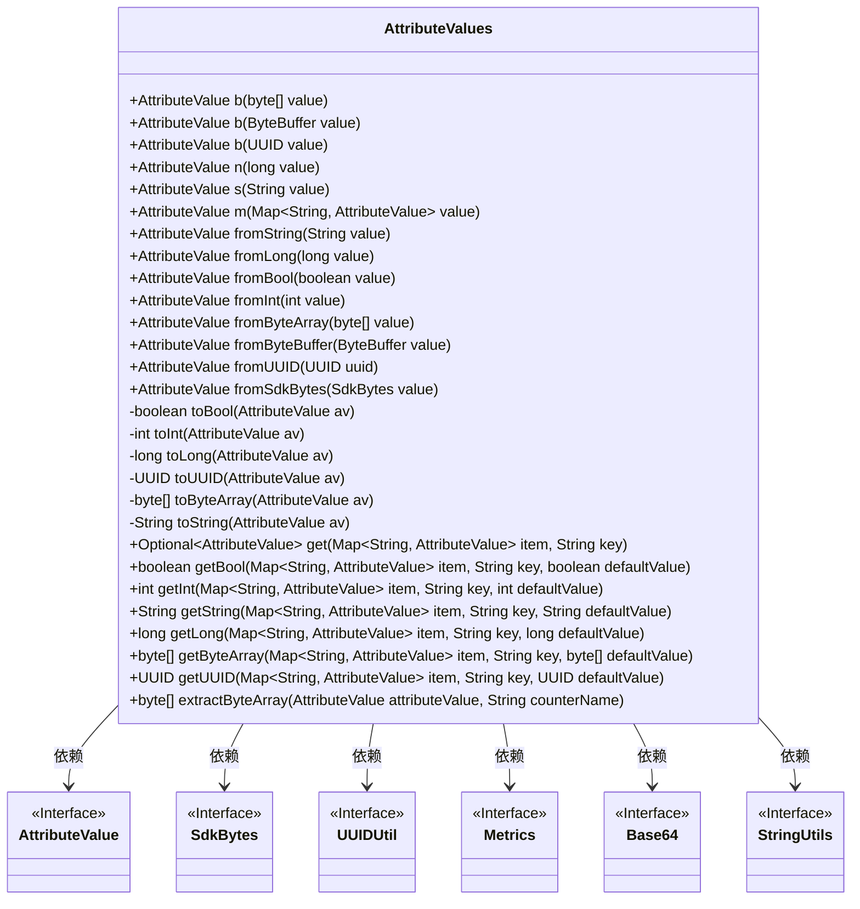

# 基础信息

|      |      |
|------|------|
| 名称 | AttributeValues |
| 编码语言 | .java |
| 代码路径 | Signal-Server/service/src/main/java/org/whispersystems/textsecuregcm/util/AttributeValues.java |
| 包名 | org.whispersystems.textsecuregcm.util |
| 依赖项 | ['java.nio.ByteBuffer', 'java.util.Base64', 'java.util.Map', 'java.util.Optional', 'java.util.UUID', 'com.google.common.annotations.VisibleForTesting', 'io.micrometer.core.instrument.Metrics', 'org.apache.commons.lang3.StringUtils', 'software.amazon.awssdk.core.SdkBytes', 'software.amazon.awssdk.services.dynamodb.model.AttributeValue'] |
| 概述说明 | AttributeValues类提供多种方法用于属性值的转换和提取。 |

# 说明

AttributeValues类是一个功能丰富的工具类，专门用于处理和操作属性值。它提供了多种方法，用于将属性值进行转换和提取。这些方法可以帮助开发者轻松地实现属性值的格式转换、类型转换以及从复杂数据结构中提取所需的属性值。通过使用AttributeValues类，开发者能够更高效地处理和管理属性值，提升代码的可读性和可维护性。

# 类列表 Class Summary

| 名称   | 类型  | 说明 |
|-------|------|-------------|
| AttributeValues | class | AttributeValues类提供多种方法转换和提取属性值。 |

## 类 AttributeValues

|      |      |
|------|------|
| 访问范围 | public |
| 类型 | class |
| 名称 | AttributeValues |
| 说明 | AttributeValues类提供多种方法转换和提取属性值。 |

### UML类图

**描述：**
`AttributeValues` 类是一个工具类，提供了多种静态方法用于创建和操作 `AttributeValue` 对象。它支持从不同类型的输入（如字节数组、字符串、整数等）生成 `AttributeValue` 实例，并提供了一些辅助方法用于从 `AttributeValue` 中提取特定类型的值。此外，它还包含一些与 `SdkBytes`、`UUIDUtil`、`Metrics`、`Base64` 和 `StringUtils` 相关的依赖关系，用于处理字节数组、UUID、度量、Base64 解码和字符串操作。

### 内部方法调用关系图

```mermaid
graph TD
    A["类AttributeValues"]
    B["方法: b(byte[] value)"]
    C["方法: b(ByteBuffer value)"]
    D["方法: b(UUID value)"]
    E["方法: n(long value)"]
    F["方法: s(String value)"]
    G["方法: m(Map<String, AttributeValue> value)"]
    H["方法: fromString(String value)"]
    I["方法: fromLong(long value)"]
    J["方法: fromBool(boolean value)"]
    K["方法: fromInt(int value)"]
    L["方法: fromByteArray(byte[] value)"]
    M["方法: fromByteBuffer(ByteBuffer value)"]
    N["方法: fromUUID(UUID uuid)"]
    O["方法: fromSdkBytes(SdkBytes value)"]
    P["方法: toBool(AttributeValue av)"]
    Q["方法: toInt(AttributeValue av)"]
    R["方法: toLong(AttributeValue av)"]
    S["方法: toUUID(AttributeValue av)"]
    T["方法: toByteArray(AttributeValue av)"]
    U["方法: toString(AttributeValue av)"]
    V["方法: get(Map<String, AttributeValue> item, String key)"]
    W["方法: getBool(Map<String, AttributeValue> item, String key, boolean defaultValue)"]
    X["方法: getInt(Map<String, AttributeValue> item, String key, int defaultValue)"]
    Y["方法: getString(Map<String, AttributeValue> item, String key, String defaultValue)"]
    Z["方法: getLong(Map<String, AttributeValue> item, String key, long defaultValue)"]
    AA["方法: getByteArray(Map<String, AttributeValue> item, String key, byte[] defaultValue)"]
    AB["方法: getUUID(Map<String, AttributeValue> item, String key, UUID defaultValue)"]
    AC["方法: extractByteArray(AttributeValue attributeValue, String counterName)"]

    A --> B
    A --> C
    A --> D
    A --> E
    A --> F
    A --> G
    A --> H
    A --> I
    A --> J
    A --> K
    A --> L
    A --> M
    A --> N
    A --> O
    A --> P
    A --> Q
    A --> R
    A --> S
    A --> T
    A --> U
    A --> V
    A --> W
    A --> X
    A --> Y
    A --> Z
    A --> AA
    A --> AB
    A --> AC
```

该流程图展示了`AttributeValues`类中的各个方法及其调用关系。类中的方法主要用于处理不同类型的属性值，包括字节数组、字符串、长整型、布尔值等，并将其转换为`AttributeValue`对象。此外，类中还提供了一些工具方法，用于从`AttributeValue`对象中提取特定类型的值，如布尔值、整型、长整型、UUID等。流程图清晰地展示了这些方法之间的调用关系，便于理解类的整体功能。

### 字段列表 Field List

| 名称  | 类型  | 说明 |
|-------|-------|------|

### 方法列表 Method List

| 名称  | 类型  | 说明 |
|-------|-------|------|
| n | AttributeValue | 静态方法返回数值类型的属性值对象。 |
| fromByteArray | AttributeValue | 静态方法将字节数组转换为属性值。 |
| s | AttributeValue | 静态方法返回AttributeValue对象，包含字符串值。 |
| b | AttributeValue | 静态方法b通过ByteBuffer生成AttributeValue对象。 |
| toInt | int | 将AttributeValue的n属性转换为整数。 |
| fromString | AttributeValue | 静态方法将字符串转换为AttributeValue对象。 |
| fromUUID | AttributeValue | 将UUID转换为AttributeValue的静态方法。 |
| fromByteBuffer | AttributeValue | 静态方法将ByteBuffer转换为AttributeValue对象。 |
| fromBool | AttributeValue | 静态方法fromBool将布尔值转换为AttributeValue对象。 |
| fromSdkBytes | AttributeValue | 静态方法将SdkBytes转换为AttributeValue对象。 |
| get | Optional<AttributeValue> | 静态方法获取Map中指定键的值，返回Optional对象。 |
| fromLong | AttributeValue | 静态方法fromLong将长整型值转换为AttributeValue对象。 |
| toByteArray | byte[] | 将AttributeValue对象转换为字节数组。 |
| toLong | long | 将AttributeValue对象中的数值字符串转换为长整型。 |
| toBool | boolean | 将AttributeValue对象转换为布尔值。 |
| toString | String | 将AttributeValue对象转换为字符串。 |
| getString | String | 静态方法获取Map中指定键的值，若不存在则返回默认值。 |
| fromInt | AttributeValue | 静态方法fromInt将整数值转换为AttributeValue对象。 |
| b | AttributeValue | 静态方法`b`将字节数组转换为`AttributeValue`对象。 |
| b | AttributeValue | 静态方法`b`将UUID转换为字节缓冲区并返回AttributeValue对象。 |
| getByteArray | byte[] | 从Map中获取指定键的字节数组，若不存在则返回默认值。 |
| getBool | boolean | 方法getBool从Map中获取指定key的布尔值，若不存在则返回默认值。 |
| toUUID | UUID | 将AttributeValue转换为UUID，使用其字节数组确保不被修改。 |
| m | AttributeValue | 静态方法`m`接收`Map<String, AttributeValue>`参数，返回`AttributeValue`对象。 |
| getLong | long | 从Map中获取指定key的long值，若无则返回默认值。 |
| extractByteArray | byte[] | 提取字节数组方法：根据属性值类型返回字节数组，否则抛出异常。 |
| getUUID | UUID | 静态方法getUUID从Map中获取指定key的UUID值，若不存在则返回默认值。 |
| getInt | int | 静态方法getInt从Map中获取指定key的整数值，若不存在则返回默认值。 |

