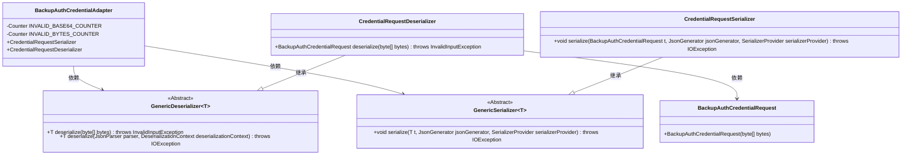
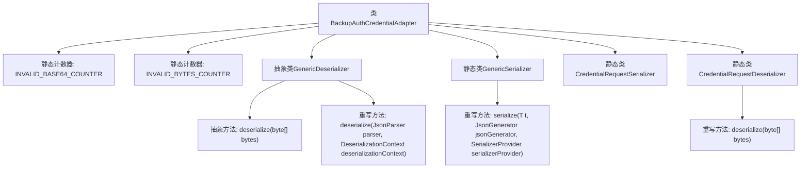

# 基础信息

|      |      |
|------|------|
| 名称 | BackupAuthCredentialAdapter |
| 编码语言 | .java |
| 代码路径 | Signal-Server/service/src/main/java/org/whispersystems/textsecuregcm/util/BackupAuthCredentialAdapter.java |
| 包名 | org.whispersystems.textsecuregcm.util |
| 依赖项 | ['com.fasterxml.jackson.core.JsonGenerator', 'com.fasterxml.jackson.core.JsonParseException', 'com.fasterxml.jackson.core.JsonParser', 'com.fasterxml.jackson.databind.DeserializationContext', 'com.fasterxml.jackson.databind.JsonDeserializer', 'com.fasterxml.jackson.databind.JsonSerializer', 'com.fasterxml.jackson.databind.SerializerProvider', 'io.micrometer.core.instrument.Counter', 'io.micrometer.core.instrument.Metrics', 'java.io.IOException', 'java.util.Base64', 'org.signal.libsignal.zkgroup.InvalidInputException', 'org.signal.libsignal.zkgroup.backups.BackupAuthCredentialRequest', 'org.signal.libsignal.zkgroup.internal.ByteArray', 'org.whispersystems.textsecuregcm.metrics.MetricsUtil'] |
| 概述说明 | BackupAuthCredentialAdapter类负责Base64编解码、序列化反序列化及错误计数。 |

# 说明

BackupAuthCredentialAdapter类负责处理Base64编解码以及序列化和反序列化操作。该类还包含一个计数器，用于记录操作过程中发生的错误。其主要功能是确保数据的正确编码和解码，并在出现错误时进行记录，以便后续分析和处理。

# 类列表 Class Summary

| 名称   | 类型  | 说明 |
|-------|------|-------------|
| BackupAuthCredentialAdapter | class | BackupAuthCredentialAdapter类处理Base64编解码及序列化反序列化，包含计数器记录错误。 |

## 类 BackupAuthCredentialAdapter

|      |      |
|------|------|
| 访问范围 | public |
| 类型 | class |
| 名称 | BackupAuthCredentialAdapter |
| 说明 | BackupAuthCredentialAdapter类处理Base64编解码及序列化反序列化，包含计数器记录错误。 |

### UML类图

该代码定义了一个 `BackupAuthCredentialAdapter` 类，包含用于序列化和反序列化备份认证凭证的静态内部类。`GenericDeserializer` 和 `GenericSerializer` 是抽象类，分别用于反序列化和序列化操作。`CredentialRequestSerializer` 和 `CredentialRequestDeserializer` 是这两个抽象类的具体实现，专门处理 `BackupAuthCredentialRequest` 对象的序列化和反序列化。代码中还包含了对无效 Base64 编码和无效字节流的计数器，用于监控和记录异常情况。

### 内部方法调用关系图

这段代码展示了`BackupAuthCredentialAdapter`类的结构，包含了两个静态计数器、一个抽象类`GenericDeserializer`和一个静态类`GenericSerializer`。`GenericDeserializer`类负责反序列化操作，处理Base64解码和字节数组的反序列化，并在出错时增加计数器。`GenericSerializer`类负责序列化操作，将字节数组编码为Base64字符串。`CredentialRequestSerializer`和`CredentialRequestDeserializer`分别是`GenericSerializer`和`GenericDeserializer`的具体实现，用于处理`BackupAuthCredentialRequest`对象的序列化和反序列化。

### 字段列表 Field List

| 名称  | 类型  | 说明 |
|-------|-------|------|
| INVALID_BASE64_COUNTER =      Metrics.counter(MetricsUtil.name(BackupAuthCredentialAdapter.class, "invalidBase64")) | Counter | 备份认证适配器中无效Base64计数器初始化。 |
| INVALID_BYTES_COUNTER =      Metrics.counter(MetricsUtil.name(BackupAuthCredentialAdapter.class, "invalidBackupAuthObject")) | Counter | 定义计数器，用于统计无效备份认证对象的数量。 |

### 方法列表 Method List

| 名称  | 类型  | 说明 |
|-------|-------|------|

