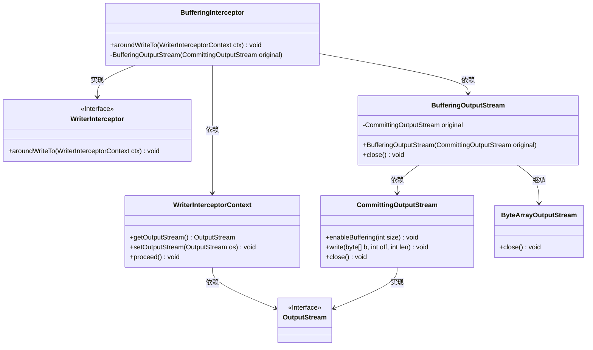
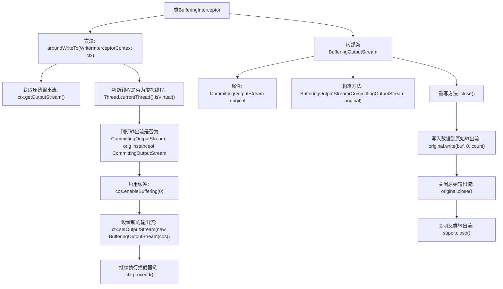

# 基础信息

|      |      |
|------|------|
| 名称 | BufferingInterceptor |
| 编码语言 | .java |
| 代码路径 | Signal-Server/service/src/main/java/org/whispersystems/textsecuregcm/util/BufferingInterceptor.java |
| 包名 | org.whispersystems.textsecuregcm.util |
| 依赖项 | ['jakarta.ws.rs.WebApplicationException', 'jakarta.ws.rs.ext.WriterInterceptor', 'jakarta.ws.rs.ext.WriterInterceptorContext', 'java.io.ByteArrayOutputStream', 'java.io.IOException', 'java.io.OutputStream', 'org.glassfish.jersey.message.internal.CommittingOutputStream'] |
| 概述说明 | BufferingInterceptor拦截器启用虚拟线程输出流缓冲。 |

# 说明

BufferingInterceptor拦截器在虚拟线程中启用输出流缓冲功能，旨在优化数据传输效率。该拦截器通过缓冲机制减少频繁的I/O操作，从而提升系统性能。具体实现中，拦截器在虚拟线程环境中工作，确保数据输出时能够高效处理，减少延迟和资源消耗。这一设计特别适用于高并发场景，能够显著改善响应速度和整体系统稳定性。

# 类列表 Class Summary

| 名称   | 类型  | 说明 |
|-------|------|-------------|
| BufferingInterceptor | class | BufferingInterceptor拦截器在虚拟线程中启用输出流缓冲。 |

## 类 BufferingInterceptor

|      |      |
|------|------|
| 访问范围 | public |
| 类型 | class |
| 名称 | BufferingInterceptor |
| 说明 | BufferingInterceptor拦截器在虚拟线程中启用输出流缓冲。 |

### UML类图

### 描述
该代码定义了一个 `BufferingInterceptor` 类，实现了 `WriterInterceptor` 接口。`BufferingInterceptor` 的 `aroundWriteTo` 方法在特定条件下（如线程为虚拟线程且输出流为 `CommittingOutputStream`）会启用缓冲，并创建一个 `BufferingOutputStream` 对象来替代原始输出流。`BufferingOutputStream` 继承自 `ByteArrayOutputStream`，并在关闭时将缓冲区内容写入原始 `CommittingOutputStream`。该设计主要用于在特定场景下优化输出流的处理。

### 内部方法调用关系图

这段代码定义了一个`BufferingInterceptor`类，它实现了`WriterInterceptor`接口，并重写了`aroundWriteTo`方法。该方法首先获取原始输出流，然后检查当前线程是否为虚拟线程以及输出流是否为`CommittingOutputStream`类型。如果是，则启用缓冲并设置新的输出流。最后，代码继续执行拦截器链。内部类`BufferingOutputStream`扩展了`ByteArrayOutputStream`，并在`close`方法中将数据写入原始输出流并关闭流。

### 字段列表 Field List

| 名称  | 类型  | 说明 |
|-------|-------|------|

### 方法列表 Method List

| 名称  | 类型  | 说明 |
|-------|-------|------|
| aroundWriteTo | void | 重写aroundWriteTo方法，处理虚拟线程下的输出流缓冲。 |

