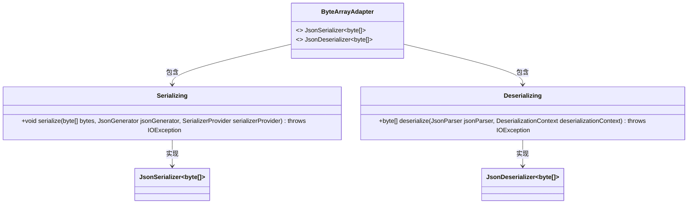
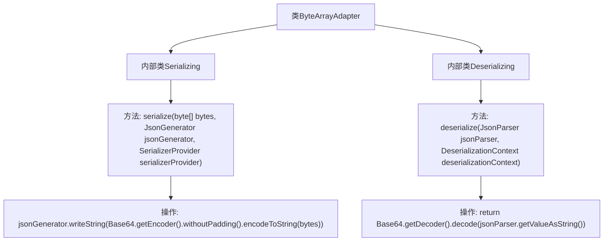

# 基础信息

|      |      |
|------|------|
| 名称 | ByteArrayAdapter |
| 编码语言 | .java |
| 代码路径 | Signal-Server/service/src/main/java/org/whispersystems/textsecuregcm/util/ByteArrayAdapter.java |
| 包名 | org.whispersystems.textsecuregcm.util |
| 依赖项 | ['com.fasterxml.jackson.core.JsonGenerator', 'com.fasterxml.jackson.core.JsonParser', 'com.fasterxml.jackson.databind.DeserializationContext', 'com.fasterxml.jackson.databind.JsonDeserializer', 'com.fasterxml.jackson.databind.JsonSerializer', 'com.fasterxml.jackson.databind.SerializerProvider', 'java.io.IOException', 'java.util.Base64'] |
| 概述说明 | ByteArrayAdapter类提供Base64编码解码的byte[]序列化和反序列化方法。 |

# 说明

ByteArrayAdapter类提供了序列化和反序列化byte数组的功能，具体通过Base64编码和解码实现。该类主要用于处理字节数组的转换，确保数据在传输或存储时能够以文本形式表示，同时保持数据的完整性和可逆性。序列化过程将byte数组转换为Base64编码的字符串，反序列化则将Base64字符串还原为原始的byte数组。

# 类列表 Class Summary

| 名称   | 类型  | 说明 |
|-------|------|-------------|
| ByteArrayAdapter | class | ByteArrayAdapter类包含序列化和反序列化byte[]的方法，使用Base64编码解码。 |

## 类 ByteArrayAdapter

|      |      |
|------|------|
| 访问范围 | public |
| 类型 | class |
| 名称 | ByteArrayAdapter |
| 说明 | ByteArrayAdapter类包含序列化和反序列化byte[]的方法，使用Base64编码解码。 |

### UML类图

**描述：**
`ByteArrayAdapter` 类包含两个静态内部类 `Serializing` 和 `Deserializing`，分别实现了 `JsonSerializer<byte[]>` 和 `JsonDeserializer<byte[]>` 接口。`Serializing` 类负责将字节数组序列化为 Base64 编码的字符串，而 `Deserializing` 类则负责将 Base64 编码的字符串反序列化为字节数组。这两个类通过 `ByteArrayAdapter` 类进行组织和管理。

### 内部方法调用关系图

这段代码定义了一个名为`ByteArrayAdapter`的类，其中包含两个静态内部类`Serializing`和`Deserializing`。`Serializing`类实现了`JsonSerializer<byte[]>`接口，用于将字节数组序列化为Base64编码的字符串，并去除填充字符。`Deserializing`类实现了`JsonDeserializer<byte[]>`接口，用于将Base64编码的字符串反序列化为字节数组。这两个类分别通过`serialize`和`deserialize`方法完成序列化和反序列化的操作。

### 字段列表 Field List

| 名称  | 类型  | 说明 |
|-------|-------|------|

### 方法列表 Method List

| 名称  | 类型  | 说明 |
|-------|-------|------|

