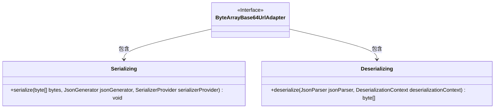
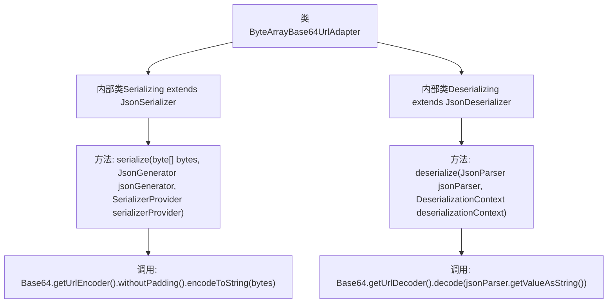

# 基础信息

|      |      |
|------|------|
| 名称 | ByteArrayBase64UrlAdapter |
| 编码语言 | .java |
| 代码路径 | Signal-Server/service/src/main/java/org/whispersystems/textsecuregcm/util/ByteArrayBase64UrlAdapter.java |
| 包名 | org.whispersystems.textsecuregcm.util |
| 依赖项 | ['com.fasterxml.jackson.core.JsonGenerator', 'com.fasterxml.jackson.core.JsonParser', 'com.fasterxml.jackson.databind.DeserializationContext', 'com.fasterxml.jackson.databind.JsonDeserializer', 'com.fasterxml.jackson.databind.JsonSerializer', 'com.fasterxml.jackson.databind.SerializerProvider', 'java.io.IOException', 'java.util.Base64'] |
| 概述说明 | ByteArrayBase64UrlAdapter类实现字节数组与Base64 URL格式互转。 |

# 说明

ByteArrayBase64UrlAdapter类是一个包含静态内部类的类，专门用于将字节数组序列化为Base64 URL格式以及将Base64 URL格式反序列化为字节数组。该类的功能集中在处理字节数组与Base64 URL之间的转换，确保数据在两种格式之间高效且准确地转换。

# 类列表 Class Summary

| 名称   | 类型  | 说明 |
|-------|------|-------------|
| ByteArrayBase64UrlAdapter | class | ByteArrayBase64UrlAdapter类包含序列化和反序列化字节数组为Base64 URL格式的静态内部类。 |

## 类 ByteArrayBase64UrlAdapter

|      |      |
|------|------|
| 访问范围 | public |
| 类型 | class |
| 名称 | ByteArrayBase64UrlAdapter |
| 说明 | ByteArrayBase64UrlAdapter类包含序列化和反序列化字节数组为Base64 URL格式的静态内部类。 |

### UML类图

**描述：**  
`ByteArrayBase64UrlAdapter` 是一个包含两个静态内部类的适配器类，用于处理字节数组与Base64 URL编码之间的转换。`Serializing` 类实现了字节数组的序列化，将其转换为Base64 URL编码字符串；`Deserializing` 类则实现了反序列化，将Base64 URL编码字符串解码为字节数组。这两个类分别通过 `JsonSerializer` 和 `JsonDeserializer` 接口实现其功能。

### 内部方法调用关系图

这段代码定义了一个名为 `ByteArrayBase64UrlAdapter` 的类，其中包含两个内部类 `Serializing` 和 `Deserializing`，分别用于将字节数组序列化为Base64 URL编码的字符串，以及将Base64 URL编码的字符串反序列化为字节数组。`Serializing` 类中的 `serialize` 方法使用 `Base64.getUrlEncoder().withoutPadding().encodeToString(bytes)` 进行编码，而 `Deserializing` 类中的 `deserialize` 方法使用 `Base64.getUrlDecoder().decode(jsonParser.getValueAsString())` 进行解码。

### 字段列表 Field List

| 名称  | 类型  | 说明 |
|-------|-------|------|

### 方法列表 Method List

| 名称  | 类型  | 说明 |
|-------|-------|------|

