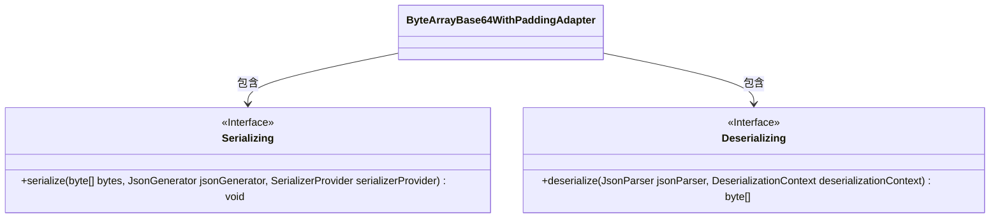
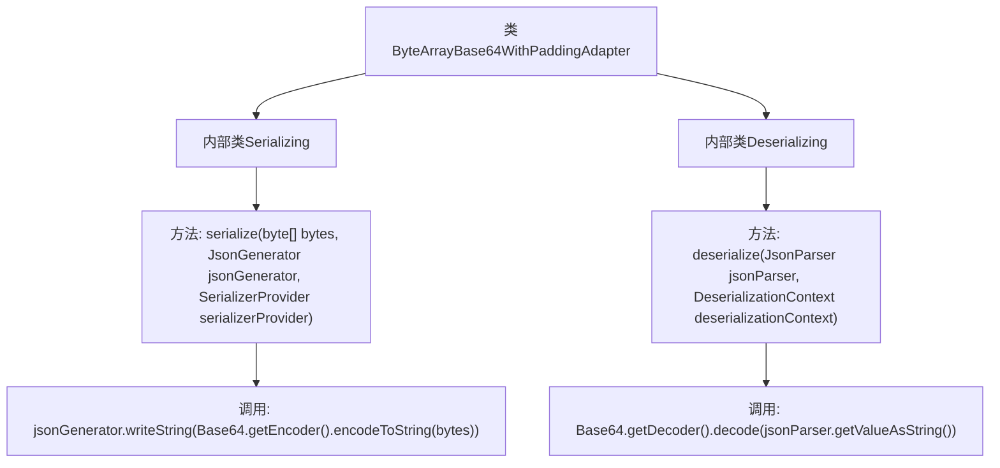

# 基础信息

|      |      |
|------|------|
| 名称 | ByteArrayBase64WithPaddingAdapter |
| 编码语言 | .java |
| 代码路径 | Signal-Server/service/src/main/java/org/whispersystems/textsecuregcm/util/ByteArrayBase64WithPaddingAdapter.java |
| 包名 | org.whispersystems.textsecuregcm.util |
| 依赖项 | ['com.fasterxml.jackson.core.JsonGenerator', 'com.fasterxml.jackson.core.JsonParser', 'com.fasterxml.jackson.databind.DeserializationContext', 'com.fasterxml.jackson.databind.JsonDeserializer', 'com.fasterxml.jackson.databind.JsonSerializer', 'com.fasterxml.jackson.databind.SerializerProvider', 'java.io.IOException', 'java.util.Base64'] |
| 概述说明 | ByteArrayBase64WithPaddingAdapter类实现字节数组与Base64字符串互转。 |

# 说明

ByteArrayBase64WithPaddingAdapter类提供了序列化和反序列化功能，能够将字节数组转换为Base64字符串，同时支持将Base64字符串还原为原始字节数组。该类的主要作用是实现字节数组与Base64编码之间的相互转换，确保数据在传输或存储时的兼容性和可读性。

# 类列表 Class Summary

| 名称   | 类型  | 说明 |
|-------|------|-------------|
| ByteArrayBase64WithPaddingAdapter | class | ByteArrayBase64WithPaddingAdapter类包含序列化和反序列化方法，分别将字节数组转换为Base64字符串及反向操作。 |

## 类 ByteArrayBase64WithPaddingAdapter

|      |      |
|------|------|
| 访问范围 | public |
| 类型 | class |
| 名称 | ByteArrayBase64WithPaddingAdapter |
| 说明 | ByteArrayBase64WithPaddingAdapter类包含序列化和反序列化方法，分别将字节数组转换为Base64字符串及反向操作。 |

### UML类图

这段代码定义了一个名为 `ByteArrayBase64WithPaddingAdapter` 的类，该类内部包含两个静态嵌套类 `Serializing` 和 `Deserializing`。`Serializing` 类实现了 `JsonSerializer` 接口，用于将字节数组序列化为 Base64 编码的字符串；`Deserializing` 类实现了 `JsonDeserializer` 接口，用于将 Base64 编码的字符串反序列化为字节数组。这两个类分别通过 `serialize` 和 `deserialize` 方法完成序列化和反序列化的操作。

### 内部方法调用关系图

这段代码定义了一个名为`ByteArrayBase64WithPaddingAdapter`的类，其中包含两个内部类`Serializing`和`Deserializing`。`Serializing`类实现了`JsonSerializer`接口，用于将字节数组序列化为Base64编码的字符串。`Deserializing`类实现了`JsonDeserializer`接口，用于将Base64编码的字符串反序列化为字节数组。代码通过`Base64`类进行编码和解码操作，确保数据的正确转换和传输。

### 字段列表 Field List

| 名称  | 类型  | 说明 |
|-------|-------|------|

### 方法列表 Method List

| 名称  | 类型  | 说明 |
|-------|-------|------|

