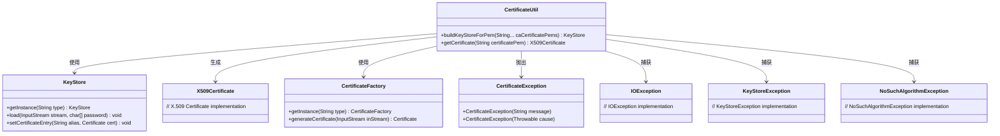
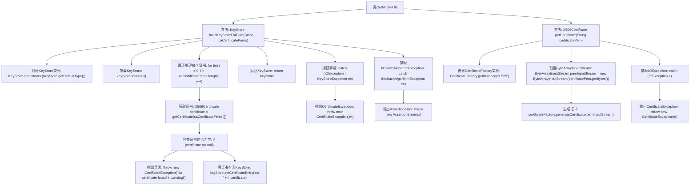

# 基础信息

|      |      |
|------|------|
| 名称 | CertificateUtil |
| 编码语言 | .java |
| 代码路径 | Signal-Server/service/src/main/java/org/whispersystems/textsecuregcm/util/CertificateUtil.java |
| 包名 | org.whispersystems.textsecuregcm.util |
| 依赖项 | ['java.io.ByteArrayInputStream', 'java.io.IOException', 'java.security.KeyStore', 'java.security.KeyStoreException', 'java.security.NoSuchAlgorithmException', 'java.security.cert.CertificateException', 'java.security.cert.CertificateFactory', 'java.security.cert.X509Certificate'] |
| 概述说明 | CertificateUtil类提供buildKeyStoreForPem和getCertificate方法，分别用于创建KeyStore和解析PEM证书。 |

# 说明

CertificateUtil类提供了两个主要功能：buildKeyStoreForPem方法用于创建并填充KeyStore，而getCertificate方法则用于解析PEM格式的X509证书。这两个方法共同支持了证书的管理和操作。

# 类列表 Class Summary

| 名称   | 类型  | 说明 |
|-------|------|-------------|
| CertificateUtil | class | CertificateUtil类包含两个方法：buildKeyStoreForPem用于创建并填充KeyStore，getCertificate用于解析PEM格式的X509证书。 |

## 类 CertificateUtil

|      |      |
|------|------|
| 访问范围 | public |
| 类型 | class |
| 名称 | CertificateUtil |
| 说明 | CertificateUtil类包含两个方法：buildKeyStoreForPem用于创建并填充KeyStore，getCertificate用于解析PEM格式的X509证书。 |

### UML类图

**描述：**  
`CertificateUtil` 类提供了两个静态方法：`buildKeyStoreForPem` 和 `getCertificate`。`buildKeyStoreForPem` 方法用于从 PEM 格式的证书字符串构建 `KeyStore` 对象，而 `getCertificate` 方法则用于从 PEM 字符串中解析出 `X509Certificate` 对象。`CertificateUtil` 依赖于 `KeyStore`、`X509Certificate` 和 `CertificateFactory` 类来完成这些操作，并在遇到异常时抛出 `CertificateException` 或捕获 `IOException`、`KeyStoreException` 和 `NoSuchAlgorithmException`。

### 内部方法调用关系图

这段代码定义了一个`CertificateUtil`类，其中包含两个方法：`buildKeyStoreForPem`和`getCertificate`。`buildKeyStoreForPem`方法用于从PEM格式的证书字符串构建一个`KeyStore`对象，而`getCertificate`方法则用于从PEM格式的字符串中提取`X509Certificate`对象。代码通过循环处理每个证书字符串，检查证书是否有效，并将其存储在`KeyStore`中。如果过程中出现异常，代码会捕获并抛出相应的异常。

### 字段列表 Field List

| 名称  | 类型  | 说明 |
|-------|-------|------|

### 方法列表 Method List

| 名称  | 类型  | 说明 |
|-------|-------|------|
| buildKeyStoreForPem | KeyStore | 构建包含PEM格式CA证书的KeyStore实例，处理异常并返回。 |
| getCertificate | X509Certificate | 从PEM字符串获取X.509证书，使用ByteArrayInputStream解析并返回。 |

