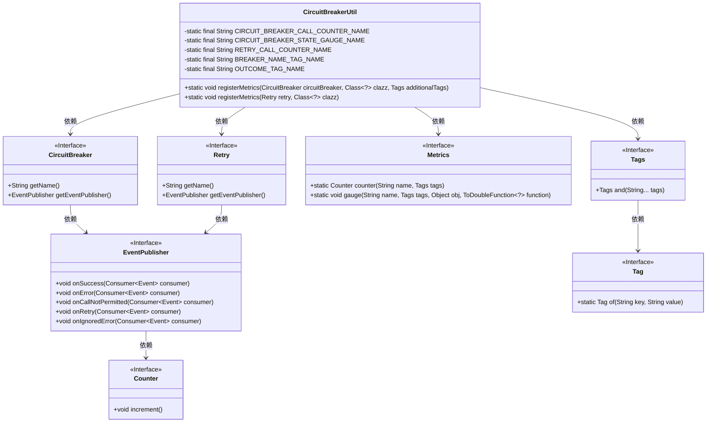

# 基础信息

|      |      |
|------|------|
| 名称 | CircuitBreakerUtil |
| 编码语言 | .java |
| 代码路径 | Signal-Server/service/src/main/java/org/whispersystems/textsecuregcm/util/CircuitBreakerUtil.java |
| 包名 | org.whispersystems.textsecuregcm.util |
| 依赖项 | ['com.codahale.metrics.MetricRegistry.name', 'io.github.resilience4j.circuitbreaker.CircuitBreaker', 'io.github.resilience4j.retry.Retry', 'io.micrometer.core.instrument.Counter', 'io.micrometer.core.instrument.Metrics', 'io.micrometer.core.instrument.Tag', 'io.micrometer.core.instrument.Tags'] |
| 概述说明 | CircuitBreakerUtil类注册断路器并监控重试机制，记录各类事件。 |

# 说明

CircuitBreakerUtil类主要负责注册断路器和重试机制的监控指标，用于跟踪和记录相关事件，包括成功调用、失败调用以及未允许调用等情况。通过该类的功能，可以有效地监控系统在遇到故障时的表现，确保系统的稳定性和可靠性。

# 类列表 Class Summary

| 名称   | 类型  | 说明 |
|-------|------|-------------|
| CircuitBreakerUtil | class | CircuitBreakerUtil类用于注册断路器和重试机制的监控指标，记录成功、失败、未允许调用等事件。 |

## 类 CircuitBreakerUtil

|      |      |
|------|------|
| 访问范围 | public |
| 类型 | class |
| 名称 | CircuitBreakerUtil |
| 说明 | CircuitBreakerUtil类用于注册断路器和重试机制的监控指标，记录成功、失败、未允许调用等事件。 |

### UML类图

这段代码定义了一个`CircuitBreakerUtil`类，用于注册与`CircuitBreaker`和`Retry`相关的指标。`CircuitBreakerUtil`类通过`Metrics`类创建计数器（`Counter`）和仪表（`gauge`），并通过`EventPublisher`监听`CircuitBreaker`和`Retry`的事件来更新这些指标。`CircuitBreaker`和`Retry`都是接口，分别提供了获取名称和事件发布者的方法。`EventPublisher`接口定义了处理不同事件的方法，如成功、错误、重试等。`Metrics`类提供了创建计数器和仪表的方法，`Tags`和`Tag`类用于管理标签。

### 内部方法调用关系图

```mermaid
graph TD
    A["类CircuitBreakerUtil"]
    B["常量: CIRCUIT_BREAKER_CALL_COUNTER_NAME"]
    C["常量: CIRCUIT_BREAKER_STATE_GAUGE_NAME"]
    D["常量: RETRY_CALL_COUNTER_NAME"]
    E["常量: BREAKER_NAME_TAG_NAME"]
    F["常量: OUTCOME_TAG_NAME"]
    G["方法: registerMetrics(CircuitBreaker circuitBreaker, Class<?> clazz, Tags additionalTags)"]
    H["方法: registerMetrics(Retry retry, Class<?> clazz)"]
    I["获取breakerName"]
    J["创建successCounter"]
    K["创建failureCounter"]
    L["创建unpermittedCounter"]
    M["注册onSuccess事件"]
    N["注册onError事件"]
    O["注册onCallNotPermitted事件"]
    P["注册gauge"]
    Q["获取retryName"]
    R["创建successCounter"]
    S["创建retryCounter"]
    T["创建errorCounter"]
    U["创建ignoredErrorCounter"]
    V["注册onSuccess事件"]
    W["注册onRetry事件"]
    X["注册onError事件"]
    Y["注册onIgnoredError事件"]

    A --> B
    A --> C
    A --> D
    A --> E
    A --> F
    A --> G
    A --> H
    G --> I
    G --> J
    G --> K
    G --> L
    G --> M
    G --> N
    G --> O
    G --> P
    H --> Q
    H --> R
    H --> S
    H --> T
    H --> U
    H --> V
    H --> W
    H --> X
    H --> Y
```

这段代码展示了`CircuitBreakerUtil`类的实现，主要用于注册和管理断路器和重试机制的指标。代码定义了两个主要方法：`registerMetrics`，分别用于注册断路器事件和重试事件的计数器。每个方法通过获取相应的名称，创建不同类型的计数器，并注册事件处理器来更新这些计数器。流程图清晰地展示了类内部方法的调用关系和事件处理流程。

### 字段列表 Field List

| 名称  | 类型  | 说明 |
|-------|-------|------|
| CIRCUIT_BREAKER_CALL_COUNTER_NAME = name(CircuitBreakerUtil.class, "breaker", "call") | String | 定义断路器调用计数器的静态常量名称。 |
| OUTCOME_TAG_NAME = "outcome" | String | 定义私有静态常量字符串OUTCOME_TAG_NAME，值为"outcome"。 |
| BREAKER_NAME_TAG_NAME = "breakerName" | String | 定义私有静态常量字符串BREAKER_NAME_TAG_NAME，值为"breakerName"。 |
| RETRY_CALL_COUNTER_NAME = name(CircuitBreakerUtil.class, "retry", "call") | String | 定义私有静态常量RETRY_CALL_COUNTER_NAME，用于记录重试调用次数。 |
| CIRCUIT_BREAKER_STATE_GAUGE_NAME = name(CircuitBreakerUtil.class, "breaker", "state") | String | 定义电路断路器状态指标名称为CircuitBreakerUtil类的breaker_state。 |

### 方法列表 Method List

| 名称  | 类型  | 说明 |
|-------|-------|------|
| registerMetrics | void | 注册断路器指标，包括成功、失败和未允许调用的计数器，以及断路器状态仪表。 |
| registerMetrics | void | 注册重试事件计数器，包括成功、重试、错误和忽略错误。 |

