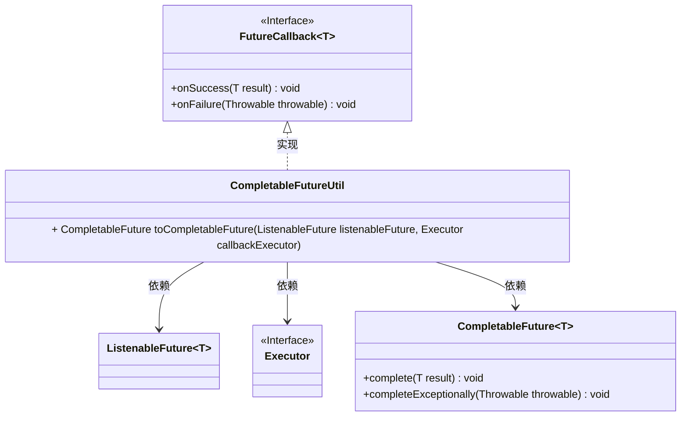
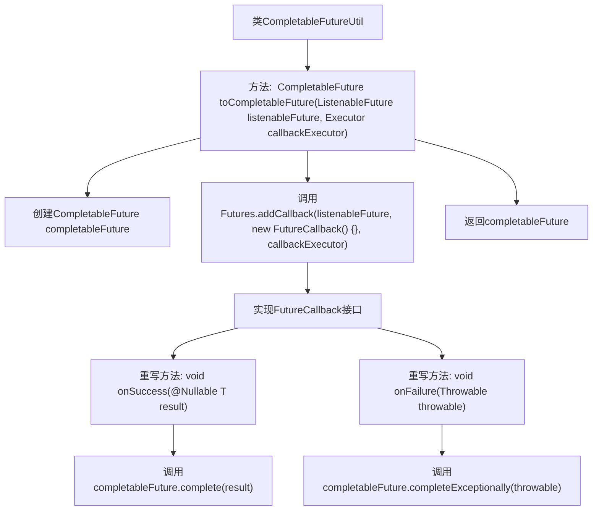

# 基础信息

|      |      |
|------|------|
| 名称 | CompletableFutureUtil |
| 编码语言 | .java |
| 代码路径 | Signal-Server/service/src/main/java/org/whispersystems/textsecuregcm/util/CompletableFutureUtil.java |
| 包名 | org.whispersystems.textsecuregcm.util |
| 依赖项 | ['com.google.common.util.concurrent.FutureCallback', 'com.google.common.util.concurrent.Futures', 'com.google.common.util.concurrent.ListenableFuture', 'javax.annotation.Nullable', 'java.util.concurrent.CompletableFuture', 'java.util.concurrent.Executor'] |
| 概述说明 | 将ListenableFuture转为CompletableFuture，支持成功与异常处理。 |

# 说明

将ListenableFuture转换为CompletableFuture，确保在异步操作中能够处理成功和异常情况。这种转换使得开发者能够利用CompletableFuture的丰富API进行更灵活的异步编程，包括链式调用、组合操作以及异常捕获等功能，从而提升代码的可读性和可维护性。

# 类列表 Class Summary

| 名称   | 类型  | 说明 |
|-------|------|-------------|
| CompletableFutureUtil | class | 将ListenableFuture转换为CompletableFuture，支持成功和异常处理。 |

## 类 CompletableFutureUtil

|      |      |
|------|------|
| 访问范围 | public |
| 类型 | class |
| 名称 | CompletableFutureUtil |
| 说明 | 将ListenableFuture转换为CompletableFuture，支持成功和异常处理。 |

### UML类图

这段代码定义了一个工具类 `CompletableFutureUtil`，其中包含一个静态方法 `toCompletableFuture`，用于将 `ListenableFuture` 转换为 `CompletableFuture`。该方法通过 `Futures.addCallback` 为 `ListenableFuture` 添加回调，当 `ListenableFuture` 成功或失败时，分别调用 `CompletableFuture` 的 `complete` 或 `completeExceptionally` 方法。代码中涉及的主要类包括 `CompletableFuture`、`ListenableFuture`、`FutureCallback` 和 `Executor`，其中 `FutureCallback` 是一个接口，由 `CompletableFutureUtil` 内部匿名类实现。

### 内部方法调用关系图

这段代码展示了如何将`ListenableFuture`转换为`CompletableFuture`。`toCompletableFuture`方法接收一个`ListenableFuture`和一个`Executor`作为参数，创建一个新的`CompletableFuture`，并通过`Futures.addCallback`方法为`ListenableFuture`添加回调。回调接口`FutureCallback`的实现中，`onSuccess`方法将结果传递给`CompletableFuture`，而`onFailure`方法将异常传递给`CompletableFuture`。最终，该方法返回这个`CompletableFuture`。

### 字段列表 Field List

| 名称  | 类型  | 说明 |
|-------|-------|------|

### 方法列表 Method List

| 名称  | 类型  | 说明 |
|-------|-------|------|
| toCompletableFuture | CompletableFuture<T> | 将ListenableFuture转换为CompletableFuture，支持成功和异常回调。 |

