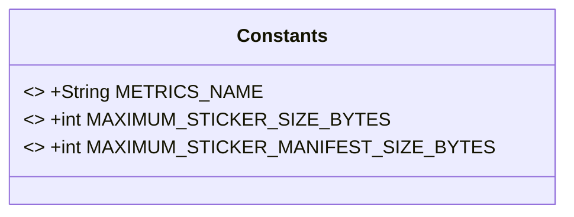
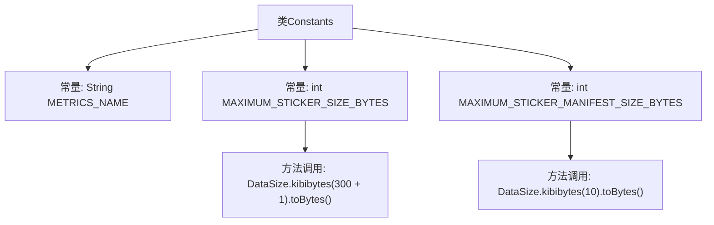

# 基础信息

|      |      |
|------|------|
| 名称 | Constants |
| 编码语言 | .java |
| 代码路径 | Signal-Server/service/src/main/java/org/whispersystems/textsecuregcm/util/Constants.java |
| 包名 | org.whispersystems.textsecuregcm.util |
| 依赖项 | ['io.dropwizard.util.DataSize'] |
| 概述说明 | 定义常量：METRICS_NAME为"textsecure"，贴图最大301KiB，清单最大10KiB。 |

# 说明

该内容定义了一个常量METRICS_NAME，其值为"textsecure"。同时，规定了最大贴图大小为301KiB，最大贴图清单大小为10KiB。这些设置用于限制贴图及其清单的大小，确保系统在处理相关数据时能够有效控制资源使用，避免超出预设的存储和处理能力范围。

# 类列表 Class Summary

| 名称   | 类型  | 说明 |
|-------|------|-------------|
| Constants | class | 定义常量：METRICS_NAME为"textsecure"，最大贴图大小为301KiB，最大贴图清单大小为10KiB。 |

## 类 Constants

|      |      |
|------|------|
| 访问范围 | public |
| 类型 | class |
| 名称 | Constants |
| 说明 | 定义常量：METRICS_NAME为"textsecure"，最大贴图大小为301KiB，最大贴图清单大小为10KiB。 |

### UML类图

这段代码定义了一个名为 `Constants` 的类，其中包含三个静态常量字段。`METRICS_NAME` 是一个字符串常量，表示指标名称；`MAXIMUM_STICKER_SIZE_BYTES` 是一个整数常量，表示最大贴图大小（包括加密开销）；`MAXIMUM_STICKER_MANIFEST_SIZE_BYTES` 是另一个整数常量，表示最大贴图清单大小。这些常量在类加载时初始化，并且在整个应用程序中保持不变。

### 内部方法调用关系图

这段代码定义了一个名为`Constants`的类，其中包含三个静态常量：`METRICS_NAME`、`MAXIMUM_STICKER_SIZE_BYTES`和`MAXIMUM_STICKER_MANIFEST_SIZE_BYTES`。`MAXIMUM_STICKER_SIZE_BYTES`和`MAXIMUM_STICKER_MANIFEST_SIZE_BYTES`的值通过调用`DataSize.kibibytes()`方法并转换为字节数来设置。这些常量用于存储应用程序中的固定值，如最大贴图大小和贴图清单大小。

### 字段列表 Field List

| 名称  | 类型  | 说明 |
|-------|-------|------|
| MAXIMUM_STICKER_SIZE_BYTES = (int) DataSize.kibibytes(300 + 1).toBytes() | int | 定义最大贴图大小为301KB的字节常量。 |
| METRICS_NAME = "textsecure" | String | METRICS_NAME常量值为"textsecure"。 |
| MAXIMUM_STICKER_MANIFEST_SIZE_BYTES = (int) DataSize.kibibytes(10).toBytes() | int | 静态常量MAXIMUM_STICKER_MANIFEST_SIZE_BYTES值为10KB的字节数。 |

### 方法列表 Method List

| 名称  | 类型  | 说明 |
|-------|-------|------|

