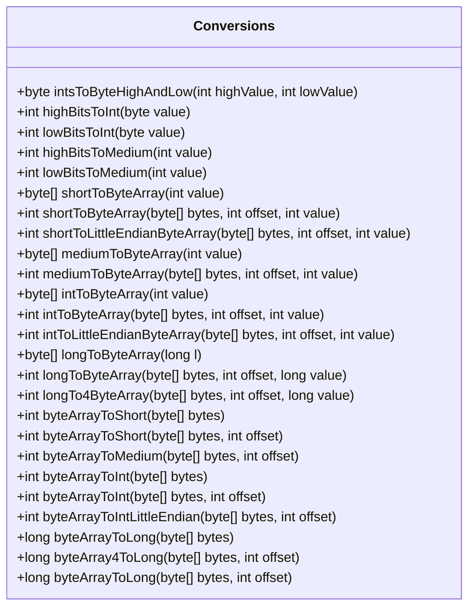

# 基础信息

|      |      |
|------|------|
| 名称 | Conversions |
| 编码语言 | .java |
| 代码路径 | Signal-Server/service/src/main/java/org/whispersystems/textsecuregcm/util/Conversions.java |
| 包名 | org.whispersystems.textsecuregcm.util |
| 依赖项 | [] |
| 概述说明 | 提供多种数据类型转换和字节数组操作的实用方法。 |

# 说明

该内容介绍了一系列实用的方法，主要用于处理多种数据类型之间的转换以及字节数组的操作。这些方法能够帮助开发者在编程中高效地进行数据类型转换，例如将整数、字符串等转换为字节数组，或者从字节数组还原为原始数据类型。此外，还提供了对字节数组的常见操作，如拼接、分割、比较等，确保在处理二进制数据时更加灵活和便捷。这些功能适用于需要频繁处理数据类型转换和字节操作的场景，提升了代码的可读性和执行效率。

# 类列表 Class Summary

| 名称   | 类型  | 说明 |
|-------|------|-------------|
| Conversions | class | 提供多种数据类型转换和字节数组操作的实用方法。 |

## 类 Conversions

|      |      |
|------|------|
| 访问范围 | public |
| 类型 | class |
| 名称 | Conversions |
| 说明 | 提供多种数据类型转换和字节数组操作的实用方法。 |

### UML类图

**描述：**  
`Conversions` 类提供了多种静态方法，用于在不同数据类型之间进行转换，特别是字节数组与整数、长整数、短整数之间的转换。这些方法支持大端序和小端序的字节序处理，能够处理高字节和低字节的分离与合并，适用于需要精确控制字节顺序的场景，如网络协议、文件格式处理等。

### 内部方法调用关系图

```mermaid
graph TD
    A["类Conversions"]
    B["方法: byte intsToByteHighAndLow(int highValue, int lowValue)"]
    C["方法: int highBitsToInt(byte value)"]
    D["方法: int lowBitsToInt(byte value)"]
    E["方法: int highBitsToMedium(int value)"]
    F["方法: int lowBitsToMedium(int value)"]
    G["方法: byte[] shortToByteArray(int value)"]
    H["方法: int shortToByteArray(byte[] bytes, int offset, int value)"]
    I["方法: int shortToLittleEndianByteArray(byte[] bytes, int offset, int value)"]
    J["方法: byte[] mediumToByteArray(int value)"]
    K["方法: int mediumToByteArray(byte[] bytes, int offset, int value)"]
    L["方法: byte[] intToByteArray(int value)"]
    M["方法: int intToByteArray(byte[] bytes, int offset, int value)"]
    N["方法: int intToLittleEndianByteArray(byte[] bytes, int offset, int value)"]
    O["方法: byte[] longToByteArray(long l)"]
    P["方法: int longToByteArray(byte[] bytes, int offset, long value)"]
    Q["方法: int longTo4ByteArray(byte[] bytes, int offset, long value)"]
    R["方法: int byteArrayToShort(byte[] bytes)"]
    S["方法: int byteArrayToShort(byte[] bytes, int offset)"]
    T["方法: int byteArrayToMedium(byte[] bytes, int offset)"]
    U["方法: int byteArrayToInt(byte[] bytes)"]
    V["方法: int byteArrayToInt(byte[] bytes, int offset)"]
    W["方法: int byteArrayToIntLittleEndian(byte[] bytes, int offset)"]
    X["方法: long byteArrayToLong(byte[] bytes)"]
    Y["方法: long byteArray4ToLong(byte[] bytes, int offset)"]
    Z["方法: long byteArrayToLong(byte[] bytes, int offset)"]

    A --> B
    A --> C
    A --> D
    A --> E
    A --> F
    A --> G
    A --> H
    A --> I
    A --> J
    A --> K
    A --> L
    A --> M
    A --> N
    A --> O
    A --> P
    A --> Q
    A --> R
    A --> S
    A --> T
    A --> U
    A --> V
    A --> W
    A --> X
    A --> Y
    A --> Z
```

这段代码定义了一个名为`Conversions`的类，其中包含了多个用于数据类型转换的静态方法。这些方法主要用于将不同类型的整数（如`int`、`short`、`long`等）转换为字节数组，或者从字节数组中提取出相应的整数值。代码还支持大端序（Big-Endian）和小端序（Little-Endian）的转换。每个方法都通过位操作和类型转换来实现其功能，确保了数据在不同表示形式之间的正确转换。

### 字段列表 Field List

| 名称  | 类型  | 说明 |
|-------|-------|------|

### 方法列表 Method List

| 名称  | 类型  | 说明 |
|-------|-------|------|
| mediumToByteArray | byte[] | 将整数转换为3字节数组的方法。 |
| lowBitsToMedium | int | 提取整数的低12位并返回。 |
| highBitsToMedium | int | 该方法将整数值右移12位并返回结果。 |
| longToByteArray | byte[] | 将长整型转换为8字节数组的方法。 |
| intToLittleEndianByteArray | int | 将整数值转换为小端字节数组并写入指定偏移量。 |
| highBitsToInt | int | 该方法将字节值的高4位转换为整数。 |
| byteArrayToMedium | int | 将字节数组转换为中整数的静态方法。 |
| intToByteArray | byte[] | 将整数转换为4字节数组。 |
| byteArrayToInt | int | 将字节数组转换为整数的静态方法。 |
| byteArrayToIntLittleEndian | int | 将小端字节数组转换为整数的静态方法。 |
| byteArrayToLong | long | 将字节数组转换为长整型数值。 |
| intsToByteHighAndLow | byte | 将高低位整数合并为单字节，确保结果在0到255之间。 |
| byteArray4ToLong | long | 将字节数组的4个字节转换为长整型数值。 |
| shortToByteArray | int | 将短整数值转换为字节数组并返回字节数。 |
| byteArrayToShort | int | 将字节数组转换为短整型，起始位置为0。 |
| byteArrayToInt | int | 将字节数组转换为整数的静态方法。 |
| mediumToByteArray | int | 将整数值转换为字节数组并存储，返回字节数3。 |
| longToByteArray | int | 将长整型值按字节拆分存储到字节数组中，返回字节数。 |
| intToByteArray | int | 将整数值转换为字节数组并存储，返回字节数4。 |
| lowBitsToInt | int | 该方法将字节的低4位转换为整数。 |
| shortToLittleEndianByteArray | int | 将短整数值转换为小端字节数组并写入指定偏移位置。 |
| byteArrayToShort | int | 将字节数组转换为短整型，偏移量指定起始位置。 |
| longTo4ByteArray | int | 将长整型值转换为4字节数组并存储。 |
| byteArrayToLong | long | 静态方法将字节数组转换为长整型，默认从索引0开始。 |
| shortToByteArray | byte[] | 将整数值转换为2字节的字节数组。 |

