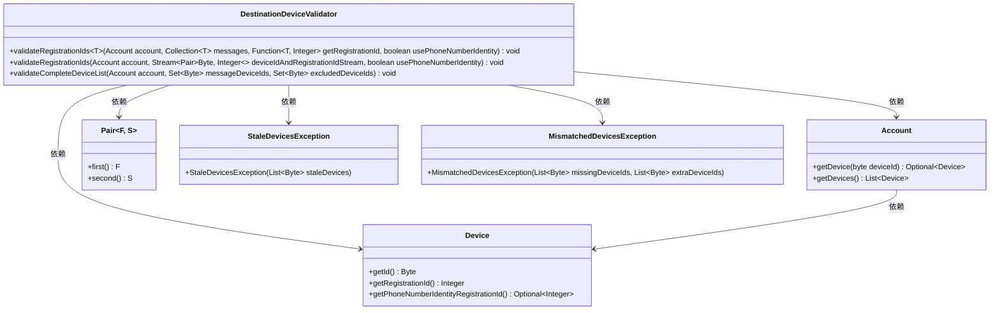
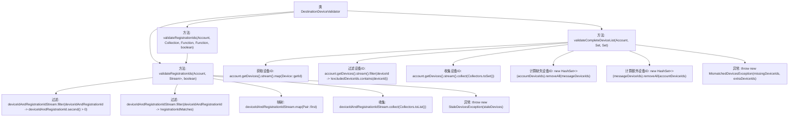

# 基础信息

|      |      |
|------|------|
| 名称 | DestinationDeviceValidator |
| 编码语言 | .java |
| 代码路径 | Signal-Server/service/src/main/java/org/whispersystems/textsecuregcm/util/DestinationDeviceValidator.java |
| 包名 | org.whispersystems.textsecuregcm.util |
| 依赖项 | ['java.util.ArrayList', 'java.util.Collection', 'java.util.HashSet', 'java.util.List', 'java.util.Set', 'java.util.function.Function', 'java.util.stream.Collectors', 'java.util.stream.Stream', 'org.whispersystems.textsecuregcm.controllers.MismatchedDevicesException', 'org.whispersystems.textsecuregcm.controllers.StaleDevicesException', 'org.whispersystems.textsecuregcm.storage.Account', 'org.whispersystems.textsecuregcm.storage.Device'] |
| 概述说明 | 验证设备ID、注册ID匹配性及设备列表完整性。 |

# 说明

该内容描述了一个验证过程，主要涉及两个关键步骤。首先，验证设备ID和注册ID是否与目标账户匹配，确保设备的身份信息准确无误。其次，检查设备列表是否完整，确保所有相关设备信息都已记录且无遗漏。这一过程旨在确保设备与账户的关联性正确，并维护设备信息的完整性。

# 类列表 Class Summary

| 名称   | 类型  | 说明 |
|-------|------|-------------|
| DestinationDeviceValidator | class | 验证设备ID和注册ID是否匹配目标账户，并检查设备列表是否完整。 |

## 类 DestinationDeviceValidator

|      |      |
|------|------|
| 访问范围 | public |
| 类型 | class |
| 名称 | DestinationDeviceValidator |
| 说明 | 验证设备ID和注册ID是否匹配目标账户，并检查设备列表是否完整。 |

### UML类图

### 描述
`DestinationDeviceValidator` 类提供了三个静态方法，用于验证设备ID和注册ID的有效性。`validateRegistrationIds` 方法通过比较设备ID和注册ID来确保它们与目标账户中的设备匹配，若不匹配则抛出 `StaleDevicesException`。`validateCompleteDeviceList` 方法验证消息中的设备ID是否与目标账户的设备ID完全匹配，若不匹配则抛出 `MismatchedDevicesException`。`Account` 类提供了获取设备和设备ID的方法，`Device` 类则提供了设备的详细信息。

### 内部方法调用关系图

这段代码描述了一个名为 `DestinationDeviceValidator` 的类，其中包含三个主要方法：`validateRegistrationIds` 的两个重载版本和 `validateCompleteDeviceList`。第一个 `validateRegistrationIds` 方法通过传入的函数将消息集合转换为设备ID和注册ID的流，并调用第二个 `validateRegistrationIds` 方法进行验证。第二个 `validateRegistrationIds` 方法通过过滤和映射操作检查设备ID和注册ID是否匹配，如果不匹配则抛出 `StaleDevicesException`。`validateCompleteDeviceList` 方法则用于验证消息中的设备ID是否与目标账户的设备ID完全匹配，如果不匹配则抛出 `MismatchedDevicesException`。

### 字段列表 Field List

| 名称  | 类型  | 说明 |
|-------|-------|------|

### 方法列表 Method List

| 名称  | 类型  | 说明 |
|-------|-------|------|
| validateRegistrationIds | void | 验证注册ID，检查设备ID和注册ID是否有效，支持电话号码身份验证。 |
| validateRegistrationIds | void | 验证设备注册ID，若不一致则抛出异常。 |
| validateCompleteDeviceList | void | 验证账户设备列表与消息设备列表是否一致，不一致时抛出异常。 |

