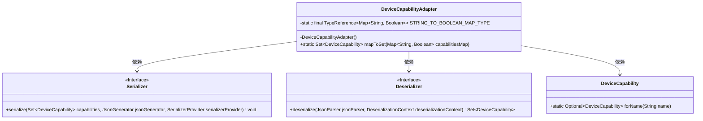
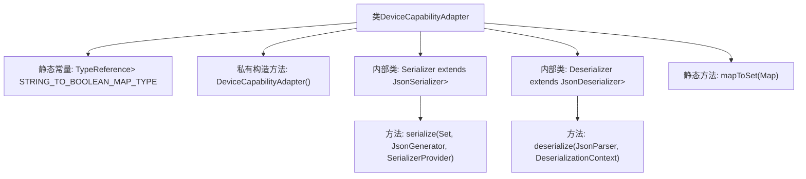

# 基础信息

|      |      |
|------|------|
| 名称 | DeviceCapabilityAdapter |
| 编码语言 | .java |
| 代码路径 | Signal-Server/service/src/main/java/org/whispersystems/textsecuregcm/util/DeviceCapabilityAdapter.java |
| 包名 | org.whispersystems.textsecuregcm.util |
| 依赖项 | ['com.fasterxml.jackson.core.JsonGenerator', 'com.fasterxml.jackson.core.JsonParser', 'com.fasterxml.jackson.core.type.TypeReference', 'com.fasterxml.jackson.databind.DeserializationContext', 'com.fasterxml.jackson.databind.JsonDeserializer', 'com.fasterxml.jackson.databind.JsonSerializer', 'com.fasterxml.jackson.databind.SerializerProvider', 'org.whispersystems.textsecuregcm.storage.DeviceCapability', 'java.io.IOException', 'java.util.EnumSet', 'java.util.Map', 'java.util.Optional', 'java.util.Set', 'java.util.stream.Collectors'] |
| 概述说明 | DeviceCapabilityAdapter类负责设备能力的序列化与反序列化，内置Serializer和Deserializer类。 |

# 说明

DeviceCapabilityAdapter类负责设备能力的序列化与反序列化操作，其内部包含两个关键组件：Serializer和Deserializer。Serializer类用于将设备能力数据转换为可存储或传输的格式，而Deserializer类则负责将序列化后的数据重新还原为设备能力对象。通过这两个内部类的协同工作，DeviceCapabilityAdapter实现了设备能力数据的高效转换与还原，确保数据在不同系统或平台间的无缝传递与解析。

# 类列表 Class Summary

| 名称   | 类型  | 说明 |
|-------|------|-------------|
| DeviceCapabilityAdapter | class | DeviceCapabilityAdapter类实现设备能力序列化与反序列化，包含Serializer和Deserializer内部类。 |

## 类 DeviceCapabilityAdapter

|      |      |
|------|------|
| 访问范围 | public |
| 类型 | class |
| 名称 | DeviceCapabilityAdapter |
| 说明 | DeviceCapabilityAdapter类实现设备能力序列化与反序列化，包含Serializer和Deserializer内部类。 |

### UML类图

这段代码定义了一个 `DeviceCapabilityAdapter` 类，用于处理 `DeviceCapability` 对象的序列化和反序列化。`Serializer` 和 `Deserializer` 是内部类，分别实现了 `JsonSerializer` 和 `JsonDeserializer` 接口，用于将 `DeviceCapability` 集合转换为 JSON 格式和从 JSON 格式转换回 `DeviceCapability` 集合。`DeviceCapability` 类提供了一个静态方法 `forName`，用于根据名称获取 `DeviceCapability` 实例。`DeviceCapabilityAdapter` 还提供了一个静态方法 `mapToSet`，用于将 `Map<String, Boolean>` 转换为 `Set<DeviceCapability>`。

### 内部方法调用关系图

这段代码定义了一个`DeviceCapabilityAdapter`类，用于序列化和反序列化`DeviceCapability`对象的集合。类中包含两个内部类：`Serializer`和`Deserializer`，分别用于将`DeviceCapability`集合序列化为JSON格式以及从JSON格式反序列化为`DeviceCapability`集合。`mapToSet`方法用于将`Map<String, Boolean>`转换为`Set<DeviceCapability>`。整个流程通过`JsonGenerator`和`JsonParser`进行数据的读写操作，并通过流操作处理集合的转换和过滤。

### 字段列表 Field List

| 名称  | 类型  | 说明 |
|-------|-------|------|
| STRING_TO_BOOLEAN_MAP_TYPE = new TypeReference<>() {} | TypeReference<Map<String, Boolean>> | 定义字符串到布尔值的映射类型引用。 |

### 方法列表 Method List

| 名称  | 类型  | 说明 |
|-------|-------|------|
| mapToSet | Set<DeviceCapability> | 将布尔值映射转换为设备能力集合。 |

