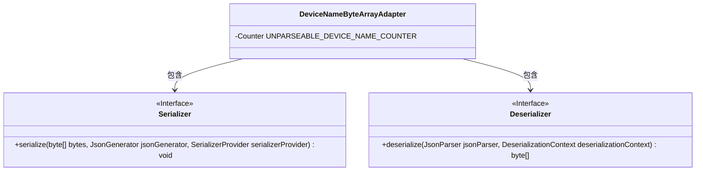
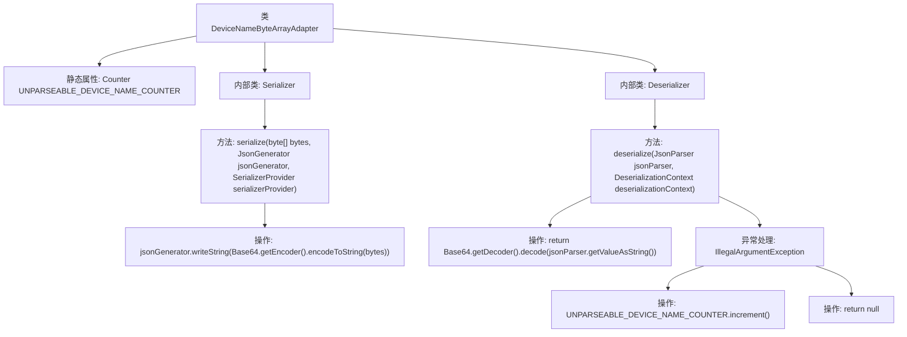

# 基础信息

|      |      |
|------|------|
| 名称 | DeviceNameByteArrayAdapter |
| 编码语言 | .java |
| 代码路径 | Signal-Server/service/src/main/java/org/whispersystems/textsecuregcm/util/DeviceNameByteArrayAdapter.java |
| 包名 | org.whispersystems.textsecuregcm.util |
| 依赖项 | ['com.fasterxml.jackson.core.JsonGenerator', 'com.fasterxml.jackson.core.JsonParser', 'com.fasterxml.jackson.databind.DeserializationContext', 'com.fasterxml.jackson.databind.JsonDeserializer', 'com.fasterxml.jackson.databind.JsonSerializer', 'com.fasterxml.jackson.databind.SerializerProvider', 'io.micrometer.core.instrument.Counter', 'io.micrometer.core.instrument.Metrics', 'org.whispersystems.textsecuregcm.metrics.MetricsUtil', 'java.io.IOException', 'java.util.Base64'] |
| 概述说明 | DeviceNameByteArrayAdapter类处理字节数组的序列化与反序列化，采用Base64编码，记录无效设备名称。 |

# 说明

DeviceNameByteArrayAdapter类提供了序列化和反序列化字节数组的功能，采用Base64编码进行处理。该类还具备记录无法解析的设备名称的能力，确保在处理过程中能够识别并记录异常情况，从而增强系统的健壮性和调试能力。

# 类列表 Class Summary

| 名称   | 类型  | 说明 |
|-------|------|-------------|
| DeviceNameByteArrayAdapter | class | DeviceNameByteArrayAdapter类包含序列化和反序列化字节数组的方法，使用Base64编码，并记录无法解析的设备名称。 |

## 类 DeviceNameByteArrayAdapter

|      |      |
|------|------|
| 访问范围 | public |
| 类型 | class |
| 名称 | DeviceNameByteArrayAdapter |
| 说明 | DeviceNameByteArrayAdapter类包含序列化和反序列化字节数组的方法，使用Base64编码，并记录无法解析的设备名称。 |

### UML类图

这段代码定义了一个 `DeviceNameByteArrayAdapter` 类，其中包含两个静态内部类 `Serializer` 和 `Deserializer`，分别用于将字节数组序列化为Base64字符串和将Base64字符串反序列化为字节数组。`Serializer` 类实现了 `JsonSerializer` 接口，`Deserializer` 类实现了 `JsonDeserializer` 接口。`DeviceNameByteArrayAdapter` 类还包含一个用于统计无法解析的设备名称的计数器 `UNPARSEABLE_DEVICE_NAME_COUNTER`。

### 内部方法调用关系图

这段代码定义了一个名为 `DeviceNameByteArrayAdapter` 的类，用于将字节数组与 JSON 数据进行序列化和反序列化。类中包含两个内部类 `Serializer` 和 `Deserializer`，分别负责将字节数组编码为 Base64 字符串以及将 Base64 字符串解码为字节数组。在反序列化过程中，如果遇到无法解析的字符串，会通过计数器 `UNPARSEABLE_DEVICE_NAME_COUNTER` 记录错误，并返回 `null`。

### 字段列表 Field List

| 名称  | 类型  | 说明 |
|-------|-------|------|
| UNPARSEABLE_DEVICE_NAME_COUNTER =      Metrics.counter(MetricsUtil.name(DeviceNameByteArrayAdapter.class, "unparseableDeviceName")) | Counter | 定义计数器UNPARSEABLE_DEVICE_NAME_COUNTER用于统计无法解析的设备名。 |

### 方法列表 Method List

| 名称  | 类型  | 说明 |
|-------|-------|------|

