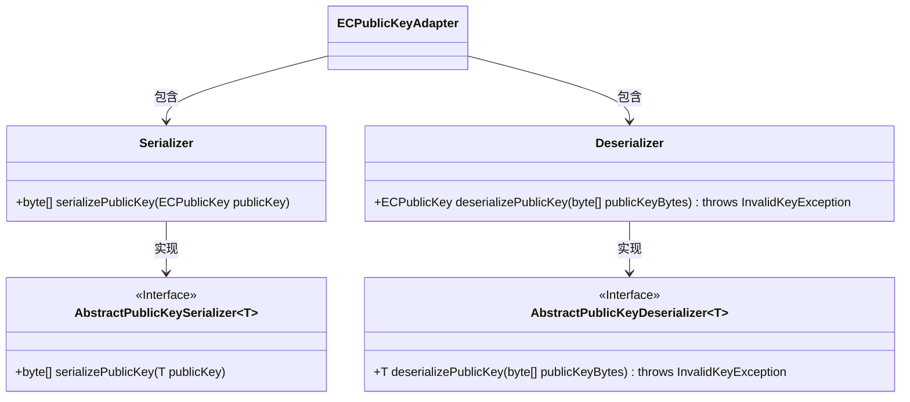
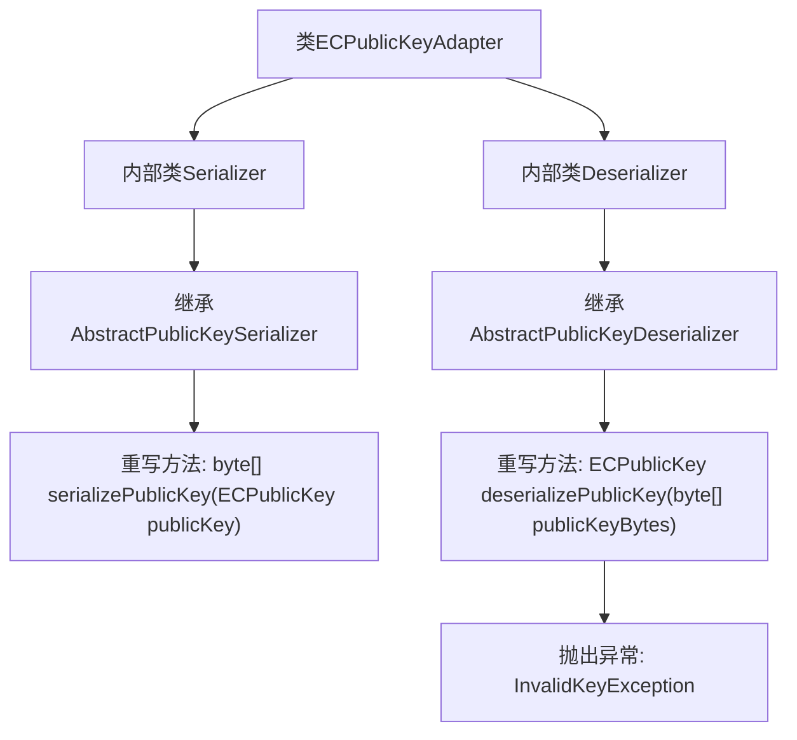

# 基础信息

|      |      |
|------|------|
| 名称 | ECPublicKeyAdapter |
| 编码语言 | .java |
| 代码路径 | Signal-Server/service/src/main/java/org/whispersystems/textsecuregcm/util/ECPublicKeyAdapter.java |
| 包名 | org.whispersystems.textsecuregcm.util |
| 依赖项 | ['org.signal.libsignal.protocol.InvalidKeyException', 'org.signal.libsignal.protocol.ecc.ECPublicKey'] |
| 概述说明 | ECPublicKeyAdapter类用于EC公钥的序列化和反序列化操作。 |

# 说明

ECPublicKeyAdapter是一个静态类，专门用于处理椭圆曲线（EC）公钥的序列化和反序列化操作。序列化是将EC公钥转换为可存储或传输的格式，而反序列化则是将这种格式重新转换为EC公钥对象。该类提供了便捷的方法，使得在需要处理EC公钥的场景中，能够高效地进行格式转换，确保数据的完整性和一致性。

# 类列表 Class Summary

| 名称   | 类型  | 说明 |
|-------|------|-------------|
| ECPublicKeyAdapter | class | ECPublicKeyAdapter包含序列化和反序列化EC公钥的静态类。 |

## 类 ECPublicKeyAdapter

|      |      |
|------|------|
| 访问范围 | public |
| 类型 | class |
| 名称 | ECPublicKeyAdapter |
| 说明 | ECPublicKeyAdapter包含序列化和反序列化EC公钥的静态类。 |

### UML类图

这段代码定义了一个`ECPublicKeyAdapter`类，该类包含两个静态内部类`Serializer`和`Deserializer`，分别用于序列化和反序列化`ECPublicKey`对象。`Serializer`类实现了`AbstractPublicKeySerializer`接口，提供了`serializePublicKey`方法；`Deserializer`类实现了`AbstractPublicKeyDeserializer`接口，提供了`deserializePublicKey`方法。这两个内部类分别负责将`ECPublicKey`对象转换为字节数组以及从字节数组还原为`ECPublicKey`对象。

### 内部方法调用关系图

这段代码定义了一个名为`ECPublicKeyAdapter`的类，其中包含两个内部类：`Serializer`和`Deserializer`。`Serializer`类继承自`AbstractPublicKeySerializer`，并重写了`serializePublicKey`方法，用于将`ECPublicKey`对象序列化为字节数组。`Deserializer`类继承自`AbstractPublicKeyDeserializer`，并重写了`deserializePublicKey`方法，用于将字节数组反序列化为`ECPublicKey`对象，且在反序列化过程中可能抛出`InvalidKeyException`异常。这两个内部类分别处理`ECPublicKey`的序列化和反序列化操作。

### 字段列表 Field List

| 名称  | 类型  | 说明 |
|-------|-------|------|

### 方法列表 Method List

| 名称  | 类型  | 说明 |
|-------|-------|------|

