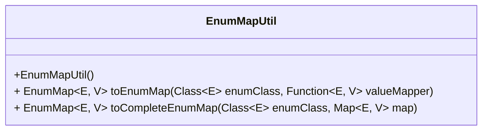
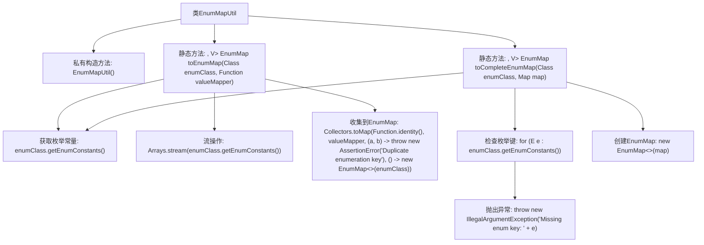

# 基础信息

|      |      |
|------|------|
| 名称 | EnumMapUtil |
| 编码语言 | .java |
| 代码路径 | Signal-Server/service/src/main/java/org/whispersystems/textsecuregcm/util/EnumMapUtil.java |
| 包名 | org.whispersystems.textsecuregcm.util |
| 依赖项 | ['java.util.Arrays', 'java.util.EnumMap', 'java.util.Map', 'java.util.function.Function', 'java.util.stream.Collectors'] |
| 概述说明 | EnumMapUtil提供静态方法，支持枚举类转EnumMap，自定义映射和完整性检查。 |

# 说明

EnumMapUtil是一个工具类，提供静态方法用于将枚举类转换为EnumMap。该工具支持自定义值映射，允许用户根据需求定义枚举值与目标值的对应关系。此外，它还具备完整性检查功能，确保转换过程中枚举类的所有值都被正确处理，避免遗漏或错误。通过使用EnumMapUtil，开发者可以高效、安全地将枚举类转换为EnumMap，提升代码的可读性和可维护性。

# 类列表 Class Summary

| 名称   | 类型  | 说明 |
|-------|------|-------------|
| EnumMapUtil | class | EnumMapUtil提供静态方法将枚举类转换为EnumMap，支持自定义值映射和完整性检查。 |

## 类 EnumMapUtil

|      |      |
|------|------|
| 访问范围 | public |
| 类型 | class |
| 名称 | EnumMapUtil |
| 说明 | EnumMapUtil提供静态方法将枚举类转换为EnumMap，支持自定义值映射和完整性检查。 |

### UML类图

**描述：**  
`EnumMapUtil` 是一个工具类，提供了两个静态方法用于处理 `EnumMap`。`toEnumMap` 方法通过枚举类和值映射函数生成一个 `EnumMap`，确保没有重复的枚举键。`toCompleteEnumMap` 方法则通过枚举类和现有映射生成一个 `EnumMap`，并检查映射中是否包含所有枚举键，若缺失则抛出异常。这两个方法都依赖于泛型和枚举类型，确保类型安全和枚举完整性。

### 内部方法调用关系图

这段代码定义了一个工具类 `EnumMapUtil`，包含两个静态方法。`toEnumMap` 方法将枚举类转换为 `EnumMap`，使用 `valueMapper` 函数为每个枚举常量生成值。`toCompleteEnumMap` 方法检查给定的 `Map` 是否包含所有枚举常量，并返回一个 `EnumMap`。如果缺少枚举键，则抛出异常。流程图展示了类和方法之间的调用关系，以及每个方法内部的操作步骤。

### 字段列表 Field List

| 名称  | 类型  | 说明 |
|-------|-------|------|

### 方法列表 Method List

| 名称  | 类型  | 说明 |
|-------|-------|------|
| toEnumMap | EnumMap<E, V> | 将枚举类转换为EnumMap，避免重复键，使用自定义值映射函数。 |
| toCompleteEnumMap | EnumMap<E, V> | 将Map转换为完整EnumMap，确保包含所有枚举键。 |

